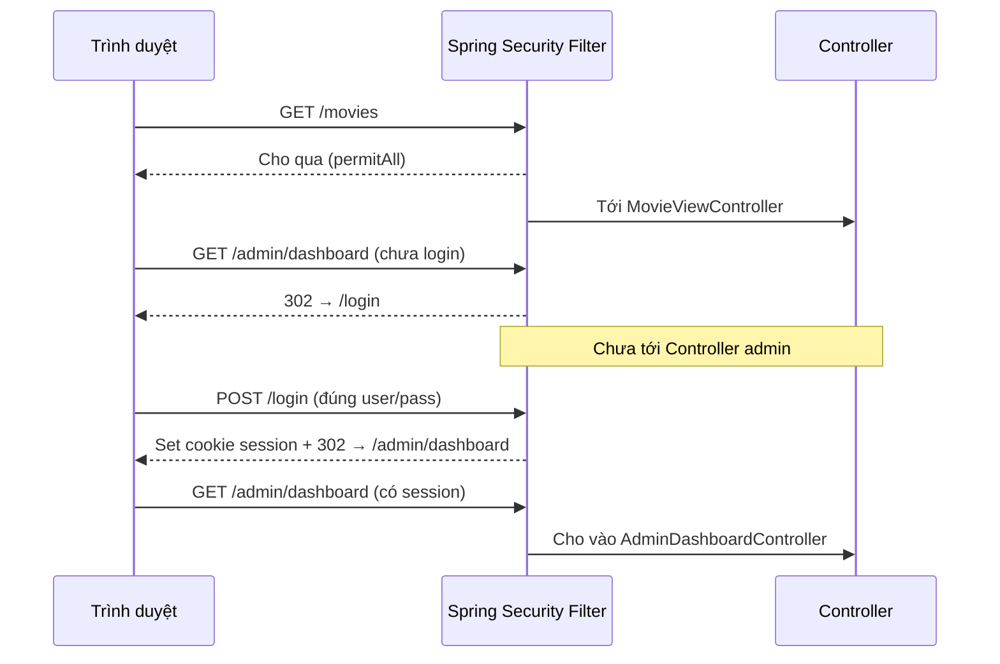

# Bài 10: Mini Project — Movie Portal + Admin Analytics Dashboard

## Mục tiêu bài học

Sau mini project này, học viên có thể:

- **Phát triển tiếp** từ app phim Bài 7 (Thymeleaf + MongoDB `mymoviedb`), không làm project từ đầu
- Viết **MongoDB aggregation** đúng schema Netflix (`date_added`, `listed_in`, `country`, `duration`…) — không nhầm với field kiểu TMDB
- Ghép theme **Dashmin** thành **Admin Dashboard** (Chart.js + bảng) qua Spring MVC + Thymeleaf
- Áp dụng **Spring Security**: khách xem site **không cần login**; **chỉ** `ROLE_ADMIN` vào dashboard và quản lý phim
- Xây **CRUD phim cho admin** (thêm / sửa / xóa) với DTO + Bean Validation + PRG, tuân thủ `Controller → Service → Repository`

> **Không nằm trong phạm vi:** đăng ký user thường; PayPal (Bài 9); REST API / SPA; Redis cache; upload ảnh phức tạp.

## Điều kiện tiên quyết

- **[Bài 6](./java_m3_bai6_Query_Optimization.md)**: aggregation (`$group`, `$sort`, `$limit`), tối ưu cơ bản
- **[Bài 7](./java_m3_bai7_Database_Query_To_FrontEnd.md)**: app phim Anime + `mymoviedb` + fragment + Chart.js
- **[Bài 8](./java_m3_bai8_Unit_Testing.md)**: Mockito (bonus test Service)
- MongoDB tại `localhost:27017`, database `db_java_t3h_module3`
- Đã import collection `mymoviedb` (CSV Netflix — xem Bài 7 §3)

```xml
<!-- Giữ dependency Bài 7, thêm: -->
<dependency>
    <groupId>org.springframework.boot</groupId>
    <artifactId>spring-boot-starter-security</artifactId>
</dependency>
```

> **Cách làm đề xuất:** copy project [`demo-bai7-mongodb-thymeleaf`](../../demo-bai7-mongodb-thymeleaf) → đổi `artifactId` / tên app thành mini project (vd. `demo-bai10-mini-project`).  
> **Theme admin:** [Dashmin — Bootstrap 5 Admin Dashboard](https://themewagon.com/themes/dashmin-responsive-free-bootstrap-5-html5-admin-dashboard-template/) (demo dùng layout Bootstrap sidebar tương đương; có thể thay bằng Dashmin đầy đủ vào `static/dashmin/`).  
> **Theme public:** giữ Anime (Bài 7).  
> **Demo chuẩn:** [`demo-bai10-mini-project`](../../demo-bai10-mini-project)

### Thời lượng gợi ý


| Phần                                         | Thời gian |
| -------------------------------------------- | --------- |
| Chốt đề + mapping field + copy Bài 7 §1–2    | ~30 phút  |
| Chuẩn hóa `date_added` / duration §3         | ~40 phút  |
| Spring Security + login §4 (học kỹ)          | ~90 phút  |
| Dashmin layout + Dashboard D1–D6 §5          | ~90 phút  |
| Admin CRUD phim (list / thêm / sửa / xóa) §6 | ~75 phút  |
| Polish + README + checklist + (bonus test)   | ~40 phút  |


> Mini project thường làm **lab / bài nộp** (1–2 buổi + về nhà), không giảng lý thuyết dài như bài thường.

## Nội dung (làm theo thứ tự)


| #       | Chủ đề                              | Kết quả kiểm tra                                     |
| ------- | ----------------------------------- | ---------------------------------------------------- |
| 1       | Tổng quan đề + vai trò khách/admin  | Nói được ai được vào `/admin/**`                     |
| 2       | Mapping Netflix ↔ 6 thống kê        | Không dùng `rating` tuổi làm “điểm”                  |
| 3       | Kế thừa Bài 7 + chuẩn hóa + **bản đồ công việc §3.4** | Biết file nào tạo/sửa trước khi code |
| 4       | Spring Security (chi tiết)          | Hiểu authn/authz/BCrypt/CSRF; public mở, admin khóa  |
| 5       | Admin Dashboard D1–D6               | 6 khối đúng aggregation                              |
| 6       | Admin CRUD phim (thêm/sửa/xóa)      | Create + update + delete + PRG; public phản ánh đúng |
| 7       | Lỗi thường gặp                      | —                                                    |
| Phụ lục | Rubric · Checklist · Liên kết       | Nộp được                                             |


---

## 1. Tổng quan đề bài

### 1.1. Bối cảnh

Công ty A đã có **trang xem phim/public** (Bài 7). Nay cần thêm:

1. **Cổng admin** để xem **thống kê điện ảnh** trên cùng database `mymoviedb`
2. **Đăng nhập admin** — khách vẫn xem site bình thường **không cần tài khoản**
3. Admin được **thêm / cập nhật / xóa phim** lưu vào MongoDB

### 1.2. Vai trò


| Vai trò                  | Login? | Được làm                                                            |
| ------------------------ | ------ | ------------------------------------------------------------------- |
| **Khách (anonymous)**    | Không  | Index, categories, detail, watching, comment guest (như Bài 7)      |
| **Admin** (`ROLE_ADMIN`) | Có     | Mọi quyền khách + Dashboard thống kê + **CRUD phim** (thêm/sửa/xóa) |


> Phạm vi bắt buộc: **một tài khoản admin** (seed sẵn). Không làm đăng ký / role `USER` thường.

### 1.3. Phạm vi / ngoài phạm vi


| Trong phạm vi                      | Ngoài phạm vi              |
| ---------------------------------- | -------------------------- |
| Public Bài 7 (giữ)                 | PayPal / thuê phim (Bài 9) |
| Login / logout admin               | Đăng ký nhiều user, OAuth  |
| Dashboard 6 thống kê (aggregation) | REST JSON API, React/Vue   |
| **CRUD phim** (thêm / sửa / xóa)   | Upload ảnh, soft-delete DB |
| Thymeleaf SSR + Chart.js           | Redis, microservices       |


---

## 2. Mapping dữ liệu — bắt buộc đọc trước khi code

### 2.1. Schema thực tế `mymoviedb` (Netflix CSV)

```
show_id, type, title, director, cast, country,
date_added, release_year, rating, duration, listed_in, description
```


| Field          | Ý nghĩa thật                                            | **Không phải**             |
| -------------- | ------------------------------------------------------- | -------------------------- |
| `rating`       | Phân loại độ tuổi (`TV-MA`, `PG-13`…)                   | Điểm vote / IMDb           |
| `date_added`   | Ngày **phát hành / lên nền tảng** (chuỗi `"August 14, 2020"`) — dùng cho D1 vì CSV **không** có tháng công chiếu rạp | `release_date` TMDB đầy đủ |

| `release_year` | Năm phát hành (số)                                      | Tháng phát hành            |
| `listed_in`    | Nhiều thể loại, cách nhau bởi `,`                       | Mảng `genres[]` sẵn        |
| `country`      | Quốc gia sản xuất / liên quan                           | `original_language`        |
| `duration`     | `"93 min"` (Movie) hoặc `"4 Seasons"` (TV)              | Luôn là phút               |


### 2.2. Sáu thống kê Dashboard (định nghĩa chốt)


| Mã     | Yêu cầu UI                                        | Field / công thức                                                                                                              | Gợi ý visualization |
| ------ | ------------------------------------------------- | ------------------------------------------------------------------------------------------------------------------------------ | ------------------- |
| **D1** | Top 7 **tháng** có số lượng **phim phát hành** nhiều nhất | Chỉ `type = "Movie"`. Dataset không có `release_date` đủ tháng → dùng `date_added` (ngày lên Netflix = ngày phát hành trên nền tảng). Parse → group `yyyy-MM` → sort count DESC → limit 7 | Bar chart |

| **D2** | Số title theo **thể loại**                        | `$split` `listed_in` → `$unwind` → `$group` → top N (vd. 10)                                                                   | Pie / doughnut      |
| **D3** | Số title theo **quốc gia**                        | `$group` `country` (bỏ null/rỗng) → top N. *MVP chấp nhận group nguyên chuỗi; bonus:* `$split` *khi* `country` *có nhiều nước* | Bar chart           |
| **D4** | Top 5 **Movie dài nhất**                          | `type = "Movie"`, parse phút từ `duration`, sort DESC, limit 5                                                                 | Table               |
| **D5** | Top 5 title **thêm gần nhất**                     | Sort `date_added` (đã Date) DESC, limit 5                                                                                      | Table               |
| **D6** | Top 10 “phổ biến” (**định nghĩa đề bài**)         | `type = "Movie"` **và** `director` không rỗng; sort `release_year` DESC; limit 10                                              | Table               |


> **Vì sao D6 không dùng “popularity”?** Dataset Netflix **không có** field popularity/vote. Đề bài **quy ước** công thức trên — ghi chú ngắn trên UI dashboard (vd. *“Theo đề: Movie có đạo diễn, ưu tiên năm phát hành mới”*).

### 2.3. Quy tắc kỹ thuật chung cho D1–D6

- Thống kê chạy bằng **aggregation trên MongoDB** (`MongoTemplate` / `Aggregation`).
- **Tuyệt đối không được sử dụng** `findAll()` rồi `stream().collect(groupingBy…)` trên toàn bộ collection (sai tinh thần Bài 6–7, chậm khi data lớn).
- Document thiếu field / parse fail → **bỏ qua** (không làm sập trang).

---

## 3. Kế thừa Bài 7 & chuẩn hóa dữ liệu

### 3.1. Checklist giữ từ Bài 7 (public)

- [ ] `/movies` — Hero + sections + sidebar comment  
- [ ] `/movies/home` — phân trang  
- [ ] `/movies/detail/{id}` + comment guest + PRG  
- [ ] `/movies/watching/{id}`  
- [ ] Model suffix `Model`; DTO cho view; constructor injection  

**Chart public** `/movies/chart` **(Bài 7):** đề xuất **chuyển toàn bộ thống kê vào** `/admin/dashboard` và có thể gỡ hoặc redirect chart cũ → admin (tránh hai nơi trùng). Public **không** bắt buộc giữ chart.

#### Bảng tóm tắt — khởi đầu từ Bài 7

| File / thành phần | Tạo / Cập nhật | Việc cần làm | Để làm gì |
|-------------------|----------------|--------------|-----------|
| Project `demo-bai7-...` | **Cập nhật** (copy) | Copy folder → đổi `artifactId`, `spring.application.name` | Nền mini project |
| `MovieModel`, `CommentModel` | **Giữ** | Chưa sửa lúc đầu | Public vẫn chạy |
| `MovieRepository`, `CommentRepository` | **Giữ** | — | Query như Bài 7 |
| `MovieService`, `CommentService`, `MovieViewController` | **Giữ** | Sau §4 chỉ kiểm tra CSRF form | Site khách |
| Templates Anime + `static/` | **Giữ** | — | UI public |
| `pom.xml` | **Cập nhật** (ở §4) | Thêm `spring-boot-starter-security` | Chuẩn bị login |

### 3.2. Chuẩn hóa `date_added` và `duration`

Hai hướng (chọn **một**, ghi rõ trong README):


| Hướng                     | Cách làm                                                                                                                                                    | Ưu                            |
| ------------------------- | ----------------------------------------------------------------------------------------------------------------------------------------------------------- | ----------------------------- |
| **A — Khi import / seed** | Script hoặc `ApplicationRunner` parse `"August 14, 2020"` → lưu thêm field `dateAddedAt` (`Date` / `LocalDate`); Movie parse `"93 min"` → `durationMinutes` | Aggregation D1/D4/D5 đơn giản |
| **B — Trong aggregation** | `$dateFromString` + `$toInt` / `$regexFind` trên field gốc                                                                                                  | Không đổi document cũ         |


**Khuyến nghị học viên:** hướng **A** (dễ debug, rõ ràng khi sửa phim).

Gợi ý format parse ngày Netflix:

```text
August 14, 2020  →  DateTimeFormatter.ofPattern("MMMM d, yyyy", Locale.ENGLISH)
```

Gợi ý parse phút (chỉ Movie):

```text
"93 min"  →  93
"4 Seasons" → bỏ qua (không vào D4)
```

#### Bảng tóm tắt — chuẩn hóa dữ liệu (hướng A)


| File / class | Tạo / Cập nhật | Việc cần làm | Để làm gì |
| ------------- | -------------- | -------------- | ----------- |
| `MovieModel` | **Cập nhật** (Bài 7) | Thêm `dateAddedAt`, `durationMinutes` | Aggregation D1/D4/D5 + CRUD không parse chuỗi mỗi lần |
| `MovieDataNormalizer` (helper) | **Tạo mới** | Parse `"August 14, 2020"` → date; `"93 min"` → số | Tái dùng khi seed và khi admin thêm/sửa |
| `MovieNormalizeRunner` | **Tạo mới** | `ApplicationRunner`: document thiếu field → `save` | Chuẩn hóa 1 lần khi start (idempotent) |
| `MovieRepository` | **Giữ / dùng lại** | Runner đọc/ghi; **không** `findAll` cho Dashboard | Truy cập MongoDB |


> Hướng B: bỏ bước 1–3; parse trong pipeline aggregation (§5). CRUD vẫn nên parse khi lưu để UI/admin nhất quán.

### 3.3. Kiến trúc package (mở rộng Bài 7)

```
src/main/java/vn/demo/
├── DemoBai10Application.java
├── config/
│   ├── SecurityConfig.java
│   └── AdminUserSeeder.java
├── model/
│   ├── MovieModel.java          ← + dateAddedAt, durationMinutes (nếu chọn hướng A)
│   ├── CommentModel.java
│   └── UserModel.java
├── repository/
│   ├── MovieRepository.java
│   ├── CommentRepository.java
│   └── UserRepository.java
├── security/
│   └── MongoUserDetailsService.java
├── service/
│   ├── MovieService.java              ← public (Bài 7)
│   ├── CommentService.java
│   ├── DashboardStatsService.java     ← D1–D6
│   └── AdminMovieService.java         ← list + create + update + delete
├── dto/
│   ├── … (DTO Bài 7)
│   ├── MovieFormDto.java              ← form thêm + sửa (chung)
│   ├── MonthCountDto.java
│   ├── GenreCountDto.java
│   ├── CountryCountDto.java
│   └── MovieRankDto.java
└── controller/
    ├── HomeController.java
    ├── MovieViewController.java       ← /movies/**
    ├── LoginController.java           ← GET /login
    ├── AdminDashboardController.java  ← /admin/dashboard
    └── AdminMovieController.java      ← /admin/movies/**

src/main/resources/
├── static/
│   ├── css|js|img|…        ← Anime (public) — giữ Bài 7
│   └── dashmin/            ← CSS/JS/img Dashmin (URL /dashmin/**)
└── templates/
    ├── anime-main/ …
    ├── fragments/ …
    ├── login.html
    └── admin/
        ├── fragments/layout.html
        ├── dashboard.html
        ├── movies-list.html
        └── movie-form.html            ← dùng chung create + edit
```

> **Asset admin không đặt dưới URL `/admin/**`.** Đặt `static/dashmin/` → trình duyệt gọi `/dashmin/css/...` và `permitAll` path này. Nếu để CSS tại `/admin/css/**` mà lại `authorize /admin/**` thì dễ bị 302/403 mất style (xem §8).

```mermaid
flowchart TB
    subgraph public [Public - permitAll]
        B[Browser] --> MVC[MovieViewController]
        MVC --> MS[MovieService / CommentService]
    end
    subgraph admin [Admin - ROLE_ADMIN]
        B2[Browser + session] --> AD[AdminDashboardController]
        B2 --> AM[AdminMovieController]
        AD --> DS[DashboardStatsService]
        AM --> AMS[AdminMovieService]
    end
    MS --> R[(MongoDB mymoviedb)]
    DS --> R
    AMS --> R
    B2 --> SEC[Spring Security]
    SEC -->|chưa login| L[/login]
```

### 3.4. Bản đồ công việc toàn project (nhìn một phát)

> Đọc bảng này trước khi code. Cột **Tạo / Cập nhật** giúp biết file nào làm mới, file nào chỉ sửa.
> Chi tiết từng bước nằm ở §3.1–§3.2, §4.8, §5, §6.

| # | Tính năng | Tạo mới (file chính) | Cập nhật (file đã có) | Để làm gì |
|---|-----------|----------------------|------------------------|-----------|
| A | Copy nền Bài 7 | — | Đổi `artifactId` / tên app | Có public `/movies` chạy được |
| B | Chuẩn hóa ngày/phút | `MovieDataNormalizer`, `MovieNormalizeRunner` | `MovieModel` (+2 field) | Dashboard D1/D4/D5 + CRUD dễ |
| C | Login admin (Security) | `UserModel`, `UserRepository`, `MongoUserDetailsService`, `SecurityConfig`, `AdminUserSeeder`, `LoginController`, `login.html` | `pom.xml` (+security); form comment (`th:action`) | Khách xem tự do; `/admin/**` chỉ ADMIN |
| D | Dashboard thống kê | `static/dashmin/**`, `admin/fragments/layout.html`, `dashboard.html`, `DashboardStatsService`, DTOs thống kê, `AdminDashboardController` | (optional) gỡ/redirect `/movies/chart` | 6 biểu đồ/bảng D1–D6 |
| E | List phim admin | `AdminMovieService`, `AdminMovieController`, `movies-list.html` | `MovieRepository` (Pageable) | Quản lý danh sách + phân trang |
| F | Form thêm/sửa | `MovieFormDto`, `movie-form.html` | `MovieModel` / helper parse khi save | Một form dùng chung create + edit |
| G | Thêm phim | Method `create` (+ mapping controller) | `MovieRepository.save` | Insert title mới + `show_id` |
| H | Sửa phim | Method `getFormById` / `update` | — | Prefill + cập nhật MongoDB |
| I | Xóa phim | Method `deleteById` | `CommentRepository` (+ `deleteByMovieId`) | Xóa movie (+ comment kèm) |

**Thứ tự làm khuyến nghị:** A → B → C → D → E → F → G → H → I.

---

## 4. Spring Security — login admin

> Module 3 **chưa** có bài Security riêng. Phần này giải thích khái niệm trước, rồi mới tới bước code.
> Đọc xong bạn phải hình dung được: *ai được vào cửa nào*, *mật khẩu lưu thế nào*, *vì sao form POST cần CSRF*.

### 4.1. Vì sao cần bảo mật? (hình dung)

Tưởng tượng website như **một tòa nhà**:


| Khu vực                      | Ví dụ URL                           | Ai vào được                   |
| ---------------------------- | ----------------------------------- | ----------------------------- |
| **Sảnh / phòng công cộng**   | `/movies`, CSS, ảnh                 | Mọi khách — **không** cần thẻ |
| **Phòng điều khiển (admin)** | `/admin/dashboard`, `/admin/movies` | Chỉ người có **thẻ ADMIN**    |
| **Quầy lấy thẻ**             | `/login`                            | Ai cũng tới được để xin thẻ   |


**Spring Security** đóng vai **bảo vệ cửa** (security filter): mỗi request đi qua bảo vệ **trước** khi tới Controller.




Hai khái niệm **dễ nhầm** — nhớ câu này:


| Thuật ngữ                      | Câu hỏi            | Trong project                    |
| ------------------------------ | ------------------ | -------------------------------- |
| **Authentication (xác thực)**  | *Bạn là ai?*       | Login đúng `admin` / mật khẩu    |
| **Authorization (phân quyền)** | *Bạn được làm gì?* | Chỉ `ROLE_ADMIN` vào `/admin/**` |


Khách xem phim: **không** cần authentication. Admin: cần **cả hai**.

### 4.2. Session sau khi login — “thẻ tạm”

1. User gửi username + password tới `/login`.
2. Security kiểm tra (qua `UserDetailsService` + `PasswordEncoder`).
3. Đúng → tạo **HTTP session**, gửi cookie (thường `JSESSIONID`) về trình duyệt.
4. Request sau kèm cookie → Security biết “đây là admin đã login” → cho vào `/admin/**`.
5. Logout → hủy session; cookie hết hiệu lực với server.

Bạn **không** tự viết check session trong mọi Controller — khai báo rule một lần trong `SecurityConfig`.

### 4.3. Role và tiền tố `ROLE_`

- Trong DB / `UserModel` lưu role gọn: `ADMIN`.
- Spring Security chuẩn hóa thành authority `ROLE_ADMIN`.
- Trong config dùng `hasRole("ADMIN")` — framework **tự thêm** tiền tố `ROLE_`.
- **Đừng** viết `hasRole("ROLE_ADMIN")` (sẽ thành `ROLE_ROLE_ADMIN` — sai).

### 4.4. Vì sao mật khẩu phải BCrypt? (không lưu plain text)


| Cách lưu                         | Rủi ro                                     |
| -------------------------------- | ------------------------------------------ |
| Lưu `admin123` thẳng vào MongoDB | DB bị lộ → attacker login ngay             |
| Hash 1 chiều (BCrypt)            | Lộ DB cũng **không** đọc được mật khẩu gốc |


**BCrypt** = thuật toán hash có **salt** (mỗi lần encode ra chuỗi khác nhau, vẫn so khớp được).

Luồng đúng:

1. **Khi seed / đổi mật khẩu:** `passwordEncoder.encode("admin123")` → lưu chuỗi `$2a$10$...` vào field `password`.
2. **Khi login:** user gõ `admin123` → Security gọi `passwordEncoder.matches(raw, hashTrongDb)` → true/false.
3. **Sai thường gặp:** encode **hai lần** khi seed, hoặc lưu plain rồi lại `matches` với hash → login mãi fail.

### 4.5. CSRF — vì sao form POST bị 403?

**CSRF** (*Cross-Site Request Forgery*): trang độc hại dụ trình duyệt của bạn (đang có session admin) gửi POST xóa phim / đổi dữ liệu **mà bạn không cố ý**.

Spring Security **bật CSRF mặc định**: mỗi form POST phải có **token bí mật** (hidden `_csrf`) khớp session.


| Làm đúng                                                                       | Làm sai                                                             |
| ------------------------------------------------------------------------------ | ------------------------------------------------------------------- |
| `<form th:action="@{/admin/movies}" method="post">` (Thymeleaf tự nhúng token) | `<form action="/admin/movies" method="post">` thiếu token → **403** |
| Comment guest Bài 7 cũng dùng `th:action`                                      | Copy HTML thuần thiếu CSRF sau khi thêm Security                    |


> **Không** tắt CSRF để “cho nhanh” trong bài nộp — trừ khi GV cho phép và bạn giải thích được rủi ro.

### 4.6. Ai được vào URL nào? (bảng rule)


| URL                                                                          | Ai truy cập      | Ghi chú                                                |
| ---------------------------------------------------------------------------- | ---------------- | ------------------------------------------------------ |
| `/`, `/movies/**`, `/css/**`, `/js/**`, `/img/**`, `/fonts/**`, `/videos/**` | Mọi người        | Public Bài 7                                           |
| `/dashmin/**`                                                                | Mọi người        | Static Dashmin — **tách** khỏi `/admin/**` kẻo mất CSS |
| `/login`, `/logout`                                                          | Mọi người        | Logout khi đã có session                               |
| `/admin/**`                                                                  | Chỉ `ROLE_ADMIN` | Dashboard + CRUD                                       |


Default nguy hiểm: `anyRequest().authenticated()` **không** tách public → cả `/movies` cũng bị bắt login.

### 4.7. Các “mảnh ghép” Security — mỗi class làm gì?


| Class / bean                                | Tạo mới?           | Việc chính                                                                              | Ví dụ đời thường         |
| ------------------------------------------- | ------------------ | --------------------------------------------------------------------------------------- | ------------------------ |
| Dependency `spring-boot-starter-security`   | Thêm vào `pom.xml` | Kéo filter chain vào app                                                                | Thuê công ty bảo vệ      |
| `UserModel`                                 | **Tạo mới**        | Document user trong MongoDB                                                             | Hồ sơ nhân viên          |
| `UserRepository`                            | **Tạo mới**        | `findByUsername`                                                                        | Tra sổ nhân sự           |
| `MongoUserDetailsService`                   | **Tạo mới**        | Implement `UserDetailsService`: load user → `UserDetails` (username, hash, authorities) | Nhân viên bảo vệ đọc thẻ |
| `PasswordEncoder` (`BCryptPasswordEncoder`) | Bean trong config  | Encode / matches                                                                        | Máy kiểm tra dấu vân tay |
| `SecurityConfig`                            | **Tạo mới**        | `SecurityFilterChain`: permit/authenticate, formLogin, logout                           | Nội quy tòa nhà          |
| `AdminUserSeeder`                           | **Tạo mới**        | Nếu chưa có `admin` → tạo + BCrypt                                                      | Cấp thẻ admin lần đầu    |
| `LoginController`                           | **Tạo mới**        | `GET /login` → `login.html`                                                             | Quầy phát thẻ            |
| `login.html`                                | **Tạo mới**        | Form `username` / `password` + CSRF                                                     | Tờ đăng nhập             |


`MovieModel`, `MovieService`, public controllers — **giữ nguyên** Bài 7; chỉ đảm bảo form comment dùng `th:action`.

### 4.8. Bảng tóm tắt — Security + login (tạo / cập nhật file nào)


| File / class | Tạo / Cập nhật | Việc cần làm | Để làm gì |
|--------------|----------------|--------------|-----------|
| `pom.xml` | **Cập nhật** | Thêm `spring-boot-starter-security` | Bật filter Security |
| `UserModel` | **Tạo mới** | `username`, `password` (hash), `role`, `enabled` + `@Document("users")` | Lưu tài khoản admin |
| `UserRepository` | **Tạo mới** | `findByUsername(...)` | Seeder + load user |
| `MongoUserDetailsService` | **Tạo mới** | `loadUserByUsername` → `UserDetails` + `roles("ADMIN")` | Security đọc user từ Mongo |
| `SecurityConfig` | **Tạo mới** | `PasswordEncoder` + `SecurityFilterChain` (§4.9) | Rule cửa + login/logout |
| `AdminUserSeeder` | **Tạo mới** | Nếu chưa có `admin` → `encode` + `save` | Tài khoản test |
| `LoginController` | **Tạo mới** | `GET /login` → `login.html` | Không 404 trang login |
| `templates/login.html` | **Tạo mới** | Form POST `/login`; `?error` / `?logout` | UI đăng nhập |
| Form comment (Bài 7) | **Cập nhật** (kiểm tra) | Đảm bảo `th:action="@{...}"` | CSRF — POST comment không 403 |
| `README` | **Cập nhật** | Ghi user/pass admin mặc định | Người khác chạy được |


**Không cần** tạo: `MovieModel`, `CommentModel`, public `MovieViewController` (trừ khi sửa CSRF form).

### 4.9. `SecurityConfig` — ý tưởng cấu hình (đọc hiểu)

Trong `SecurityFilterChain` (Spring Security 6 / Boot 3), thứ tự tư duy:

1. **CSRF** — giữ mặc định (bật) cho form Thymeleaf.
2. **authorizeHttpRequests**
  - `requestMatchers` public (movies, static, dashmin, login) → `permitAll()`
  - `requestMatchers("/admin/**")` → `hasRole("ADMIN")`
  - (tuỳ chọn) `anyRequest().permitAll()` hoặc authenticated tùy policy còn lại — **ưu tiên liệt kê rõ**, tránh khóa nhầm public.
3. **formLogin** — `loginPage("/login")`, `defaultSuccessUrl("/admin/dashboard", true)`.
4. **logout** — `logoutUrl("/logout")`, `logoutSuccessUrl("/login?logout")`.
5. Gắn `UserDetailsService` + `PasswordEncoder` (Boot thường tự wire nếu chỉ có một bean mỗi loại).

Pseudo cấu trúc (học viên viết Java thật theo version Boot đang dùng):

```text
http
  .authorizeHttpRequests(auth -> auth
      .requestMatchers("/", "/movies/**", "/css/**", "/js/**", "/img/**",
                       "/fonts/**", "/videos/**", "/dashmin/**", "/login").permitAll()
      .requestMatchers("/admin/**").hasRole("ADMIN")
      .anyRequest().permitAll()
  )
  .formLogin(form -> form.loginPage("/login").defaultSuccessUrl("/admin/dashboard", true))
  .logout(logout -> logout.logoutSuccessUrl("/login?logout"));
```

### 4.10. `UserModel` + seed — field


| Field      | Kiểu gợi ý   | Mô tả                               |
| ---------- | ------------ | ----------------------------------- |
| `id`       | String `@Id` | Mongo ObjectId                      |
| `username` | String       | Unique, vd. `admin`                 |
| `password` | String       | **BCrypt hash** — không plain text  |
| `role`     | String       | `ADMIN` → map `ROLE_ADMIN`          |
| `enabled`  | boolean      | `true` — tắt được tài khoản sau này |


`AdminUserSeeder`: nếu `findByUsername("admin").isEmpty()` → tạo mới với `encoder.encode("admin123")`. **Bắt buộc ghi README**; production phải đổi mật khẩu.

### 4.11. Trang login + CSRF trên form public

- `GET /login` → `login.html` (có controller — **không** để 404).
- Form field name đúng chuẩn Security: `username`, `password` (đúng tên này).
- Hiện lỗi khi `?error`, thông báo khi `?logout`; link về `/movies`.
- Mọi POST (login, comment, CRUD admin) dùng Thymeleaf `th:action` để có CSRF.

> **Gợi ý giảng viên:** Demo `SecurityConfig` mẫu 15–20 phút trước lab, hoặc phát starter chỉ gồm Security + login.

### 4.12. Acceptance — Security

- [ ] Giải thích được khác nhau authentication vs authorization  
- [ ] Vào `/movies` **không** login → 200, nội dung Bài 7  
- [ ] Comment guest POST vẫn chạy (CSRF OK)  
- [ ] Vào `/admin/dashboard` chưa login → redirect `/login`  
- [ ] Login sai → ở lại login + thông báo  
- [ ] Login `admin` đúng → vào dashboard  
- [ ] Password trong MongoDB là hash BCrypt (không phải `admin123` plain)  
- [ ] `/dashmin/**` load được CSS (không bị rule `/admin/**` nuốt)  

---

## 5. Admin Dashboard (Dashmin) — D1 đến D6

### 5.1. Tích hợp theme

1. Tải Dashmin → copy CSS/JS/img cần dùng vào `static/dashmin/`
2. Tạo `templates/admin/fragments/layout.html` (sidebar, topbar, scripts)
3. `dashboard.html` `th:replace` fragment; asset dùng `th:href="@{/dashmin/css/...}"` (hoặc path static tương ứng)

Gợi ý menu sidebar admin:

- Dashboard  
- Movies (danh sách)  
- Thêm phim  
- Logout  
- (Link) Về trang public `/movies`

#### Bảng tóm tắt — tích hợp Dashmin + khung dashboard

| File / thành phần | Tạo / Cập nhật | Việc cần làm | Để làm gì |
|-------------------|----------------|--------------|-----------|
| `static/dashmin/**` | **Tạo mới** (copy theme) | Copy CSS/JS/img Dashmin | Style admin (`/dashmin/**`, `permitAll`) |
| `templates/admin/fragments/layout.html` | **Tạo mới** | Sidebar, topbar, scripts chung | Layout mọi trang `/admin` |
| `templates/admin/dashboard.html` | **Tạo mới** | 6 khối chart/table + Chart.js | UI thống kê D1–D6 |
| `MonthCountDto`, `GenreCountDto`, `CountryCountDto`, `MovieRankDto` | **Tạo mới** | Field khớp aggregation | Đổ Thymeleaf / Chart.js |
| `DashboardStatsService` | **Tạo mới** | 6 method aggregation (xem §5.2) | Lấy số liệu trên MongoDB |
| `AdminDashboardController` | **Tạo mới** | `GET /admin`, `GET /admin/dashboard` | Controller → Service → view |
| `SecurityConfig` | **Đã có** (§4) | Kiểm tra `/admin/**` + `/dashmin/**` | Không vào lậu / không mất CSS |
| `MovieChartService`, `/movies/chart` | **Cập nhật** (Bài 7, optional) | Gỡ hoặc redirect → `/admin/dashboard` | Tránh trùng thống kê |
| `MovieModel` / `MovieRepository` | **Giữ** | Không thêm field nếu đã §3.2 | Nguồn dữ liệu aggregation |

### 5.2. `DashboardStatsService`

Mỗi method một pipeline (hoặc một method trả object gom DTO). Gợi ý chữ ký:

```java
List<MonthCountDto> topMovieReleaseMonths(int limit); // D1, limit=7 — chỉ Movie, group tháng phát hành
List<GenreCountDto> countByGenre(int limit);         // D2
List<CountryCountDto> countByCountry(int limit);     // D3
List<MovieRankDto> topLongestMovies(int limit);      // D4, limit=5
List<MovieRankDto> latestAdded(int limit);           // D5, limit=5
List<MovieRankDto> topPopularByRule(int limit);      // D6, limit=10
```

**D2 — lưu ý `listed_in`:** một title thuộc nhiều genre → `$split` + `$unwind` rồi mới `$group`. Không group nguyên chuỗi `"Dramas, International Movies"` như một thể loại.

**D1/D5 — lưu ý ngày:** D1 dùng `dateAddedAt` **và** filter `type = Movie` (đừng đếm TV Show). D5 vẫn sort `dateAddedAt` mọi type.

#### Bảng tóm tắt — từng thống kê D1–D6

Làm lần lượt trong `DashboardStatsService` + gắn UI trên `dashboard.html`. **Không** tạo Model mới.

| Mã | Method (Service) | File liên quan | Tạo / Cập nhật | Để làm gì |
|----|------------------|----------------|----------------|-----------|
| D1 | `topMovieReleaseMonths(7)` | `DashboardStatsService`, `MonthCountDto`, bar trên `dashboard.html` | **Cập nhật** service + HTML | Top 7 tháng **phim** phát hành nhiều nhất |
| D2 | `countByGenre(10)` | + `GenreCountDto` + pie | **Cập nhật** | Đếm theo thể loại (`$split`/`$unwind`) |
| D3 | `countByCountry(10)` | + `CountryCountDto` + bar | **Cập nhật** | Đếm theo quốc gia |
| D4 | `topLongestMovies(5)` | + `MovieRankDto` + table | **Cập nhật** | Top Movie dài nhất |
| D5 | `latestAdded(5)` | + `MovieRankDto` + table | **Cập nhật** | Top mới thêm gần nhất |
| D6 | `topPopularByRule(10)` | + `MovieRankDto` + chú thích UI | **Cập nhật** | Top theo quy ước đề bài |

### 5.3. Controller + view

`AdminDashboardController`:

- `GET /admin` → `redirect:/admin/dashboard`
- `GET /admin/dashboard` → add attributes (lists D1–D6) → `admin/dashboard`

Chart.js: truyền labels/data bằng `th:inline="javascript"` (cùng kỹ thuật Bài 7 §8) **hoặc** nhúng sẵn trong từng card.

### 5.4. Acceptance — từng thống kê

**D1 — Top 7 tháng phim phát hành nhiều nhất**

- Chỉ đếm `type = "Movie"` (không gộp TV Show)  
- Aggregation trên DB; group tháng-năm từ `dateAddedAt` (map từ `date_added`)  
- Bar chart tối đa 7 cột; bỏ document parse fail / sentinel  

**D2 — Theo thể loại**

- Đã tách multi-genre; pie/doughnut top N

**D3 — Theo quốc gia**

- Không đếm `country` null/rỗng; bar top N

**D4 — Top 5 Movie dài nhất**

- Chỉ `Movie`; table có title + số phút; không dùng `rating` tuổi

**D5 — Top 5 thêm gần nhất**

- Table title + ngày thêm; thứ tự mới → cũ

**D6 — Top 10 theo quy ước đề**

- Đúng filter + sort đã chốt §2.2; có chú thích công thức trên UI

---

## 6. Admin — CRUD phim (thêm / sửa / xóa)

### 6.1. Danh sách


| Mục      | Nội dung                                                             |
| -------- | -------------------------------------------------------------------- |
| URL      | `GET /admin/movies?page=0&size=10`                                   |
| Service  | `AdminMovieService.findPage(...)` — tái sử dụng `Pageable` (Bài 4/7) |
| UI       | Bảng: title, type, country, release_year; nút **Sửa** + **Xóa**      |
| Optional | `?q=` lọc `title` regex (ôn Bài 6) — bonus                           |


Nút **Thêm phim** trên list (hoặc sidebar) → `/admin/movies/new`.

#### Bảng tóm tắt — danh sách phim admin

| File / class | Tạo / Cập nhật | Việc cần làm | Để làm gì |
|--------------|----------------|--------------|-----------|
| `AdminMovieService` | **Tạo mới** | Method `findPage(Pageable)` | Nghiệp vụ list |
| `AdminMovieController` | **Tạo mới** | `GET /admin/movies` | Nhận page/size → view |
| `movies-list.html` | **Tạo mới** | Bảng + nút Thêm/Sửa/Xóa + phân trang | UI quản lý |
| `admin/fragments/layout.html` | **Đã có** (§5) | `th:replace` | Cùng khung Dashmin |
| `MovieRepository` | **Giữ / dùng** | `findAll(Pageable)` (optional search) | Phân trang MongoDB |

### 6.2. Form dùng chung — `MovieFormDto`

Dùng **một** DTO + **một** template `movie-form.html` cho cả thêm và sửa (khác nhau ở `th:action` / tiêu đề trang).

**Field bắt buộc hỗ trợ trên form:**  
`title`, `type`, `director`, `cast`, `country`, `date_added`, `release_year`, `rating`, `duration`, `listed_in`, `description`


| Mục           | Nội dung                                                                                            |
| ------------- | --------------------------------------------------------------------------------------------------- |
| DTO           | `MovieFormDto` — **không** bind trực tiếp `MovieModel` nếu có field nội bộ (`dateAddedAt`…)         |
| Validation    | `@NotBlank` title; `release_year` hợp lệ; `type` chỉ `Movie` / `TV Show` (tuỳ chọn `@Pattern`)      |
| Parse sau lưu | Luôn cập nhật `dateAddedAt`, `durationMinutes` (nếu chọn hướng A §3.2) từ `date_added` / `duration` |


> Trang **public** không hiện nút Thêm/Sửa/Xóa. Chỉ thao tác trong `/admin/**`.

#### Bảng tóm tắt — DTO + form chung (dùng cho Create & Update)

| File / class | Tạo / Cập nhật | Việc cần làm | Để làm gì |
|--------------|----------------|--------------|-----------|
| `MovieFormDto` | **Tạo mới** | Field form + `@NotBlank` / validation | Bind form; không lộ field nội bộ |
| `movie-form.html` | **Tạo mới** | Một HTML; `th:action` khác nhau create vs edit | Tránh 2 form copy-paste |
| `AdminMovieService` (map DTO↔Model) | **Cập nhật** | `toForm` / `toEntity` + parse ngày/phút | Create/Update cùng chuẩn hóa |
| `MovieModel` | **Đã có** (+ field §3.2) | Không bind thẳng ra form | Lưu MongoDB đúng schema |

### 6.3. Thêm phim (Create)


| Mục       | Nội dung                                                                                                   |
| --------- | ---------------------------------------------------------------------------------------------------------- |
| URL GET   | `/admin/movies/new` — form trống                                                                           |
| URL POST  | `/admin/movies` — tạo mới                                                                                  |
| Service   | `AdminMovieService.create(MovieFormDto)`                                                                   |
| `show_id` | Tự sinh phía server (vd. `s` + timestamp, hoặc `UUID`) — **không** bắt admin nhập; unique trong collection |
| `@Id`     | Để MongoDB tự sinh `ObjectId` (ghi rõ trong README nếu chọn cách khác)                                     |
| PRG       | POST OK → `redirect:/admin/movies` (hoặc trang edit bản ghi mới) + flash “Đã thêm”                         |
| Routing   | Khai báo `/admin/movies/new` **tách** path (đừng để `{id}` nuốt chữ `new`)                                 |


#### Bảng tóm tắt — Create

| File / class | Tạo / Cập nhật | Việc cần làm | Để làm gì |
|--------------|----------------|--------------|-----------|
| `AdminMovieController` | **Cập nhật** | `GET /admin/movies/new`, `POST /admin/movies` | Mở form trống + nhận submit |
| `AdminMovieService.create` | **Cập nhật** (thêm method) | Sinh `show_id`; map DTO→Model; `save` | Insert document |
| `MovieRepository` | **Giữ** | `save(...)` | Ghi MongoDB |
| `movie-form.html` | **Đã có** | `th:action="@{/admin/movies}"` POST | CSRF + gửi form |
| Flash + `redirect:` | Trong controller | PRG về list | F5 không tạo trùng |

**Acceptance — Create**

- [ ] Form trống mở được khi đã login admin  
- [ ] Sai validate → ở lại form, hiện lỗi field, **không** insert  
- [ ] Lưu OK → thấy dòng mới trên `/admin/movies` và có thể mở detail public  
- [ ] `show_id` được gán phía server  
- [ ] Chưa login không POST được  

### 6.4. Cập nhật phim (Update)


| Mục       | Nội dung                                                                |
| --------- | ----------------------------------------------------------------------- |
| URL GET   | `/admin/movies/{id}/edit` — prefill                                     |
| URL POST  | `/admin/movies/{id}/edit` — lưu                                         |
| Service   | `AdminMovieService.update(id, MovieFormDto)`                            |
| PRG       | POST OK → redirect list hoặc lại trang edit + flash “Đã cập nhật”       |
| Không đổi | Giữ nguyên `@Id`; `show_id` **readonly** trên form (tránh gãy liên kết) |


#### Bảng tóm tắt — Update

| File / class | Tạo / Cập nhật | Việc cần làm | Để làm gì |
|--------------|----------------|--------------|-----------|
| `AdminMovieService.getFormById` / `update` | **Cập nhật** (thêm method) | Load→DTO; ghi field cho phép; giữ `@Id` + `show_id` | Prefill + lưu |
| `AdminMovieController` | **Cập nhật** | `GET\|POST /admin/movies/{id}/edit` | Luồng sửa |
| `movie-form.html` | **Đã có** | Prefill; `show_id` readonly | Không gãy liên kết |
| `MovieService` (public) | **Giữ** | Không bắt buộc sửa | Detail public phản ánh data mới |

**Acceptance — Update**

- [ ] Prefill đúng document theo `id`  
- [ ] Sai validate → ở lại form, hiện lỗi field  
- [ ] Lưu OK → MongoDB đổi; mở `/movies/detail/{id}` thấy dữ liệu mới  
- [ ] `id` không tồn tại → 404 / trang not-found admin  
- [ ] Chưa login không POST được  

### 6.5. Xóa phim (Delete)


| Mục       | Nội dung                                                                                                              |
| --------- | --------------------------------------------------------------------------------------------------------------------- |
| URL       | `POST /admin/movies/{id}/delete` — **không** dùng `GET` để xóa                                                        |
| UI        | Nút Xóa trên list (và/hoặc trang edit); **confirm** trước khi submit                                                  |
| Service   | `AdminMovieService.deleteById(id)` — hard delete trong `mymoviedb`                                                    |
| Comments  | **Bắt buộc chọn một:** (1) xóa kèm comments theo `movieId` (**khuyến nghị**), hoặc (2) để comment mồ côi + ghi README |
| PRG       | Xóa OK → `redirect:/admin/movies` + flash “Đã xóa”                                                                    |
| Not found | `id` không tồn tại → flash lỗi hoặc 404, không crash                                                                  |


#### Bảng tóm tắt — Delete

| File / class | Tạo / Cập nhật | Việc cần làm | Để làm gì |
|--------------|----------------|--------------|-----------|
| `AdminMovieService.deleteById` | **Cập nhật** (thêm method) | Xóa movie; khuyến nghị xóa comment theo `movieId` | Hard delete sạch |
| `CommentRepository` | **Cập nhật** | Thêm `deleteByMovieId(String)` nếu chưa có | Cascade comment |
| `AdminMovieController` | **Cập nhật** | `POST /admin/movies/{id}/delete` | Không dùng GET |
| `movies-list.html` | **Cập nhật** | Form POST + `confirm()` / modal | Tránh xóa nhầm |
| `DashboardStatsService` | **Giữ** | Không sửa — aggregation tự hết đếm bản đã xóa | Kiểm tra lại D1–D6 |

**Acceptance — Delete**

- [ ] Confirm trước khi xóa  
- [ ] Xóa OK → không còn trên admin list; `/movies/detail/{id}` → not-found  
- [ ] Dashboard không còn đếm title đã xóa  
- [ ] Comments liên quan được xóa kèm (nếu chọn khuyến nghị)  
- [ ] Chưa login không xóa được  
- [ ] Không xóa bằng `GET`  

### 6.6. Gợi ý method `AdminMovieService`

```java
Paged… findPage(Pageable pageable /*, String q */);
MovieFormDto getFormById(String id);     // map Model → DTO; không thấy → 404
String create(MovieFormDto form);        // return id mới
void update(String id, MovieFormDto form);
void deleteById(String id);
```

Controller chỉ nhận request, gọi service, set flash, `redirect:` — không viết query MongoDB trong controller.

---

## 7. Bảng URL tổng hợp

### Public (`permitAll`)


| Method | URL                     | Mô tả             |
| ------ | ----------------------- | ----------------- |
| GET    | `/`                     | → `/movies`       |
| GET    | `/movies`               | Index             |
| GET    | `/movies/home`          | Categories + page |
| GET    | `/movies/detail/{id}`   | Detail            |
| POST   | `/movies/detail/{id}`   | Comment (PRG)     |
| GET    | `/movies/watching/{id}` | Watching          |
| POST   | `/movies/watching/{id}` | Comment (PRG)     |
| GET    | `/login`                | Form login        |
| POST   | `/login`                | Security xử lý    |
| POST   | `/logout`               | Logout            |


### Admin (`hasRole("ADMIN")`)


| Method | URL                         | Mô tả                |
| ------ | --------------------------- | -------------------- |
| GET    | `/admin`                    | → `/admin/dashboard` |
| GET    | `/admin/dashboard`          | Thống kê D1–D6       |
| GET    | `/admin/movies`             | List + phân trang    |
| GET    | `/admin/movies/new`         | Form thêm            |
| POST   | `/admin/movies`             | Tạo mới (PRG)        |
| GET    | `/admin/movies/{id}/edit`   | Form sửa             |
| POST   | `/admin/movies/{id}/edit`   | Cập nhật (PRG)       |
| POST   | `/admin/movies/{id}/delete` | Xóa (PRG + confirm)  |


---

## 8. Lỗi thường gặp


| Triệu chứng                                      | Nguyên nhânprobable                               | Cách xử lý                                          |
| ------------------------------------------------ | ------------------------------------------------- | --------------------------------------------------- |
| Dashboard “điểm cao” toàn TV-MA                  | Sort nhầm field `rating` (độ tuổi)                | Làm đúng D4 = `durationMinutes`                     |
| Genre bị dính nhiều tên một cột                  | Quên `$unwind` sau `$split`                       | Pipeline D2                                         |
| D1 trống / sai tháng                             | `date_added` còn String, format locale sai        | Parse `Locale.ENGLISH`; kiểm tra sample             |
| CSS Dashmin 404 / mất style sau khi bật Security | Asset nằm dưới `/admin/**` bị auth chặn           | Đưa asset ra `/dashmin/**` + `permitAll`            |
| Vào `/movies` bị bắt login                       | `anyRequest().authenticated()` quá rộng           | Tách rõ public vs `/admin/**`                       |
| Sửa `date_added` nhưng D5 không đổi              | Quên cập nhật `dateAddedAt`                       | Re-parse trong create/update                        |
| Thêm phim xong public không thấy                 | Quên set field / sai collection / cache Thymeleaf | Kiểm tra `save()` + `show_id`; tắt cache dev        |
| Xóa bằng GET bị xóa nhầm                         | Link `<a href=".../delete">`                      | Đổi thành `POST` + confirm                          |
| Comment vẫn hiện sau khi xóa phim                | Không cascade xóa `comments`                      | Xóa theo `movieId` trong `deleteById`               |
| Form thêm 404 / bị coi là `{id}=new`             | Mapping `{id}` bắt trước `/new`                   | Tách `@GetMapping("/movies/new")` rõ ràng           |
| CSRF 403 khi POST form                           | Thiếu hidden CSRF                                 | Dùng Thymeleaf form / `th:action` đúng chuẩn        |
| Password không login được                        | Lưu plain text hoặc encode 2 lần                  | Chỉ `encoder.encode` khi seed; login so khớp BCrypt |


---

## 9. Rubric chấm (100 điểm)


| Tiêu chí                                                          | Điểm  | Ghi chú                                          |
| ----------------------------------------------------------------- | ----- | ------------------------------------------------ |
| Public Bài 7 vẫn chạy (index, list, detail/watching, comment PRG) | 15    | Không vỡ chức năng cũ                            |
| Spring Security (public mở, `/admin/**` chỉ ADMIN, BCrypt, seed)  | 15    |                                                  |
| Dashboard D1–D6 đúng mapping + aggregation MongoDB + Chart/bảng   | 25    | Sai metric (dùng `rating` tuổi…) trừ mạnh        |
| Admin **CRUD** phim (DTO, validation, PRG; tạo/sửa/xóa đúng)      | 30    | Thiếu create hoặc delete → trừ mạnh              |
| README (import CSV, tài khoản admin, chạy app) + UI đọc được      | 10    |                                                  |
| **Bonus**                                                         | +5–10 | Unit test Service; `?q=` search admin; trang 403 |


### Thang trừ nhanh (gợi ý GV)

- Dùng `findAll` + group Java cho thống kê: **−10 đến −15**  
- Dashboard không auth: **−15**  
- Bind entity trực tiếp + không validate: **−5**  
- Xóa bằng `GET` hoặc không confirm: **−5**  
- Chỉ làm được update, thiếu create/delete: **−10 đến −15**

---

## Phụ lục

### Checklist nộp bài

- [ ] Project phát triển từ Bài 7 (cùng `mymoviedb`, layered architecture)  
- [ ] README: JDK, MongoDB URI, lệnh `mongoimport`, user/pass admin  
- [ ] `/movies/**` không cần login  
- [ ] `/admin/**` yêu cầu `ROLE_ADMIN`  
- [ ] Password BCrypt; có seeder admin  
- [ ] Dashboard đủ D1–D6 đúng bảng §2.2 (có chú thích D6 trên UI)  
- [ ] Aggregation trên MongoDB (không `findAll` group JVM)  
- [ ] `/admin/movies` phân trang  
- [ ] **Thêm** phim: `/new` + POST `/admin/movies`, PRG, hiện trên public  
- [ ] **Sửa** phim: prefill + validate + PRG; public thấy data mới  
- [ ] **Xóa** phim: POST + confirm; detail public → not-found; (khuyến nghị) xóa comments kèm  
- [ ] CSS/JS: `th:href` / `th:src` (public + admin)  
- [ ] Constructor injection; model suffix `Model`  

### Thứ tự code gợi ý khi chấm / tự kiểm

Làm theo **bản đồ §3.4** (A→I):

1. Copy Bài 7 → public chạy (§3.1)  
2. Chuẩn hóa `dateAddedAt` / `durationMinutes` (§3.2)  
3. Security + login (§4.8)  
4. Dashmin + Dashboard D1–D6 (§5)  
5. Admin list + form + create / update / delete (§6)  
6. README + flow khách / admin đầy đủ  

### Bài tập / bonus (không bắt buộc)

1. Unit test `AdminMovieService` / `DashboardStatsService` (Bài 8).
2. `GET /admin/movies?q=` — lọc title.
3. Trang 403 riêng khi user không đủ quyền.
4. Soft-delete (`deleted=true`) thay hard delete — ngoài phạm vi chấm chính.

### Liên kết tham khảo

- [Spring Security — Form login](https://docs.spring.io/spring-security/reference/servlet/authentication/passwords/form.html)  
- [Spring Data MongoDB — Aggregation](https://docs.spring.io/spring-data/mongodb/reference/mongodb/aggregation-framework.html)  
- [Chart.js](https://www.chartjs.org/docs/latest/)  
- [Dashmin theme](https://themewagon.com/themes/dashmin-responsive-free-bootstrap-5-html5-admin-dashboard-template/)  
- [Bài 6](./java_m3_bai6_Query_Optimization.md) · [Bài 7](./java_m3_bai7_Database_Query_To_FrontEnd.md) · [Bài 8](./java_m3_bai8_Unit_Testing.md) · [Bài 9](./java_m3_bai9_Online_Payment.md)  
- Nền public: `[demo-bai7-mongodb-thymeleaf](../../demo-bai7-mongodb-thymeleaf)`  
- **Demo chuẩn:** [`demo-bai10-mini-project`](../../demo-bai10-mini-project)

### Đối chiếu PDF Mini Project cũ


| PDF cũ                                 | Syllabus này                                            |
| -------------------------------------- | ------------------------------------------------------- |
| Chỉ 6 yêu cầu + ảnh Dashmin            | Đề đủ: mapping field, AC, rubric, Security, **CRUD**    |
| “Ngôn ngữ / điểm / phổ biến” kiểu TMDB | Đổi thành quốc gia / duration / quy ước D6 trên Netflix |
| Project tách, không nói Bài 7          | **Phát triển từ Bài 7**                                 |
| Không login                            | Admin login; khách không cần login                      |
| Không sửa dữ liệu                      | Admin **thêm / cập nhật / xóa** phim                    |


