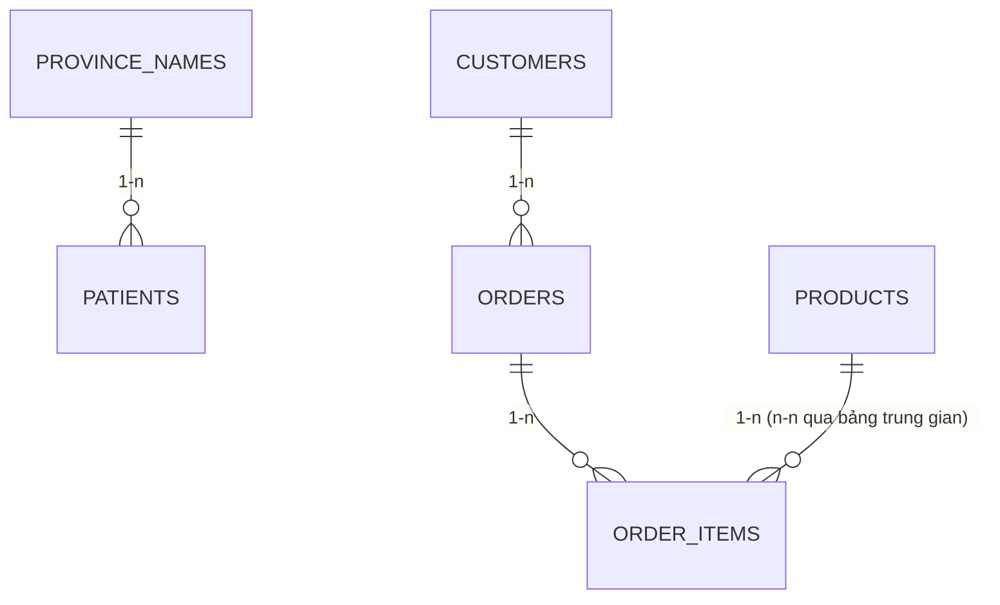

# Bài 1: Cơ sở dữ liệu cơ bản

## Mục tiêu bài học

Sau bài này, học viên có thể:

- Giải thích **database** là gì và phân biệt **structured / semi-structured / unstructured data**
- Nêu lý do dùng database thay cho hệ thống file
- Phân biệt **Relational database (SQL)** và **Document database (NoSQL)** — biết khi nào dùng cái nào
- Mô tả các thành phần của relational database: **table, Primary Key, Foreign Key**, quan hệ **1-1, 1-n, n-n**
- Giải thích vai trò của **DBMS**
- Viết được các câu lệnh **SQL cơ bản**: `SELECT`, `INSERT`, `UPDATE`, `DELETE` và `JOIN` nối bảng
- Nhận biết mối liên hệ giữa **bảng quan hệ** và **ORM / document model** sẽ học ở các bài sau

## Điều kiện tiên quyết

- Biết khái niệm **dữ liệu** và **ứng dụng** ở mức tổng quan
- Đã quen thao tác file/thư mục trên máy tính
- *(Khuyến khích)* Đã cài sẵn một công cụ chạy thử SQL: **SQLite**, **MySQL** hoặc dùng web [sql-practice.com](https://www.sql-practice.com/)

> **Ghi chú:** Đây là **bài nền tảng cơ sở dữ liệu**. Toàn bộ Module 3 ("Cơ sở dữ liệu và ORM") sẽ tập trung vào **MongoDB (NoSQL)** từ Bài 2 trở đi — nhưng các khái niệm table / khóa / quan hệ ở bài này là nền để so sánh và hiểu vì sao NoSQL ra đời.

### Thời lượng gợi ý

| Phần | Thời gian |
|------|-----------|
| Lý thuyết §1–5 | ~35 phút |
| SQL cơ bản §6 (có demo) | ~35 phút |
| Thực hành §6.7 + bài tập | ~20 phút |

## Nội dung

| # | Chủ đề |
|---|--------|
| 1 | Database là gì? |
| 2 | Tại sao phải dùng database |
| 3 | Các loại database (SQL vs NoSQL) |
| 4 | Thành phần của relational database |
| 5 | DBMS |
| 6 | Câu lệnh SQL cơ bản |
| 7 | Bắc cầu sang ORM & MongoDB |
| 8 | Lỗi thường gặp |
| Phụ lục | Demo SQL · Bài tập · Câu hỏi ôn tập · Liên kết tham khảo |

---

## 1. Database là gì?

- **Database (cơ sở dữ liệu)** là một **tập hợp dữ liệu có cấu trúc và liên quan với nhau**, được tổ chức để dễ truy xuất, quản lý và cập nhật.
- Dữ liệu trong thực tế có nhiều mức độ "cấu trúc" khác nhau:

| Loại dữ liệu | Đặc điểm | Ví dụ |
|--------------|----------|-------|
| **Structured** | Có schema rõ ràng (hàng/cột) | Danh sách hóa đơn, danh sách học viên, thông tin tài khoản ngân hàng |
| **Semi-structured** | Có cấu trúc nhưng linh hoạt (key–value, lồng nhau) | JSON, XML, log sự kiện |
| **Unstructured** | Không có schema cố định | Nội dung email, file Word, chat, slide, hình ảnh |

> **Ẩn dụ:** Database giống một **tủ hồ sơ thông minh** — không chỉ cất dữ liệu, mà còn biết cách sắp xếp, tìm kiếm và kiểm soát ai được xem/sửa.

---

## 2. Tại sao phải dùng database

### 2.1. Trước khi có database: quản lý bằng file

Dữ liệu từng được lưu trong các **hệ thống quản lý file** (file Excel, file text rời rạc). Cách này bộc lộ nhiều nhược điểm:

| Nhược điểm | Giải thích |
|------------|------------|
| **Không nhất quán** | Mỗi hệ điều hành / phần mềm quản lý file theo cách khác nhau |
| **Tốn bộ nhớ** | Mỗi file mang theo header/metadata riêng |
| **Khó tìm kiếm** | Tìm 1 chuỗi trong 1000 file ở 100 thư mục rất chậm |
| **Khó truy cập đồng thời** | Nhiều người sửa cùng lúc dễ ghi đè, mất dữ liệu |
| **Thiếu ràng buộc** | Không bắt buộc các file cùng format, dễ sai lệch dữ liệu |

### 2.2. Database ra đời để khắc phục

- Database **tập trung quản lý dữ liệu hiệu quả** mà người dùng **không cần quan tâm cách lưu trữ vật lý**.
- Hỗ trợ tìm kiếm nhanh (nhờ **index**), truy cập đồng thời an toàn, và ràng buộc toàn vẹn dữ liệu.

> **Ví dụ — thư viện lớn:**
> - **Cách cũ:** thông tin sách nằm rải rác trong nhiều file Excel ở nhiều máy. Tìm cuốn "Harry Potter" phải mở từng file; mỗi lần cập nhật phải đồng bộ thủ công nhiều máy → chậm, dễ sai.
> - **Dùng database:** mọi máy truy vấn vào **một nguồn dữ liệu chung**. Thủ thư tìm/cập nhật một chỗ, tất cả máy thấy ngay.

---

## 3. Các loại database (SQL vs NoSQL)

Database được phân loại theo **cách lưu trữ và truy xuất dữ liệu**. Hai nhóm phổ biến nhất trong phát triển ứng dụng web:

### 3.1. Relational database (SQL)

- Chia dữ liệu thành các **bảng (table)** gồm **dòng (row)** và **cột (column)**.
- Mỗi **dòng** = thông tin của 1 đối tượng; mỗi **cột** = 1 thuộc tính.
- Phù hợp hệ thống có **dữ liệu quan hệ chặt chẽ**.

| Ứng dụng tiêu biểu | Dữ liệu liên quan |
|--------------------|-------------------|
| Hệ thống ngân hàng | tài khoản, giao dịch, thẻ |
| Thương mại điện tử | khách hàng, đơn hàng, sản phẩm, thanh toán |
| Quản lý nhân sự | nhân viên, bảng lương, chấm công |

DBMS tiêu biểu: **MySQL, PostgreSQL, Oracle, SQL Server, SQLite**.

### 3.2. Document database (NoSQL)

- Thuộc nhóm **NoSQL**, lưu dữ liệu **bán cấu trúc** dạng **JSON / BSON / XML**.
- **Linh hoạt** hơn relational khi cấu trúc dữ liệu thường xuyên thay đổi; tốc độ đọc/ghi nhanh.
- Ứng dụng: nền tảng live-stream, CMS (1 bài báo = 1 document), IoT.

DBMS tiêu biểu: **MongoDB, Couchbase, Apache CouchDB**.

### 3.3. So sánh nhanh SQL vs NoSQL

| Tiêu chí | Relational (SQL) | Document (NoSQL) |
|----------|------------------|------------------|
| **Cấu trúc** | Schema cố định (bảng/cột) | Schema linh hoạt (document) |
| **Quan hệ** | JOIN qua khóa ngoại | Nhúng (embed) hoặc tham chiếu |
| **Mở rộng** | Thường scale dọc (mạnh máy) | Dễ scale ngang (nhiều node) |
| **Toàn vẹn** | Ràng buộc mạnh (ACID) | Linh hoạt hơn (BASE) |
| **Phù hợp** | Dữ liệu quan hệ chặt, giao dịch | Dữ liệu đa dạng, thay đổi nhanh |

> **Định hướng module:** Từ **Bài 2** trở đi ta đi sâu vào **MongoDB (document NoSQL)**. Hiểu rõ mô hình quan hệ ở bài này giúp bạn nhận ra **khi nào nên nhúng, khi nào nên tham chiếu** trong MongoDB (Bài 5).

---

## 4. Thành phần của relational database

### 4.1. Table, Row, Column

Ví dụ bảng `patients` (bệnh nhân):

| patient_id | first_name | last_name | gender | city | province_id | height |
|------------|------------|-----------|--------|------|-------------|--------|
| 1 | Donald | Waterfield | M | Barrie | ON | 156 |
| 2 | Mickey | Baasha | M | Dundas | ON | 185 |
| 3 | Jiji | Sharma | M | Hamilton | ON | 171 |

- Mỗi **dòng** là một bệnh nhân; mỗi **cột** là một thuộc tính.
- Mỗi cột có **kiểu dữ liệu (data type)** xác định:

| Kiểu | Ý nghĩa | Ví dụ |
|------|---------|-------|
| `INT` / `BIGINT` | Số nguyên | `patient_id` |
| `VARCHAR(n)` | Chuỗi độ dài tối đa n | `first_name` |
| `DATE` / `DATETIME` | Ngày, giờ | `birth_date` |
| `DECIMAL(p,s)` | Số thập phân chính xác (tiền tệ) | `price` |
| `BOOLEAN` | Đúng/sai | `is_active` |

### 4.2. Khóa chính (Primary Key — PK)

- **Mỗi bảng chỉ có DUY NHẤT một Primary Key** — dùng để nhận diện duy nhất từng dòng.
- PK có thể gồm **1 cột** hoặc **nhiều cột** (gọi là **khóa kết hợp / composite key**).
- Giá trị PK phải **duy nhất** và **không được NULL** (`NOT NULL`).
- Có thể là số (thường dùng, ví dụ `patient_id`) hoặc chuỗi.

> **Sửa lỗi hiểu sai phổ biến:** "Một bảng có nhiều khóa chính" là **SAI**. Đúng là: một bảng có **một** PK, và PK đó **có thể được tạo từ nhiều cột**.

### 4.3. Khóa ngoại (Foreign Key — FK)

- FK là cột (hoặc nhóm cột) trong bảng này **tham chiếu tới PK của bảng khác**.
- Vai trò chính: **đảm bảo toàn vẹn tham chiếu (referential integrity)** — giá trị FK phải tồn tại ở bảng được tham chiếu (bảng cha).
- Nhờ FK, ta **không phải lưu lặp lại** toàn bộ thông tin của bảng cha (đây là kết quả của việc **chuẩn hóa — normalization**).

> **Ví dụ:** Bảng `patients` có cột `province_id` là FK trỏ tới PK `province_id` của bảng `province_names`. Mỗi bệnh nhân chỉ lưu **mã tỉnh**, không cần lưu lại cả tên tỉnh.

### 4.4. Quan hệ giữa các bảng (relationships)

| Quan hệ | Mô tả | Ví dụ | Cách hiện thực |
|---------|-------|-------|----------------|
| **1-1** (One-to-One) | 1 dòng bảng A ↔ đúng 1 dòng bảng B | 1 công dân có 1 CCCD | FK + ràng buộc `UNIQUE` |
| **1-n** (One-to-Many) | 1 dòng bảng A ↔ nhiều dòng bảng B | 1 khách hàng có nhiều đơn hàng | FK đặt ở bảng "nhiều" (đơn hàng giữ `customer_id`) |
| **n-n** (Many-to-Many) | nhiều ↔ nhiều | 1 khách mua nhiều sản phẩm; 1 sản phẩm bán cho nhiều khách | **Bảng trung gian (junction table)** chứa 2 FK |

> **Lưu ý quan trọng:** Quan hệ **n-n không thể** hiện thực bằng 1 FK đơn giản. Phải tạo **bảng trung gian** (ví dụ `order_items` chứa `order_id` + `product_id`). Đây là điểm người mới hay nhầm.



### 4.5. Ràng buộc dữ liệu (Constraints)

**Constraint** là các quy tắc gắn vào cột/bảng để **DBMS tự động kiểm tra** tính hợp lệ của dữ liệu — giúp dữ liệu luôn đúng ngay từ tầng database, không phụ thuộc hoàn toàn vào code ứng dụng.

| Constraint | Ý nghĩa | Ví dụ |
|------------|---------|-------|
| `PRIMARY KEY` | Định danh duy nhất từng dòng (= `NOT NULL` + `UNIQUE`) | `patient_id` |
| `NOT NULL` | Bắt buộc phải có giá trị | `first_name NOT NULL` |
| `UNIQUE` | Không được trùng giá trị | `email UNIQUE` |
| `DEFAULT` | Giá trị mặc định nếu không truyền | `is_active BOOLEAN DEFAULT TRUE` |
| `CHECK` | Điều kiện giá trị hợp lệ | `CHECK (height > 0)` |
| `FOREIGN KEY` | Tham chiếu PK bảng khác (toàn vẹn tham chiếu) | `province_id` |
| `AUTO_INCREMENT` *(MySQL)* | Tự sinh số tăng dần cho PK | `id INT AUTO_INCREMENT` |

**Ví dụ `CREATE TABLE` đầy đủ ràng buộc (MySQL):**

```sql
CREATE TABLE patients (
    patient_id  INT          NOT NULL AUTO_INCREMENT,
    first_name  VARCHAR(30)  NOT NULL,
    last_name   VARCHAR(30)  NOT NULL,
    gender      CHAR(1)      NOT NULL,
    email       VARCHAR(100) UNIQUE,
    city        VARCHAR(30),
    province_id VARCHAR(2),
    height      INT,
    weight      INT,
    is_active   BOOLEAN      DEFAULT TRUE,
    PRIMARY KEY (patient_id),
    CONSTRAINT chk_height CHECK (height > 0),
    CONSTRAINT fk_province FOREIGN KEY (province_id)
        REFERENCES province_names (province_id)
);
```

> **Vì sao quan trọng với lập trình viên:** Ràng buộc ở DB là "lưới an toàn" cuối cùng. Dù code ứng dụng có bug, DB vẫn từ chối dữ liệu sai (vd `height = -5` bị `CHECK` chặn). Nhưng đừng dựa **hoàn toàn** vào DB — vẫn nên validate ở tầng ứng dụng để báo lỗi thân thiện cho người dùng.

---

## 5. DBMS

- **DBMS (Database Management System — hệ quản trị cơ sở dữ liệu)** là phần mềm đóng vai trò **cầu nối giữa người dùng/ứng dụng và dữ liệu lưu trữ**.
- Chức năng chính:
  - Tạo và quản lý dữ liệu (thêm/sửa/xóa/sao lưu/phục hồi)
  - **Bảo mật** và **kiểm soát quyền truy cập**
  - Đảm bảo **toàn vẹn** và **đồng thời** (concurrency)

| DBMS | Loại | Điểm nổi bật |
|------|------|--------------|
| **MySQL** | Relational | Mã nguồn mở, phổ biến, dễ dùng |
| **PostgreSQL** | Relational | Nhiều tính năng nâng cao, hiệu suất cao |
| **SQLite** | Relational | Nhỏ gọn, nhúng trong app/mobile, không cần server |
| **Oracle / SQL Server** | Relational | Doanh nghiệp lớn |
| **MongoDB** | Document (NoSQL) | Tiêu biểu NoSQL — **trọng tâm Module 3** |

---

## 6. Câu lệnh SQL cơ bản

### 6.0. Phân nhóm lệnh SQL

| Nhóm | Tên | Lệnh tiêu biểu | Vai trò |
|------|-----|----------------|---------|
| **DDL** | Data Definition | `CREATE`, `ALTER`, `DROP` | Định nghĩa cấu trúc bảng |
| **DML** | Data Manipulation | `SELECT`, `INSERT`, `UPDATE`, `DELETE` | Thao tác dữ liệu |
| **DCL** | Data Control | `GRANT`, `REVOKE` | Phân quyền |
| **TCL** | Transaction Control | `COMMIT`, `ROLLBACK` | Quản lý giao dịch |

> Bài này tập trung **DML** (4 lệnh CRUD) + giới thiệu nhanh **DDL** (`CREATE TABLE`) để biết bảng `patients` từ đâu ra. Phần demo (Phụ lục) có đầy đủ script DDL.

### 6.1. Dữ liệu mẫu

Sử dụng 2 bảng (nguồn: [sql-practice.com](https://www.sql-practice.com/)):

- `patients(patient_id, first_name, last_name, gender, birth_date, city, province_id, allergies, height, weight)`
- `province_names(province_id, province_name)` — `patients.province_id` là **FK** tới `province_names.province_id`.

> **Lưu ý cú pháp:** SQL chỉ chấp nhận **dấu nháy thẳng** `'...'` cho chuỗi. Khi copy từ tài liệu, tránh dấu nháy cong (`’ ’`) vì sẽ gây lỗi syntax.

### 6.2. SELECT — truy vấn dữ liệu

**Cú pháp (thứ tự mệnh đề rất quan trọng):**

```sql
SELECT   <danh sách cột>
FROM     <tên bảng>
WHERE    <điều kiện>
ORDER BY <cột> [ASC | DESC]
LIMIT    <số lượng>
OFFSET   <vị trí bắt đầu>;
```

**Toán tử trong điều kiện:**

| Nhóm | Toán tử | Ý nghĩa |
|------|---------|---------|
| So sánh | `=`, `<>` (hoặc `!=`), `>`, `>=`, `<`, `<=` | Bằng / khác / lớn hơn / nhỏ hơn... |
| Chuỗi & tập hợp | `LIKE`, `IN`, `BETWEEN` | So khớp mẫu / thuộc danh sách / trong khoảng |
| NULL | `IS NULL`, `IS NOT NULL` | Có / không có giá trị |
| Luận lý | `AND`, `OR`, `NOT` | Kết hợp / phủ định điều kiện |

**Ví dụ cơ bản:**

```sql
-- Tất cả cột
SELECT * FROM patients;

-- Chọn vài cột
SELECT first_name, last_name, gender FROM patients;

-- Một điều kiện
SELECT first_name, last_name FROM patients
WHERE first_name = 'Rick';

-- Nhiều điều kiện
SELECT first_name, last_name FROM patients
WHERE first_name = 'Rick' AND last_name = 'Bennett';

-- Sắp xếp + giới hạn
SELECT first_name, weight FROM patients
ORDER BY weight DESC
LIMIT 10;
```

**Ví dụ cho từng toán tử:**

*Nhóm so sánh:*

```sql
-- = : bằng đúng giá trị
SELECT first_name, last_name FROM patients
WHERE first_name = 'Rick';

-- <> (hoặc !=) : khác giá trị
SELECT first_name, gender FROM patients
WHERE gender <> 'M';

-- > : lớn hơn
SELECT first_name, height FROM patients
WHERE height > 180;

-- >= : lớn hơn hoặc bằng
SELECT first_name, weight FROM patients
WHERE weight >= 70;

-- < : nhỏ hơn
SELECT first_name, height FROM patients
WHERE height < 150;

-- <= : nhỏ hơn hoặc bằng
SELECT first_name, weight FROM patients
WHERE weight <= 50;
```

*Nhóm chuỗi & tập hợp:*

```sql
-- LIKE với % : khớp chuỗi con bất kỳ (tên CHỨA 'ick')
SELECT first_name FROM patients
WHERE first_name LIKE '%ick%';

-- LIKE với % ở cuối : bắt đầu bằng 'Ja'
SELECT first_name FROM patients
WHERE first_name LIKE 'Ja%';

-- LIKE với _ : đúng 1 ký tự bất kỳ ở vị trí đó (vd 'R_ck' khớp 'Rick', 'Rock')
SELECT first_name FROM patients
WHERE first_name LIKE 'R_ck';

-- IN : thuộc một trong các giá trị liệt kê
SELECT first_name, province_id FROM patients
WHERE province_id IN ('ON', 'QC', 'BC');

-- NOT IN : KHÔNG thuộc danh sách
SELECT first_name, province_id FROM patients
WHERE province_id NOT IN ('ON', 'QC');

-- BETWEEN : trong khoảng (bao gồm 2 đầu mút) — height từ 150 đến 180
SELECT first_name, height FROM patients
WHERE height BETWEEN 150 AND 180;

-- NOT BETWEEN : ngoài khoảng
SELECT first_name, height FROM patients
WHERE height NOT BETWEEN 150 AND 180;
```

*Nhóm NULL:*

```sql
-- IS NULL : bệnh nhân CHƯA khai dị ứng (allergies rỗng)
SELECT first_name, allergies FROM patients
WHERE allergies IS NULL;

-- IS NOT NULL : bệnh nhân CÓ ghi dị ứng
SELECT first_name, allergies FROM patients
WHERE allergies IS NOT NULL;
```

*Nhóm luận lý:*

```sql
-- AND : cả hai điều kiện cùng đúng
SELECT first_name, last_name FROM patients
WHERE first_name = 'Rick' AND last_name = 'Bennett';

-- OR : chỉ cần một điều kiện đúng
SELECT first_name, city FROM patients
WHERE city = 'Toronto' OR city = 'Hamilton';

-- NOT : phủ định điều kiện (không phải nam giới)
SELECT first_name, gender FROM patients
WHERE NOT gender = 'M';

-- Kết hợp AND + OR (dùng ngoặc để rõ thứ tự ưu tiên)
SELECT first_name, gender, city FROM patients
WHERE gender = 'F' AND (city = 'Toronto' OR city = 'Ajax');
```

*Kết hợp với sắp xếp & giới hạn:*

```sql
-- Sắp xếp giảm dần theo cân nặng, lấy 10 dòng đầu
SELECT first_name, weight FROM patients
ORDER BY weight DESC
LIMIT 10;
```

> **Bẫy với NULL:** Không dùng `=` với NULL. `WHERE allergies = NULL` **luôn trả về rỗng**; phải viết `WHERE allergies IS NULL`.

### 6.3. DISTINCT — loại bỏ giá trị trùng

```sql
-- Liệt kê các mã tỉnh khác nhau (không lặp)
SELECT DISTINCT province_id FROM patients;

-- Các thành phố khác nhau, sắp xếp A→Z
SELECT DISTINCT city FROM patients ORDER BY city;
```

### 6.4. Hàm tổng hợp + GROUP BY / HAVING

**Hàm tổng hợp (aggregate functions)** tính toán trên một nhóm dòng và trả về **một giá trị**:

| Hàm | Ý nghĩa |
|-----|---------|
| `COUNT(*)` / `COUNT(cột)` | Đếm số dòng |
| `SUM(cột)` | Tổng |
| `AVG(cột)` | Trung bình |
| `MIN(cột)` / `MAX(cột)` | Nhỏ nhất / lớn nhất |

```sql
-- Tổng số bệnh nhân
SELECT COUNT(*) AS tong_so FROM patients;

-- Chiều cao trung bình, cao nhất, thấp nhất
SELECT AVG(height) AS tb, MAX(height) AS cao_nhat, MIN(height) AS thap_nhat
FROM patients;
```

**`GROUP BY`** gom các dòng cùng giá trị thành nhóm để áp dụng hàm tổng hợp cho từng nhóm:

```sql
-- Đếm số bệnh nhân theo từng tỉnh
SELECT province_id, COUNT(*) AS so_benh_nhan
FROM patients
GROUP BY province_id;

-- Chiều cao trung bình theo giới tính
SELECT gender, AVG(height) AS chieu_cao_tb
FROM patients
GROUP BY gender;
```

**`HAVING`** lọc **sau khi gom nhóm** (khác `WHERE` lọc **trước** khi gom):

```sql
-- Chỉ lấy các tỉnh có nhiều hơn 1 bệnh nhân
SELECT province_id, COUNT(*) AS so_benh_nhan
FROM patients
GROUP BY province_id
HAVING COUNT(*) > 1;
```

> **`WHERE` vs `HAVING` (hay bị hỏi):**
> - `WHERE` lọc **từng dòng** trước khi gom nhóm — **không** dùng được hàm tổng hợp.
> - `HAVING` lọc **từng nhóm** sau khi `GROUP BY` — dùng được hàm tổng hợp như `COUNT()`, `SUM()`.
>
> Thứ tự xử lý: `FROM` → `WHERE` → `GROUP BY` → `HAVING` → `SELECT` → `ORDER BY` → `LIMIT`.

### 6.5. Subquery — truy vấn con

**Subquery** là một câu `SELECT` lồng bên trong câu lệnh khác.

```sql
-- Bệnh nhân cao hơn chiều cao trung bình (subquery trả 1 giá trị)
SELECT first_name, last_name, height
FROM patients
WHERE height > (SELECT AVG(height) FROM patients);

-- Bệnh nhân sống ở tỉnh Ontario (subquery trả danh sách dùng với IN)
SELECT first_name, last_name
FROM patients
WHERE province_id IN (
    SELECT province_id FROM province_names WHERE province_name = 'Ontario'
);
```

> Nhiều truy vấn `IN (subquery)` có thể viết lại bằng `JOIN` (thường nhanh hơn). Subquery hữu ích khi cần so sánh với một **giá trị tính toán** (như `AVG`) mà JOIN khó diễn đạt.

### 6.6. JOIN — nối nhiều bảng

- **Mục đích:** lấy thông tin nằm ở nhiều bảng trong một truy vấn.
- **Điều kiện:** các bảng phải có cột chung làm liên kết (thường là **FK ↔ PK**).

**Cú pháp đúng — `JOIN ... ON` đặt TRƯỚC `WHERE`:**

```sql
SELECT   <danh sách cột>
FROM     <bảng 1>
JOIN     <bảng 2> ON <bảng 1>.<khóa> = <bảng 2>.<khóa>
WHERE    <điều kiện>
ORDER BY <cột>;
```

> **Sửa lỗi cú pháp:** Một số tài liệu viết `WHERE` trước `JOIN` — đó là **SAI** và sẽ lỗi syntax. Mệnh đề `JOIN ... ON` luôn đứng ngay sau `FROM`, còn `WHERE` đứng sau.

**Ví dụ — hiển thị kèm tên tỉnh từ bảng khác:**

```sql
SELECT patients.patient_id, patients.first_name,
       patients.city, patients.province_id,
       province_names.province_name
FROM patients
JOIN province_names
  ON patients.province_id = province_names.province_id;
```

> **Lưu ý:** Vì cả 2 bảng đều có cột `province_id`, phải ghi rõ **tên bảng + tên cột** (`patients.province_id`) để tránh nhập nhằng. Có thể dùng **alias** cho gọn: `FROM patients p JOIN province_names pn ON p.province_id = pn.province_id`.

**Một số kiểu JOIN:**

| Kiểu | Lấy gì |
|------|--------|
| `INNER JOIN` | Chỉ các dòng khớp ở **cả hai** bảng (mặc định) |
| `LEFT JOIN` | Tất cả dòng bảng trái + dòng khớp bên phải (không khớp → NULL) |
| `RIGHT JOIN` | Tất cả dòng bảng phải + dòng khớp bên trái |
| `FULL JOIN` | Tất cả dòng cả hai bảng |

> **Lưu ý:** MySQL hỗ trợ `INNER`, `LEFT`, `RIGHT` JOIN nhưng **không có `FULL JOIN`** (phải mô phỏng bằng `UNION` của `LEFT` + `RIGHT`). SQLite chỉ hỗ trợ `RIGHT/FULL JOIN` từ phiên bản 3.39 trở lên.

### 6.7. INSERT — thêm dữ liệu

```sql
INSERT INTO patients (first_name, last_name, gender, city, province_id)
VALUES ('Maria', 'Nguyen', 'F', 'Toronto', 'ON');
```

### 6.8. UPDATE — sửa dữ liệu

```sql
UPDATE patients
SET last_name = 'Trump'
WHERE first_name = 'Donald';
```

> ⚠️ **CẢNH BÁO:** Quên mệnh đề `WHERE` sẽ **cập nhật TOÀN BỘ các dòng** trong bảng! Luôn kiểm tra `WHERE` trước khi chạy `UPDATE`.

### 6.9. DELETE — xóa dữ liệu

```sql
DELETE FROM patients
WHERE first_name = 'Donald';
```

> ⚠️ **CẢNH BÁO:** `DELETE FROM patients;` (không có `WHERE`) sẽ **xóa SẠCH bảng**. Mẹo an toàn: chạy `SELECT` với cùng điều kiện trước để xem mình sắp tác động lên những dòng nào.

### 6.10. Thực hành

Viết câu `SELECT` cho từng yêu cầu (đáp án ở [Phụ lục](#bài-tập)):

1. Tìm tất cả các dòng có `gender` là `'M'`
2. Tìm tất cả các dòng có `height` lớn hơn 100
3. Tìm 10 dòng có `first_name` là `'John'` và `city` là `'Toronto'`, sắp xếp theo `weight`
4. Tìm tất cả phụ nữ (`gender = 'F'`) đang sống ở thành phố `'Ajax'`
5. Tìm tất cả đàn ông sống ở tỉnh Ontario, hiển thị kèm cột tên tỉnh (dùng JOIN)
6. Đếm số bệnh nhân theo từng `province_id` (dùng `GROUP BY`)
7. Tìm các thành phố (`city`) có nhiều hơn 1 bệnh nhân (dùng `GROUP BY` + `HAVING`)
8. Tìm các bệnh nhân có `weight` lớn hơn cân nặng trung bình của toàn bảng (dùng subquery)

---

## 7. Bắc cầu sang ORM & MongoDB

Bài này là nền cho phần còn lại của Module 3:

| Khái niệm SQL (bài này) | Tương ứng MongoDB (Bài 2–5) | Tương ứng ORM/JPA |
|-------------------------|-----------------------------|-------------------|
| Table | Collection | Entity / `@Document` |
| Row | Document (JSON/BSON) | Object Java |
| Column | Field | Thuộc tính class |
| Primary Key | `_id` | `@Id` |
| Foreign Key + JOIN | Embed (nhúng) **hoặc** Reference (`$lookup`) | Quan hệ `@DBRef` / mapping |

> **Câu hỏi dẫn dắt cho Bài 5:** Khi nào nên **nhúng** dữ liệu liên quan vào cùng document (đọc nhanh, dữ liệu đi cùng nhau) và khi nào nên **tham chiếu** như FK (tránh trùng lặp, dữ liệu lớn/độc lập)? Hiểu quan hệ 1-1/1-n/n-n ở bài này chính là chìa khóa.

---

## 8. Lỗi thường gặp

| Triệu chứng | Nguyên nhân | Cách xử lý |
|-------------|-------------|------------|
| `syntax error near 'WHERE'` khi JOIN | Đặt `WHERE` trước `JOIN` | Đưa `JOIN ... ON` lên ngay sau `FROM` |
| Lỗi chuỗi không hợp lệ | Dùng dấu nháy cong `’ ’` | Thay bằng nháy thẳng `' '` |
| `ambiguous column name` | Cột trùng tên ở 2 bảng khi JOIN | Ghi rõ `tên_bảng.tên_cột` hoặc dùng alias |
| Cập nhật/xóa nhầm toàn bảng | Quên `WHERE` | Luôn `SELECT` thử điều kiện trước |
| `FOREIGN KEY constraint failed` | Chèn FK trỏ tới giá trị không tồn tại | Tạo dòng ở bảng cha trước |
| Không phân biệt `=` và `==` | SQL dùng `=` để so sánh | Dùng `=` (một dấu bằng) |

---

## Tóm tắt

| Khái niệm | Ý chính |
|-----------|---------|
| **Database** | Tập hợp dữ liệu có cấu trúc, liên quan; thay thế quản lý bằng file |
| **SQL vs NoSQL** | Quan hệ (bảng, schema cứng) vs Document (JSON, schema mềm) |
| **PK** | Duy nhất 1/bảng, `NOT NULL`, có thể gồm nhiều cột |
| **FK** | Tham chiếu PK bảng khác — đảm bảo toàn vẹn tham chiếu |
| **Quan hệ** | 1-1, 1-n (FK ở bảng "nhiều"), n-n (bảng trung gian) |
| **Constraints** | `NOT NULL`, `UNIQUE`, `DEFAULT`, `CHECK`, `FOREIGN KEY` — DB tự kiểm tra |
| **DBMS** | Cầu nối ứng dụng ↔ dữ liệu; MySQL, PostgreSQL, MongoDB... |
| **SQL CRUD** | `SELECT` / `INSERT` / `UPDATE` / `DELETE`; JOIN nối bảng |
| **Aggregate + GROUP BY** | `COUNT/SUM/AVG/MIN/MAX`; `HAVING` lọc sau gom nhóm |
| **Subquery** | `SELECT` lồng trong câu lệnh khác |
| **WHERE** | Bắt buộc cân nhắc khi `UPDATE`/`DELETE`; dùng `IS NULL` (không `= NULL`) |

**Chuẩn bị cho Bài 2:** Tìm hiểu **NoSQL & MongoDB** — vì sao mô hình document linh hoạt hơn bảng quan hệ, và cài đặt MongoDB + `mongosh`.

---

## Phụ lục

### Demo SQL

Toàn bộ script chạy được nằm trong [`demo-bai1-basic-database/`](../../demo-bai1-basic-database/):

| File | Nội dung |
|------|----------|
| `schema.sql` | `CREATE TABLE` cho `province_names`, `patients` (kèm PK, FK) |
| `seed.sql` | Dữ liệu mẫu |
| `queries.sql` | Ví dụ SELECT/JOIN/INSERT/UPDATE/DELETE trong bài |
| `aggregate.sql` | Ví dụ DISTINCT / hàm tổng hợp / GROUP BY / HAVING / subquery (§6.3–6.5) |
| `exercises.sql` | **Đáp án** 8 câu thực hành §6.10 |

> **Thực hành trên MySQL:** `schema.sql` viết theo cú pháp MySQL (`AUTO_INCREMENT`, `CHECK`, `ENGINE=InnoDB`). Có thể chạy nhanh không cần cài đặt bằng web [sql-practice.com](https://www.sql-practice.com/) — chọn chế độ **MySQL**, bộ dữ liệu `patients`/`province_names` có sẵn.

Chạy bằng MySQL (local hoặc Docker):

```bash
cd demo-bai1-basic-database
mysql -u root -p -e "CREATE DATABASE IF NOT EXISTS demo_bai1;"
mysql -u root -p demo_bai1 < schema.sql
mysql -u root -p demo_bai1 < seed.sql
mysql -u root -p demo_bai1 < queries.sql
mysql -u root -p demo_bai1 < aggregate.sql
```

### Bài tập

**Đáp án phần thực hành §6.10:**

<details>
<summary>Xem đáp án</summary>

```sql
-- 1.
SELECT * FROM patients WHERE gender = 'M';

-- 2.
SELECT * FROM patients WHERE height > 100;

-- 3.
SELECT * FROM patients
WHERE first_name = 'John' AND city = 'Toronto'
ORDER BY weight
LIMIT 10;

-- 4.
SELECT * FROM patients
WHERE gender = 'F' AND city = 'Ajax';

-- 5.
SELECT p.first_name, p.last_name, pn.province_name
FROM patients p
JOIN province_names pn ON p.province_id = pn.province_id
WHERE p.gender = 'M' AND pn.province_name = 'Ontario';

-- 6.
SELECT province_id, COUNT(*) AS so_benh_nhan
FROM patients
GROUP BY province_id;

-- 7.
SELECT city, COUNT(*) AS so_benh_nhan
FROM patients
GROUP BY city
HAVING COUNT(*) > 1;

-- 8.
SELECT first_name, last_name, weight
FROM patients
WHERE weight > (SELECT AVG(weight) FROM patients);
```

</details>

**Bài tập thêm:**

1. Viết câu lệnh `CREATE TABLE` cho bảng `orders` có quan hệ 1-n với `customers`.
2. Thiết kế bảng trung gian cho quan hệ n-n giữa `products` và `orders`.
3. Viết `UPDATE` tăng `height` thêm 1 cho mọi bệnh nhân ở thành phố `'Hamilton'` — kiểm tra `WHERE` cẩn thận.

### Câu hỏi ôn tập

1. Database khác hệ thống file ở những điểm nào?
2. Phân biệt structured / semi-structured / unstructured data.
3. Khi nào nên chọn SQL, khi nào nên chọn NoSQL?
4. Một bảng có thể có bao nhiêu Primary Key? PK gồm nhiều cột gọi là gì?
5. Vai trò chính của Foreign Key là gì?
6. Quan hệ n-n được hiện thực như thế nào trong relational database?
7. Vì sao thứ tự `JOIN` và `WHERE` lại quan trọng?
8. Điều gì xảy ra nếu chạy `UPDATE`/`DELETE` mà quên `WHERE`?
9. Phân biệt `WHERE` và `HAVING`. Khi nào bắt buộc dùng `HAVING`?
10. Kể tên 4 hàm tổng hợp và cho biết `GROUP BY` dùng để làm gì.
11. `CHECK` và `UNIQUE` constraint khác nhau ở điểm nào?
12. Vì sao `WHERE allergies = NULL` không trả về kết quả? Viết lại cho đúng.

### Liên kết tham khảo

- [15 Types of Databases — AlgoMaster](https://blog.algomaster.io/p/15-types-of-databases)
- [SQL Practice (dữ liệu patients)](https://www.sql-practice.com/)
- [SQL SELECT Query — TutorialsPoint](https://www.tutorialspoint.com/sql/sql-select-query.htm)
- [SQL Joins — TutorialsPoint](https://www.tutorialspoint.com/sql/sql-using-joins.htm)
- [SQL Operators — GeeksforGeeks](https://www.geeksforgeeks.org/sql/sql-operators/)
- [MongoDB — chuẩn bị cho Bài 2](https://www.mongodb.com/docs/manual/)
