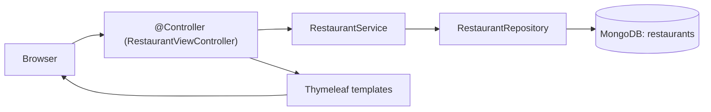

# Bài 4: Spring Boot & MongoDB (2) — Giao diện Thymeleaf: Import, Phân trang, Sắp xếp, Chỉnh sửa

## Mục tiêu bài học

Sau bài này, học viên có thể:

- Quản lý dữ liệu MongoDB **qua giao diện web** (Thymeleaf) thay vì chỉ qua API
- Tách **Model** và **DTO**; Service chuyển Model ↔ DTO trước khi trả Controller
- Dùng **thuần `@Controller`** (không `@RestController`) cho toàn bộ ứng dụng web
- **Import dữ liệu từ file** (định dạng **NDJSON** — mỗi dòng 1 object) và lưu theo **batch**
- Cấu hình giới hạn kích thước file upload (`spring.servlet.multipart.*`)
- Ánh xạ **document lồng nhau** (`RestaurantModel` → `AddressModel`, `List<GradeModel>`) với `@Field`, `@JsonProperty`, `@JsonIgnoreProperties`
- Hiển thị danh sách + **phân trang** (`Page`/`Pageable`/`PageRequest`) + **sắp xếp** (`Sort`)
- Xây trang **xem & chỉnh sửa** chi tiết, áp dụng **Post-Redirect-Get (PRG)**
- Phân biệt **`_id`** (MongoDB) và **`restaurant_id`** (id nghiệp vụ)

## Điều kiện tiên quyết

- Đã hoàn thành **[Bài 3 — Spring Boot & MongoDB (1)](./java_m3_bai3_MongoDB_Spring_1.md)**: model, repository, service, `@Controller` + Thymeleaf
- Nắm Thymeleaf cơ bản (`th:each`, `th:object`, `th:field`, `th:href`) và mẫu PRG (Module 2)
- MongoDB đang chạy ở `localhost:27017`

> **Ghi chú:** Bài này dùng collection **`restaurants`** (bộ dữ liệu nhà hàng New York của w3resource).
> Thiết kế dữ liệu NoSQL (embedded vs reference) sẽ học sâu ở **Bài 5**; Aggregation/`@Query`/`MongoTemplate`
> sẽ học ở **Bài 6**. Bài 4 tập trung vào **giao diện Thymeleaf hoàn chỉnh**.

### Thời lượng gợi ý

| Phần | Thời gian |
|------|-----------|
| Cấu hình + import file §1–4 (có demo) | ~35 phút |
| Hiển thị + phân trang + sắp xếp §5–7 | ~35 phút |
| Xem & chỉnh sửa §8 | ~30 phút |
| Lỗi thường gặp + bài tập | ~15 phút |

## Nội dung

| # | Chủ đề |
|---|--------|
| 1 | Kết hợp database và giao diện |
| 2 | Cấu hình upload + trang HTML |
| 3 | Model lồng nhau (RestaurantModel/AddressModel/GradeModel) |
| 4 | Import dữ liệu từ file (NDJSON, batch) |
| 5 | Hiển thị danh sách |
| 6 | Phân trang dữ liệu |
| 7 | Sắp xếp dữ liệu |
| 8 | Xem & chỉnh sửa dữ liệu |
| 9 | Lỗi thường gặp |
| Phụ lục | Bài tập · Checklist · Liên kết |

---

## 1. Kết hợp database và giao diện

- **Mục đích:** quản lý dữ liệu trong MongoDB **thông qua trang web** (xem, thêm, sửa) thay vì
  gọi API thuần.
- **Toàn bộ controller dùng `@Controller`** — mỗi handler trả về **tên template** hoặc `redirect:`.



Các bước lập trình: (1) chỉnh `application.properties` → (2) tạo HTML template → (3) model →
(4) repository → (5) service → (6) controller.

### 1.1. Cấu trúc package (gợi ý)

Bài 4 **chỉ có giao diện web** (Thymeleaf) nên controller để chung 1 package `controller`
(không tách `api`/`web` như Bài 3).

```
src/main/java/vn/demo/
├── DemoBai4MongoApplication.java
├── model/
│   ├── RestaurantModel.java             ← MODEL: collection "restaurants"
│   ├── AddressModel.java                ← object lồng (embedded)
│   └── GradeModel.java                  ← object lồng (embedded)
├── repository/
│   └── RestaurantRepository.java        ← REPOSITORY: truy cập MongoDB
├── service/
│   └── RestaurantService.java           ← SERVICE: import, phân trang, update
├── dto/
│   ├── RestaurantDto.java               ← DTO: hiển thị trên danh sách
│   ├── RestaurantFormDto.java           ← DTO: form chi tiết / cập nhật
│   ├── PagedResponse.java               ← DTO phân trang offset generic (enterprise)
│   ├── PageMapper.java                  ← utility: Page&lt;Model&gt; → PagedResponse&lt;Dto&gt;
│   ├── PagedListView.java               ← bọc PagedResponse + metadata UI (sort, cửa sổ trang)
│   └── ImportResultDto.java             ← DTO: kết quả import
└── controller/
    ├── HomeController.java              ← / → /restaurants
    └── RestaurantViewController.java    ← @Controller: upload/list/detail/update

src/main/resources/
├── application.properties
├── static/css/restaurants.css
└── templates/
    ├── fragments/layout.html
    └── restaurants/{upload,list,detail,not-found}.html
```

### 1.2. Nhiệm vụ cụ thể của từng tầng

| Tầng | Lớp trong bài | Nhiệm vụ cụ thể |
|------|---------------|-----------------|
| **Model (Entity)** | `RestaurantModel`, `AddressModel`, `GradeModel` | Mô tả document + các object lồng nhau; ánh xạ field ↔ thuộc tính |
| **Repository** | `RestaurantRepository` | Truy cập MongoDB; phân trang (`findAll(Pageable)`); tìm theo `restaurant_id` |
| **Service** | `RestaurantService` | Nghiệp vụ: import NDJSON, phân trang, cập nhật; **chuyển Model ↔ DTO** |
| **DTO** | `RestaurantDto`, `RestaurantFormDto`, `PagedResponse`, `PagedListView`, `ImportResultDto` | Dữ liệu gửi về Controller; entity không lộ ra ngoài Service |
| **Controller (web)** | `RestaurantViewController` | Nhận request, gọi Service, đẩy dữ liệu vào `Model`, trả tên view |
| **Controller (home)** | `HomeController` | Điều hướng `/` → `/restaurants` |

> **Quy tắc vàng:** `Controller → Service → Repository → MongoDB`. Controller không gọi thẳng
> Repository; Service không biết gì về HTTP. **Controller không làm việc trực tiếp với entity** —
> Service chuyển `RestaurantModel` sang DTO trước khi trả về.

---

## 2. Cấu hình upload + trang HTML

### 2.1. `application.properties`

```properties
spring.data.mongodb.uri=mongodb://localhost:27017/db_java_t3h_module3

# Giới hạn kích thước file upload
spring.servlet.multipart.max-file-size=20MB
spring.servlet.multipart.max-request-size=20MB

# Số dòng mỗi trang
app.restaurants.page-size=10
```

### 2.2. Trang HTML upload (`templates/restaurants/upload.html`)

```html
<!-- form gửi file lên server theo đường dẫn trong "action" -->
<form action="/restaurants/upload" method="post" enctype="multipart/form-data">
    <label for="file">Chọn file NDJSON (mỗi dòng là 1 object restaurant):</label><br/>
    <input id="file" name="file" type="file" accept=".json,.ndjson" required/><br/><br/>
    <button type="submit">Upload</button>
</form>

<div class="status" th:if="${message}">
    <h3>Status</h3>
    <p th:text="${message}"></p>
    <p th:if="${importCount != null}">Imported Count: <span th:text="${importCount}"></span></p>
</div>
```

> **Định dạng file — NDJSON (quan trọng):** Mỗi **dòng** là một object JSON độc lập
> (`{...}\n{...}`), **không** phải một mảng `[ {...}, {...} ]`. Parser của bài đọc theo từng
> dòng nên file phải đúng định dạng này. File `restaurants.json` của w3resource chính là NDJSON.

> **Xem code:** [`templates/restaurants/upload.html`](../../demo-bai4-mongodb-spring/java-springboot-bai4/src/main/resources/templates/restaurants/upload.html)

---

## 3. Model lồng nhau (RestaurantModel/AddressModel/GradeModel)

Một object restaurant có các object con (`address`, `grades`) nên ta tạo các class tương ứng.

```java
@Getter @Setter @ToString
@JsonIgnoreProperties(ignoreUnknown = true)
@Document(collection = "restaurants")
public class RestaurantModel {
    @Id
    private String id;                       // "_id" của MongoDB

    @Indexed
    @Field("restaurant_id")                  // tên field trong MongoDB
    @JsonProperty("restaurant_id")           // tên field trong file JSON
    private String restaurantId;             // id nghiệp vụ

    private String name;
    private String borough;
    private String cuisine;
    private AddressModel address;             // object lồng
    private List<GradeModel> grades;          // mảng object lồng
}
```

| Annotation | Vai trò |
|------------|---------|
| `@Field("restaurant_id")` | Map thuộc tính Java `restaurantId` ↔ field `restaurant_id` trong MongoDB |
| `@JsonProperty("restaurant_id")` | Map khi đọc JSON từ file |
| `@JsonIgnoreProperties(ignoreUnknown=true)` | Bỏ qua field thừa trong file (vd `grades[].date`) |
| `@Indexed` | Index trên `restaurant_id` để tra cứu nhanh |

> **Phân biệt 2 id:** `id` (`_id`/ObjectId, MongoDB tự sinh) **khác** `restaurantId`
> (`restaurant_id`, id nghiệp vụ có sẵn trong dữ liệu). Khi tìm theo "id" trên URL trang chi tiết,
> ta tìm theo `restaurant_id`.

> **Xem code:** [`model/RestaurantModel.java`](../../demo-bai4-mongodb-spring/java-springboot-bai4/src/main/java/vn/demo/model/RestaurantModel.java) ·
> [`AddressModel.java`](../../demo-bai4-mongodb-spring/java-springboot-bai4/src/main/java/vn/demo/model/AddressModel.java) ·
> [`GradeModel.java`](../../demo-bai4-mongodb-spring/java-springboot-bai4/src/main/java/vn/demo/model/GradeModel.java)

---

## 4. Import dữ liệu từ file (NDJSON, batch)

### 4.1. Service đọc file theo từng dòng + ghi theo batch

```java
public ImportResultDto handleImport(MultipartFile file) {
    if (file == null || file.isEmpty()) {
        return ImportResultDto.fail("Please select a JSON file to upload.");
    }
    try (BufferedReader reader = new BufferedReader(
            new InputStreamReader(file.getInputStream(), StandardCharsets.UTF_8))) {
        int count = importFromReader(reader);
        return ImportResultDto.ok(count);
    } catch (Exception e) {
        return ImportResultDto.fail("Failed to import file: " + e.getMessage());
    }
}

private int importFromReader(BufferedReader reader) throws IOException {
    int count = 0;
    List<RestaurantModel> batch = new ArrayList<>();
    String line;
    while ((line = reader.readLine()) != null) {       // duyệt từng dòng
        if (line.trim().isEmpty()) continue;           // bỏ dòng rỗng
        batch.add(parseLine(line));
        count++;
        if (batch.size() >= 500) {                     // ghi mỗi 500 document/lần
            restaurantRepository.saveAll(batch);
            batch.clear();
        }
    }
    if (!batch.isEmpty()) restaurantRepository.saveAll(batch);  // phần còn lại
    return count;
}
```

> **Tối ưu:** tái sử dụng **một** `ObjectMapper` (thread-safe) thay vì tạo mới mỗi dòng;
> ghi **batch 500** thay vì ghi từng document để giảm số lần round-trip xuống DB.

### 4.2. Controller — `@Controller`, đưa thông báo vào Model

```java
@GetMapping("/restaurants/upload")
public String showUploadPage() {
    return "restaurants/upload";          // trả TÊN template
}

@PostMapping("/restaurants/upload")
public String handleUpload(@RequestParam("file") MultipartFile file, Model model) {
    ImportResultDto result = restaurantService.handleImport(file);
    model.addAttribute("message", result.message());
    if (result.success()) model.addAttribute("importCount", result.importCount());
    return "restaurants/upload";          // trả TÊN template, KHÔNG trả chuỗi thông báo
}
```

> **Lỗi cần tránh:** với `@Controller`, nếu `return result.message()` (vd "File is uploaded...")
> thì Spring hiểu chuỗi đó là **tên view** → lỗi không tìm thấy template. Luôn đưa thông báo vào
> `Model` và trả về **tên template**.

### 4.3. Cách khác — `mongoimport`

```bash
# Tên collection phải khớp @Document(collection="restaurants")
mongoimport --db db_java_t3h_module3 --collection restaurants --file restaurants.json
```

> Tham khảo: [mongoimport](https://www.mongodb.com/docs/database-tools/mongoimport/)
>
> **Xem code:** [`service/RestaurantService.java`](../../demo-bai4-mongodb-spring/java-springboot-bai4/src/main/java/vn/demo/service/RestaurantService.java) ·
> [`dto/ImportResultDto.java`](../../demo-bai4-mongodb-spring/java-springboot-bai4/src/main/java/vn/demo/dto/ImportResultDto.java) ·
> [`controller/RestaurantViewController.java`](../../demo-bai4-mongodb-spring/java-springboot-bai4/src/main/java/vn/demo/controller/RestaurantViewController.java)

---

## 5. Hiển thị danh sách

Tạo trang `/restaurants` hiển thị dữ liệu trong bảng (`th:each`). Mỗi dòng có link
`restaurant_id` dẫn tới trang chi tiết (xem §8).

```html
<tr th:each="r : ${list}">
    <td><a th:href="@{/restaurants/detail/{id}(id=${r.restaurantId})}"
           th:text="${r.restaurantId}">ID</a></td>
    <td th:text="${r.name}">Name</td>
    <td th:text="${r.borough}">Borough</td>
    <td th:text="${r.cuisine}">Cuisine</td>
</tr>
```

---

## 6. Phân trang dữ liệu

Nếu hiển thị toàn bộ dữ liệu cùng lúc sẽ không hiệu quả khi dữ liệu lớn. Ta phân trang, mỗi
trang một số dòng cố định (`page-size`).

### 6.0. Vì sao dùng `PagedResponse`? (từ Bài 4 trở đi dùng luôn)

Ở **Bài 3 §6.1** đã so sánh `Page` (Spring Data) với `PagedResponse` generic. **Từ Bài 4**, demo
dùng **luôn** pattern enterprise — không trả `Page` ra Controller:

| Lý do | Giải thích ngắn |
|-------|-----------------|
| Không lộ framework | `Page` thuộc Spring Data; `PagedResponse<T>` là contract của app |
| Tái sử dụng | Một class phân trang dùng cho mọi entity (`RestaurantDto`, `MovieDto`…) |
| Tách UI khỏi API | `PagedListView` chứa `sortBy`, cửa sổ trang; `PagedResponse` giữ thuần metadata |

**Luồng chuẩn:** `Repository → Page<Model>` (nội bộ Service) → `PageMapper` → `PagedResponse<Dto>`
→ `PagedListView<Dto>` (nếu cần metadata Thymeleaf) → Controller.

> **Xem code:** [`dto/PagedResponse.java`](../../demo-bai4-mongodb-spring/java-springboot-bai4/src/main/java/vn/demo/dto/PagedResponse.java) ·
> [`dto/PageMapper.java`](../../demo-bai4-mongodb-spring/java-springboot-bai4/src/main/java/vn/demo/dto/PageMapper.java) ·
> [`dto/PagedListView.java`](../../demo-bai4-mongodb-spring/java-springboot-bai4/src/main/java/vn/demo/dto/PagedListView.java)

> Chi tiết lý do (đã học ở Bài 3): [Bài 3 §6.1](./java_m3_bai3_MongoDB_Spring_1.md#61-phân-trang-làm-nhanh-trả-page--vì-sao-enterprise-tách-pagedresponse).

> **Phân trang 0-indexed (rất quan trọng):** `PageRequest.of(page, size)` đánh số trang **bắt
> đầu từ 0**. Với `pageSize = 10`:
> - `?page=0` → 10 bản ghi đầu (chỉ số 0–9), hiển thị là **"Trang 1"**
> - `?page=1` → bản ghi 10–19, hiển thị **"Trang 2"**
> - `?page=k` → bản ghi `k*10` … `k*10+9`, hiển thị **"Trang k+1"**

### 6.1. Controller gọi Service, nhận DTO phân trang

```java
@GetMapping("/restaurants")
public String listRestaurants(
        @RequestParam(defaultValue = "0") int page,
        @RequestParam(defaultValue = "name") String sortBy,
        @RequestParam(defaultValue = "asc") String dir,
        Model model) {

    Sort sort = dir.equalsIgnoreCase("desc")
            ? Sort.by(sortBy).descending() : Sort.by(sortBy).ascending();
    PagedListView<RestaurantDto> listView = restaurantService.findPage(
            PageRequest.of(Math.max(page, 0), pageSize, sort), sortBy, dir);

    model.addAttribute("list", listView.getContent());
    model.addAttribute("currentPage", listView.getPagination().getPage());
    model.addAttribute("totalPages", listView.getPagination().getTotalPages());
    model.addAttribute("startPage", listView.getStartPage());
    model.addAttribute("endPage", listView.getEndPage());
    model.addAttribute("sortBy", listView.getSortBy());
    model.addAttribute("dir", listView.getDir());
    return "restaurants/list";
}
```

> **Xem code:** [`RestaurantViewController#listRestaurants`](../../demo-bai4-mongodb-spring/java-springboot-bai4/src/main/java/vn/demo/controller/RestaurantViewController.java)

### 6.2. Service chuyển Model → DTO (pattern enterprise)

```java
public PagedListView<RestaurantDto> findPage(Pageable pageable, String sortBy, String dir) {
    Page<RestaurantModel> page = restaurantRepository.findAll(pageable);
    return PagedListView.from(page, RestaurantDto::fromEntity, null, sortBy, dir, MAX_PAGES_TO_SHOW);
}
```

`PagedListView.from(...)` gọi `PageMapper.map(page, RestaurantDto::fromEntity)` để tạo
`PagedResponse<RestaurantDto>`, đồng thời tính **cửa sổ 5 nút trang** (`startPage`/`endPage`)
cho thanh phân trang Thymeleaf.

> **Xem code đầy đủ:** [`service/RestaurantService.java#findPage`](../../demo-bai4-mongodb-spring/java-springboot-bai4/src/main/java/vn/demo/service/RestaurantService.java) ·
> [`controller/RestaurantViewController.java`](../../demo-bai4-mongodb-spring/java-springboot-bai4/src/main/java/vn/demo/controller/RestaurantViewController.java)

### 6.3. HTML thanh phân trang

```html
<div class="pagination" th:if="${totalPages > 1}">
    <a th:if="${currentPage > 0}"
       th:href="@{/restaurants(page=${currentPage - 1}, sortBy=${sortBy}, dir=${dir})}">Prev</a>

    <span th:each="pageNum : ${#numbers.sequence(startPage, endPage)}">
        <a th:if="${pageNum != currentPage}"
           th:href="@{/restaurants(page=${pageNum}, sortBy=${sortBy}, dir=${dir})}"
           th:text="${pageNum + 1}">Page</a>
        <span th:if="${pageNum == currentPage}" th:text="${pageNum + 1}"></span>
    </span>

    <a th:if="${currentPage < totalPages - 1}"
       th:href="@{/restaurants(page=${currentPage + 1}, sortBy=${sortBy}, dir=${dir})}">Next</a>
</div>
```

> Link phân trang luôn kèm `sortBy`, `dir` để **giữ trạng thái sắp xếp** khi đổi trang.

---

## 7. Sắp xếp dữ liệu

Thêm thông tin `Sort` vào `PageRequest`:

```java
// Tăng dần theo name
PageRequest.of(page, pageSize, Sort.by("name").ascending());
// Giảm dần theo name
PageRequest.of(page, pageSize, Sort.by("name").descending());
// Sắp xếp theo nhiều thuộc tính
PageRequest.of(page, pageSize,
        Sort.by("name").descending().and(Sort.by("cuisine").ascending()));
```

Trong demo, hướng sắp xếp được truyền qua `?sortBy=name&dir=asc|desc`.

---

## 8. Xem & chỉnh sửa dữ liệu

### 8.1. Controller hiển thị + nhận cập nhật

```java
@GetMapping("/restaurants/detail/{id}")
public String showRestaurantDetail(@PathVariable String id, Model model) {
    RestaurantFormDto restaurant = restaurantService.getFormByRestaurantId(id);
    if (restaurant == null) return "restaurants/not-found";
    model.addAttribute("restaurant", restaurant);
    return "restaurants/detail";
}

@PostMapping("/restaurants/detail/{id}")
public String updateRestaurant(@PathVariable String id,
        @ModelAttribute RestaurantFormDto updatedRestaurant,
        RedirectAttributes redirectAttributes) {
    RestaurantFormDto saved = restaurantService.updateDetail(id, updatedRestaurant);
    if (saved == null) {
        redirectAttributes.addFlashAttribute("message", "Restaurant not found");
        return "redirect:/restaurants";
    }
    redirectAttributes.addFlashAttribute("message", "Update data successfully");
    return "redirect:/restaurants/detail/" + id;
}
```

### 8.2. Service tìm theo `restaurant_id` + cập nhật partial

```java
public RestaurantFormDto getFormByRestaurantId(String restaurantId) {
    RestaurantModel model = restaurantRepository.findFirstByRestaurantId(restaurantId);
    return RestaurantFormDto.fromEntity(model);
}

public RestaurantFormDto updateDetail(String restaurantId, RestaurantFormDto form) {
    RestaurantModel existing = restaurantRepository.findFirstByRestaurantId(restaurantId);
    if (existing == null) return null;
    RestaurantModel changes = form.toEntity();
    if (changes.getName() != null)    existing.setName(changes.getName());
    if (changes.getBorough() != null) existing.setBorough(changes.getBorough());
    if (changes.getCuisine() != null) existing.setCuisine(changes.getCuisine());
    return RestaurantFormDto.fromEntity(restaurantRepository.save(existing));
}
```

Repository bổ sung:

```java
RestaurantModel findFirstByRestaurantId(String restaurantId);
```

### 8.3. Form chi tiết (`th:object` + `th:field`)

```html
<form th:action="@{/restaurants/detail/{id}(id=${restaurant.restaurantId})}"
      th:object="${restaurant}" method="post">
    <input type="text" th:field="*{name}"/>
    <input type="text" th:field="*{borough}"/>
    <input type="text" th:field="*{cuisine}"/>
    <button type="submit">Update</button>
</form>
```

> **Xem code:** [`controller/RestaurantViewController.java`](../../demo-bai4-mongodb-spring/java-springboot-bai4/src/main/java/vn/demo/controller/RestaurantViewController.java) ·
> [`dto/RestaurantDto.java`](../../demo-bai4-mongodb-spring/java-springboot-bai4/src/main/java/vn/demo/dto/RestaurantDto.java) ·
> [`dto/RestaurantFormDto.java`](../../demo-bai4-mongodb-spring/java-springboot-bai4/src/main/java/vn/demo/dto/RestaurantFormDto.java) ·
> [templates `restaurants/`](../../demo-bai4-mongodb-spring/java-springboot-bai4/src/main/resources/templates/restaurants)

---

## 9. Lỗi thường gặp

| Triệu chứng | Nguyên nhân | Cách xử lý |
|-------------|-------------|------------|
| Trình duyệt hiện "File is uploaded..." như tên view lỗi | `@Controller` trả về chuỗi thông báo | Đưa message vào `Model`, trả **tên template** |
| Upload mảng JSON `[ {...} ]` bị lỗi parse | File không phải NDJSON | Dùng file mỗi dòng 1 object (NDJSON) |
| `mongoimport` xong nhưng web không thấy | Collection khác `@Document` | Dùng đúng `--collection restaurants` |
| `MaxUploadSizeExceededException` | File lớn hơn cấu hình | Tăng `spring.servlet.multipart.max-*` |
| Trang chi tiết luôn not-found | Tìm theo `_id` thay vì `restaurant_id` | Dùng `findFirstByRestaurantId` |
| Field `restaurant_id` null sau import | Thiếu `@JsonProperty`/`@Field` | Khai báo cả hai annotation |
| Lỗi `Unrecognized field "date"` | Field thừa trong file | `@JsonIgnoreProperties(ignoreUnknown=true)` |
| Phân trang lệch (mất trang 1) | Nhầm 0-indexed | `PageRequest.of` từ 0, hiển thị `page + 1` |
| Đổi trang mất sắp xếp | Link thiếu `sortBy`/`dir` | Thêm tham số vào `th:href` |

---

## Tóm tắt

| Khái niệm | Ý chính |
|-----------|---------|
| `@Controller` | Trả tên template (toàn bài, không `@RestController`) |
| `multipart` config | Giới hạn kích thước file upload |
| NDJSON | Mỗi dòng 1 object JSON; đọc bằng `BufferedReader` |
| Batch import | `saveAll` mỗi 500 + tái dùng `ObjectMapper` |
| Model lồng | `@Field`, `@JsonProperty`, `@JsonIgnoreProperties` |
| `_id` vs `restaurant_id` | Khóa MongoDB vs id nghiệp vụ |
| Phân trang | `Page`/`Pageable`/`PageRequest`, 0-indexed |
| Sắp xếp | `Sort.by(...).ascending()/descending().and(...)` |
| PRG | `redirect:` + flash message sau cập nhật |

---

## Phụ lục

### Bài tập

1. Thêm cột **số lượng grades** và **điểm trung bình** vào danh sách.
2. Cho phép **lọc theo `borough`** (dùng `findByBorough`) kết hợp phân trang.
3. Mở rộng trang chi tiết để **sửa cả `address`** (building, street, zipcode).
4. Thêm **sắp xếp nhiều thuộc tính** (name rồi cuisine) qua tham số URL.

### Checklist nộp bài

- [ ] Upload file NDJSON thành công, hiển thị Imported Count
- [ ] `mongoimport` đúng collection `restaurants`
- [ ] Danh sách hiển thị + phân trang hoạt động (đúng 0-indexed)
- [ ] Sắp xếp A→Z / Z→A, giữ trạng thái khi đổi trang
- [ ] Trang chi tiết tìm theo `restaurant_id`, cập nhật + PRG
- [ ] Toàn bộ controller dùng `@Controller` (không `@RestController`)
- [ ] HTML có `xmlns:th`

### Liên kết tham khảo

- [Spring Data MongoDB — Paging & Sorting](https://docs.spring.io/spring-data/mongodb/reference/repositories/core-concepts.html)
- [mongoimport](https://www.mongodb.com/docs/database-tools/mongoimport/)
- Dữ liệu mẫu: https://www.w3resource.com/mongodb-exercises/restaurants.zip
- [Bài 3 — Spring Boot & MongoDB (1)](./java_m3_bai3_MongoDB_Spring_1.md)
- [Bài 6 — Tối ưu truy vấn MongoDB](./java_m3_bai6_Query_Optimization.md)
- Demo: [`demo-bai4-mongodb-spring`](../../demo-bai4-mongodb-spring)
