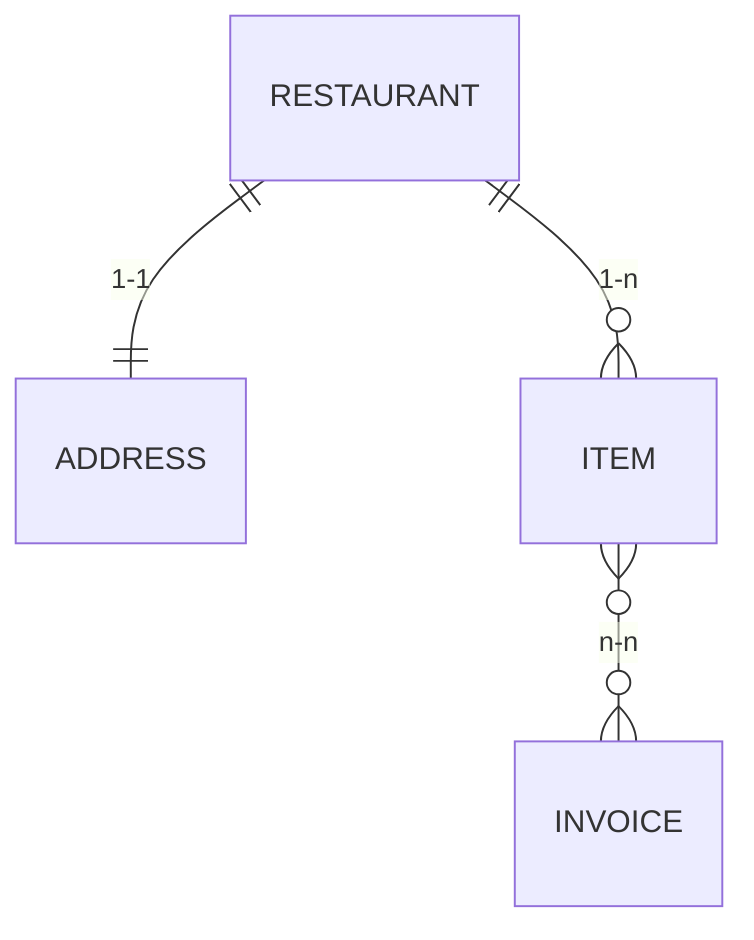
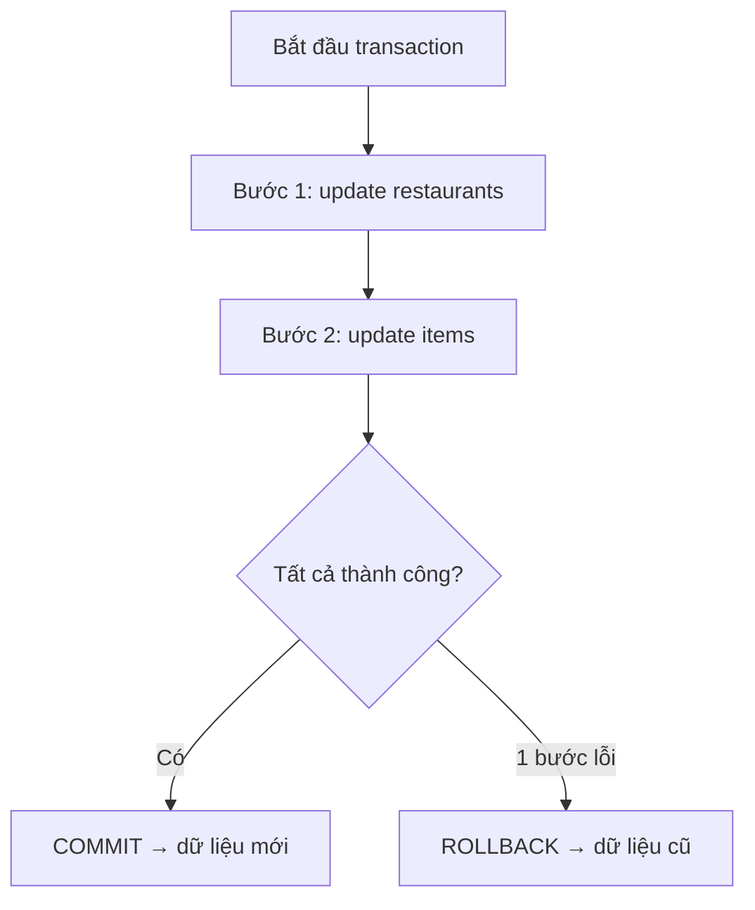

# Bài 5: Mối quan hệ giữa các collection trong MongoDB — Thiết kế, `$lookup`, Transaction

## Mục tiêu bài học

Sau bài này, học viên có thể:

- Hiểu **relationship** (mối quan hệ) trong NoSQL và **khác biệt** so với khóa ngoại của RDBMS
- Phân biệt 3 loại quan hệ: **1-1**, **1-n**, **n-n**
- Chọn đúng cách thiết kế dữ liệu: **Embedded** (nhúng) vs **Reference** (tham chiếu) theo tiêu chí thực tế
- Đánh **index** trên khóa liên kết để truy vấn nhiều collection hiệu quả
- Truy vấn liên kết nhiều collection bằng **`$lookup`** (+ `$match`, `$unwind`) trong `mongosh` và trong Spring (`MongoTemplate`, `Aggregation`)
- Trả dữ liệu liên kết về client bằng **DTO** thay vì `HashMap` (type-safe)
- Cập nhật dữ liệu trên **nhiều collection an toàn** bằng **MongoDB Transaction** (`@Transactional` + `MongoTransactionManager`), hiểu **điều kiện bắt buộc** (Replica Set)
- Tối ưu cập nhật hàng loạt bằng `updateMulti` (tránh N+1 write)
- **PHẦN BÀI TẬP:** dựng **giao diện Thymeleaf** quản lý quan hệ Restaurant ↔ Item

## Điều kiện tiên quyết

- Đã hoàn thành **[Bài 3 — Spring Boot & MongoDB (1)](./java_m3_bai3_MongoDB_Spring_1.md)**: model, repository, service, `@Controller` + Thymeleaf
- Đã hoàn thành **[Bài 4 — Spring Boot & MongoDB (2)](./java_m3_bai4_MongoDB_Spring_2.md)**: model lồng nhau (`@Field`, `@JsonProperty`), phân trang, PRG
- Nắm Aggregation cơ bản (sẽ học sâu ở Bài 6) và `mongosh`
- MongoDB đang chạy ở `localhost:27017` — **và phải bật Replica Set** nếu muốn chạy phần Transaction (xem §8.2)

```xml
<dependency>
    <groupId>org.springframework.boot</groupId>
    <artifactId>spring-boot-starter-web</artifactId>
</dependency>
<dependency>
    <groupId>org.springframework.boot</groupId>
    <artifactId>spring-boot-starter-data-mongodb</artifactId>
</dependency>
<dependency>
    <groupId>org.springframework.boot</groupId>
    <artifactId>spring-boot-starter-thymeleaf</artifactId>
</dependency>
<dependency>
    <groupId>org.projectlombok</groupId>
    <artifactId>lombok</artifactId>
    <optional>true</optional>
</dependency>
```

> **Ghi chú:** Bài này dùng 2 collection **`restaurants`** và **`items`** (1 nhà hàng có nhiều món ăn).
> Kiến thức Aggregation nâng cao (`@Query`, `Criteria`, pipeline phức tạp) sẽ học ở **Bài 6**.

### Thời lượng gợi ý


| Phần                                         | Thời gian |
| -------------------------------------------- | --------- |
| Khái niệm + loại quan hệ §1–3                | ~20 phút  |
| Thiết kế Embedded vs Reference + Index §4–5  | ~25 phút  |
| Truy vấn `$lookup` (shell + Spring) §6–7     | ~35 phút  |
| Cập nhật nhiều collection + Transaction §8–9 | ~30 phút  |
| PHẦN BÀI TẬP — Thymeleaf §10                 | ~40 phút  |
| Lỗi thường gặp + bài tập                     | ~20 phút  |


## Nội dung

| # | Chủ đề |
|---|--------|
| 1 | Mục đích — vì sao tách nhiều collection |
| 2 | Định nghĩa relationship (và khác biệt với RDBMS) |
| 3 | Ba loại quan hệ: 1-1, 1-n, n-n |
| 4 | Thiết kế Embedded vs Reference (4.1–4.2), tiêu chí lựa chọn (4.3), ví dụ cụ thể (4.4), n-n (4.5) |
| 5 | Index trên khóa liên kết |
| 6 | Truy vấn `$lookup` trong `mongosh` (6.1 chuẩn bị dữ liệu → 6.2 khái niệm → 6.3–6.5 ví dụ) |
| 7 | API truy vấn nhiều collection (Spring + DTO) |
| **8** | **Cập nhật nhiều collection + Transaction** (8.1 bài toán → 8.2 điều kiện → 8.3–8.5 code) |
| 9 | Tối ưu cập nhật hàng loạt `updateMulti` (9.1–9.4) |
| **10** | **PHẦN BÀI TẬP — Giao diện Thymeleaf** (10.1–10.6) |
| 11 | Lỗi thường gặp |
| Phụ lục | Bài tập mở rộng · Checklist · Liên kết |
---

## 1. Mục đích — vì sao tách nhiều collection

Trong thực tế, dữ liệu thường được lưu ở **nhiều collection** để:

- **Tránh trùng lặp** dữ liệu (giảm dung lượng, dễ đồng bộ)
- **Giảm thời gian** tìm kiếm/lưu trữ
- **Dễ mở rộng** và **dễ phân quyền/bảo mật** theo nghiệp vụ

Các collection thường được chia theo nghiệp vụ:


| Collection           | Quản lý              |
| -------------------- | -------------------- |
| `users`              | Thông tin khách hàng |
| `orders`             | Đơn hàng             |
| `products` / `items` | Sản phẩm / món ăn    |


Để đảm bảo tính toàn vẹn, các collection liên hệ với nhau qua các **khóa** (key/field). Bài này tập trung: **truy vấn** và **cập nhật** nhiều collection trong **1 API hoặc 1 luồng xử lý**.

---

## 2. Định nghĩa relationship (và khác biệt với RDBMS)

**Relationship** là sự liên kết luận lý giữa các table (RDBMS) hoặc collection (MongoDB) thông qua 1 hay nhiều **khóa** (keys/fields).

Ví dụ mô hình một nhà hàng:




> **⚠️ Khác biệt quan trọng với RDBMS:** MongoDB **KHÔNG có ràng buộc khóa ngoại (Foreign Key
> Constraint)**. Nếu bạn xóa một `restaurant`, các `items` trỏ tới nó **sẽ không tự bị xóa hay báo lỗi**.
> Tính toàn vẹn tham chiếu (referential integrity) phải do **tầng ứng dụng (application layer)
> tự đảm bảo**. Đây là điểm khác cốt lõi so với MySQL/PostgreSQL.

---

## 3. Ba loại quan hệ: 1-1, 1-n, n-n


| Loại      | Ví dụ              | Mô tả                                                       |
| --------- | ------------------ | ----------------------------------------------------------- |
| **1 - 1** | Nhà hàng — Địa chỉ | 1 nhà hàng ở 1 địa chỉ                                      |
| **1 - n** | Nhà hàng — Món ăn  | 1 nhà hàng có nhiều món ăn                                  |
| **n - n** | Món ăn — Hóa đơn   | 1 món ăn nằm trong nhiều hóa đơn; 1 hóa đơn có nhiều món ăn |


---

## 4. Thiết kế: Embedded vs Reference — tiêu chí lựa chọn

Có **2 phương pháp** thiết kế quan hệ trong MongoDB.

### 4.1. Cách 1 — Embedded documents (nhúng)

Lưu dữ liệu liên quan **ngay trong document của đối tượng chính**.

```json
// document trong collection: restaurants
{
  "restaurant_id": "30075445",
  "name": "Morris Park Bake Shop",
  "menu_items": [
    { "name": "Cheeseburger", "price": 8.99, "category": "Main" },
    { "name": "Fries",        "price": 3.49, "category": "Side" }
  ]
}
```

→ Thường dùng cho quan hệ **1-1** và **1-n**.

### 4.2. Cách 2 — Reference documents (tham chiếu)

Lưu **giá trị khóa liên kết** ở collection khác (giống khóa ngoại). Dùng cho **mọi loại quan hệ** (1-1, 1-n, n-n) nhằm **giảm trùng lặp**.

```json
// collection: restaurants
{ "restaurant_id": "30075445", "name": "Morris Park Bake Shop", "borough": "Bronx" }

// collection: items  (mỗi item trỏ về nhà hàng qua restaurant_id)
{ "restaurant_id": "30075445", "name": "Cheeseburger", "price": 8.99, "category": "Main" }
{ "restaurant_id": "30075445", "name": "Fries",        "price": 3.49, "category": "Side" }
```

### 4.3. Khi nào dùng cái nào? (tiêu chí thực tế)

> **Quy tắc thực chiến:** *“What is accessed together, is stored together”* — dữ liệu hay được
> đọc cùng nhau thì nên lưu cùng nhau (embedded).


| Tiêu chí                  | Nên **Embedded**                        | Nên **Reference**                      |
| ------------------------- | --------------------------------------- | -------------------------------------- |
| Cách truy cập             | Luôn đọc cha + con cùng lúc             | Đọc độc lập, hoặc dùng lại ở nhiều nơi |
| Số lượng con              | Ít, có giới hạn (vd địa chỉ, vài grade) | Nhiều / tăng vô hạn (vd log, order)    |
| Tần suất thay đổi của con | Hiếm khi đổi độc lập                    | Thay đổi thường xuyên, độc lập         |
| Quan hệ                   | 1-1, 1-n (n nhỏ)                        | 1-n (n lớn), n-n                       |
| Trùng lặp dữ liệu         | Chấp nhận một phần                      | Cần tránh tối đa                       |


> **⚠️ 2 cạm bẫy phải nhớ:**
>
> 1. **Giới hạn 16MB/document:** một document MongoDB tối đa 16MB. Đừng embed mảng lớn vô hạn.
> 2. **Unbounded array anti-pattern:** mảng nhúng phình mãi (vd nhúng toàn bộ order vào user) sẽ
>   làm document chậm và chạm trần 16MB → dùng **reference** thay thế.

### 4.4. Ví dụ cụ thể — chọn Embedded hay Reference?

**Ví dụ 1 — Nhà hàng & Địa chỉ (1-1) → nên EMBEDDED.**
Địa chỉ luôn được đọc kèm nhà hàng, chỉ có 1, hiếm khi đổi độc lập → nhúng vào luôn:

```json
// collection: restaurants  (địa chỉ nhúng bên trong)
{
  "restaurant_id": "30075445",
  "name": "Morris Park Bake Shop",
  "address": { "street": "Morris Park Ave", "zipcode": "10462", "city": "Bronx" }
}
```

→ Đọc 1 lần là có cả địa chỉ, không cần `$lookup`.

**Ví dụ 2 — Bài viết & Bình luận trên blog (1-n, n có thể rất lớn) → nên REFERENCE.**
Một bài viết có thể có hàng nghìn bình luận, tăng vô hạn theo thời gian (unbounded). Nếu nhúng
sẽ phình document và chạm trần 16MB → tách collection riêng:

```json
// collection: posts
{ "post_id": "P-100", "title": "Học MongoDB", "content": "..." }

// collection: comments  (mỗi bình luận trỏ về bài viết qua post_id)
{ "post_id": "P-100", "user": "an", "text": "Bài hay quá!" }
{ "post_id": "P-100", "user": "binh", "text": "Cảm ơn tác giả." }
```

**Ví dụ 3 — Đơn hàng & Sản phẩm (n-n) → bắt buộc REFERENCE.**
1 đơn hàng có nhiều sản phẩm, 1 sản phẩm nằm trong nhiều đơn hàng. Không thể nhúng 2 chiều →
dùng tham chiếu (xem §4.5).

**Ví dụ 4 — “Lai” (kết hợp cả hai) — rất phổ biến trong thực tế.**
Đơn hàng nhúng **bản chụp (snapshot)** vài thông tin sản phẩm hay đọc cùng (tên, giá lúc mua) để
hiển thị nhanh hóa đơn, **đồng thời** vẫn giữ `product_id` để tham chiếu sản phẩm gốc:

```json
// collection: orders
{
  "order_id": "OD-001",
  "items": [
    { "product_id": "SP-01", "name": "Áo thun", "price_at_time": 120000, "qty": 2 },
    { "product_id": "SP-09", "name": "Nón",     "price_at_time": 80000,  "qty": 1 }
  ]
}
```

→ Hiển thị hóa đơn không cần `$lookup`; vẫn tra cứu được sản phẩm gốc qua `product_id` khi cần.
Giá lúc mua (`price_at_time`) được “đóng băng”, không bị ảnh hưởng khi sản phẩm gốc đổi giá.

> **Tóm gọn cách chọn nhanh:**
>
> - Quan hệ 1-1, con nhỏ & gắn chặt → **Embedded** (vd địa chỉ).
> - 1-n với n lớn/không giới hạn → **Reference** (vd bình luận, log, đơn hàng).
> - n-n → **Reference** (mảng khóa hoặc collection trung gian).
> - Cần hiển thị nhanh + vẫn truy vết gốc → **Lai** (nhúng snapshot + giữ id tham chiếu).

### 4.5. Thiết kế quan hệ n-n

Quan hệ n-n thường hiện thực bằng **mảng tham chiếu** hoặc **collection trung gian**.

```json
// Cách A — mảng khóa tham chiếu trong invoices
// collection: invoices
{ "invoice_id": "INV-001", "item_ids": ["IT-01", "IT-02", "IT-09"] }

// Cách B — collection trung gian (junction) invoice_items
// collection: invoice_items
{ "invoice_id": "INV-001", "item_id": "IT-01", "quantity": 2 }
{ "invoice_id": "INV-001", "item_id": "IT-02", "quantity": 1 }
```

> Cách B (collection trung gian) linh hoạt hơn vì lưu được **thuộc tính của quan hệ** (vd `quantity`, `price_at_time`).

---

## 5. Index trên khóa liên kết

Truy vấn liên kết (`$lookup`, `findByRestaurantId`) sẽ **quét toàn bộ collection** nếu khóa
liên kết **không có index** → rất chậm khi dữ liệu lớn.

```javascript
// mongosh: tạo index cho khóa liên kết
db.items.createIndex({ restaurant_id: 1 });
```

```java
// Spring: đánh index ngay trong model
@Indexed
@Field("restaurant_id")
private String restaurantId;
```

> **Quy tắc:** mọi field dùng làm **khóa liên kết** (localField/foreignField trong `$lookup`,
> hoặc field trong `findBy...`) **nên được đánh index**.

---

## 6. Truy vấn liên kết bằng `$lookup` (`mongosh`)

### 6.1. Chuẩn bị dữ liệu

> **Cần bao nhiêu collection?** Để minh họa quan hệ **1-n** ta cần **2 collection**:
>
> - **`restaurants`** — collection **chính (cha)**: thông tin nhà hàng. Khóa nghiệp vụ là `restaurant_id`.
> - **`items`** — collection **phụ (con)**: các món ăn. Mỗi item có field `restaurant_id` để **trỏ về**
> nhà hàng mà nó thuộc về (đây chính là **khóa liên kết**).
>
> Hai collection được nối với nhau qua cặp field cùng tên `restaurant_id`. Một `restaurant`
> (vd `"30075445"`) sẽ có **nhiều** `items` cùng mang `restaurant_id = "30075445"`.

**Bước 1 — tạo collection chính `restaurants` (1 nhà hàng):**

```javascript
db.getCollection("restaurants").insertOne(
  {
    "restaurant_id": "30075445",          // khóa nghiệp vụ — các item sẽ trỏ về đây
    "name": "Morris Park Bake Shop",
    "borough": "Bronx",
    "cuisine": "Bakery"
  }
);
```

**Bước 2 — tạo collection phụ `items` (2 món của nhà hàng trên):**

```javascript
db.getCollection("items").insertMany([
  { "restaurant_id": "30075445", "name": "Cheeseburger", "price": 8.99, "category": "Main" },
  { "restaurant_id": "30075445", "name": "Fries",        "price": 3.49, "category": "Side" }
]);
```

> **Lưu ý:** cả 2 document trong `items` đều có `restaurant_id = "30075445"` → tức là cùng thuộc
> về nhà hàng "Morris Park Bake Shop". Đây là cách MongoDB biểu diễn quan hệ "1 nhà hàng có nhiều món".

Sau bước này ta có:


| Collection    | Số document | Vai trò     | Field liên kết  |
| ------------- | ----------- | ----------- | --------------- |
| `restaurants` | 1           | Chính (cha) | `restaurant_id` |
| `items`       | 2           | Phụ (con)   | `restaurant_id` |


### 6.2. `$lookup` là gì và dùng để làm gì?

`$lookup` là một **stage trong aggregation pipeline** dùng để **nối (join) dữ liệu từ một
collection khác** — tương tự `LEFT JOIN` trong SQL. Nó lấy mỗi document ở collection đang truy vấn,
tìm các document khớp ở collection kia, rồi **gắn kết quả vào một field mảng mới**.

Cú pháp tổng quát và ý nghĩa từng tham số:

```javascript
{
  $lookup: {
    from: "<collection_phụ>",       // collection muốn nối vào (collection kia)
    localField: "<field_bên_này>",  // field ở collection ĐANG truy vấn dùng để so khớp
    foreignField: "<field_bên_kia>",// field ở collection PHỤ dùng để so khớp
    as: "<tên_field_kết_quả>"       // tên field MẢNG chứa các document khớp được
  }
}
```

> **Cách đọc dễ nhớ:** *“Lấy mỗi document bên này, tìm trong **`from`** những document có
> **`foreignField`** bằng **`localField`** của tôi, gom lại bỏ vào field **`as`**.”*

Các stage thường đi kèm `$lookup`:


| Stage      | Dùng để làm gì                                                                             |
| ---------- | ------------------------------------------------------------------------------------------ |
| `$match`   | Lọc bớt document **trước** khi join (giảm dữ liệu, tăng tốc) — nên đặt **trước** `$lookup` |
| `$lookup`  | Nối collection khác vào, kết quả là một field **mảng**                                     |
| `$unwind`  | "Phẳng" field mảng thành object (dùng cho quan hệ 1-1, xem §6.5)                           |
| `$project` | Chọn/ẩn bớt field cho gọn kết quả                                                          |


### 6.3. Ví dụ 1 — tìm tất cả món của 1 nhà hàng (chưa cần `$lookup`)

```javascript
// Truy vấn collection phụ trực tiếp theo khóa liên kết
db.items.find({ restaurant_id: "30075445" });
```

### 6.4. Ví dụ 2 — 1 nhà hàng kèm danh sách món (`$lookup`)

**Mục tiêu:** truy vấn trên collection **chính** `restaurants`, với mỗi nhà hàng **gắn thêm**
danh sách món của nó (lấy từ collection `items`). Đây là hướng dùng phổ biến nhất: *“lấy cha kèm các con”*.

```javascript
db.restaurants.aggregate([
  { $match: { restaurant_id: "30075445" } },     // B1: chỉ lấy đúng nhà hàng cần tìm
  {
    $lookup: {
      from: "items",                 // B2: nối với collection items
      localField: "restaurant_id",   //     so khớp restaurant_id của restaurants...
      foreignField: "restaurant_id", //     ...với restaurant_id của items
      as: "menuItems"                //     gom các món khớp vào field mảng "menuItems"
    }
  }
]);
```

> **Diễn giải:** với nhà hàng `30075445`, MongoDB quét `items` tìm mọi document có
> `restaurant_id = "30075445"`, gom lại thành mảng `menuItems` gắn vào nhà hàng.

Kết quả:

```json
{
  "restaurant_id": "30075445",
  "name": "Morris Park Bake Shop",
  "borough": "Bronx",
  "menuItems": [
    { "restaurant_id": "30075445", "name": "Cheeseburger", "price": 8.99, "category": "Main" },
    { "restaurant_id": "30075445", "name": "Fries",        "price": 3.49, "category": "Side" }
  ]
}
```

### 6.5. Ví dụ 3 — danh sách món kèm thông tin nhà hàng

**Mục tiêu:** hướng ngược lại — truy vấn trên collection **phụ** `items`, với mỗi món **gắn thêm**
thông tin nhà hàng chứa nó. Dùng khi muốn hiển thị danh sách món mà vẫn biết món đó của nhà hàng nào.

```javascript
db.items.aggregate([
  { $match: { restaurant_id: "30075445" } },   // B1: lọc các món của nhà hàng cần xem
  {
    $lookup: {
      from: "restaurants",           // B2: nối ngược về collection restaurants
      localField: "restaurant_id",   //     so khớp restaurant_id của items...
      foreignField: "restaurant_id", //     ...với restaurant_id của restaurants
      as: "restaurantInfo"           //     gắn thông tin nhà hàng vào field "restaurantInfo"
    }
  }
]);
```

> **⚠️ `$lookup` luôn trả về MẢNG** (`restaurantInfo: [ {...} ]`), kể cả quan hệ 1-1. Với 1-1,
> thêm **`$unwind`** để “phẳng” kết quả thành object:

```javascript
db.items.aggregate([
  { $match: { restaurant_id: "30075445" } },
  { $lookup: { from: "restaurants", localField: "restaurant_id",
               foreignField: "restaurant_id", as: "restaurantInfo" } },
  { $unwind: "$restaurantInfo" }   // mảng 1 phần tử → object
]);
```

---

## 7. API truy vấn nhiều collection (Spring + DTO)

### 7.1. Model `ItemModel` (lưu ý mapping field)

> **Tên class trong demo:** syllabus dùng tên ngắn `Item`; project demo đặt **`ItemModel`**
> (cùng quy ước `MovieModel`, `RestaurantModel` ở Bài 3/4). Logic và annotation giống nhau.

```java
@Getter @Setter @ToString
@NoArgsConstructor @AllArgsConstructor
@Document(collection = "items")
public class ItemModel {

    @Id
    private String id;                 // _id của MongoDB

    @Indexed
    @Field("restaurant_id")            // BẮT BUỘC: map restaurantId (Java) ↔ restaurant_id (Mongo)
    private String restaurantId;       // khóa liên kết

    private String name;
    private String description;
    private Double price;
    private String category;
}
```

> **⚠️ Cạm bẫy mapping kinh điển:** nếu **thiếu `@Field("restaurant_id")`**, Spring sẽ lưu field
> tên `restaurantId` (camelCase) trong MongoDB. Khi đó câu `$lookup`/`find` theo `restaurant_id`
> (snake_case) sẽ **không khớp** → kết quả rỗng mà không báo lỗi. Đây là bug rất khó tìm.

### 7.2. DTO trả kết quả liên kết

> **Vì sao không trả `HashMap`?** Trả thẳng `HashMap`/`List<HashMap>` ra controller làm **mất
> type-safety**, khó validate, khó sinh tài liệu API, dễ sai tên field. Hãy dùng **DTO**.

```java
@Getter @Setter @NoArgsConstructor
public class RestaurantWithItemsDto {
    @Field("restaurant_id")           // map field MongoDB → Java (aggregation cần đúng tên)
    private String restaurantId;
    private String name;
    private String borough;
    private List<ItemModel> menuItems;   // danh sách item lookup được
}
```

> **Xem code đầy đủ:** [`model/ItemModel.java`](../../demo-bai5-mongodb-spring/java-springboot-bai5/src/main/java/vn/demo/model/ItemModel.java) ·
> [`dto/RestaurantWithItemsDto.java`](../../demo-bai5-mongodb-spring/java-springboot-bai5/src/main/java/vn/demo/dto/RestaurantWithItemsDto.java)

### 7.3. Controller

> **Gợi ý:** khai báo **`@RequestMapping("/api/restaurants")`** ở cấp class để gom **đường dẫn gốc
> chung**, các handler bên trong chỉ cần khai báo phần đường dẫn còn lại → gọn và dễ bảo trì.

```java
@RestController
@RequestMapping("/api/restaurants")   // đường dẫn gốc chung cho cả controller
@RequiredArgsConstructor
public class RestaurantRestController {

    private final RestaurantService restaurantService;

    // URL đầy đủ = /api/restaurants/{id}/with-items
    @GetMapping("/{id}/with-items")
    public ResponseEntity<List<RestaurantWithItemsDto>> getRestaurantWithItems(
            @PathVariable("id") String restaurantId) {
        return ResponseEntity.ok(restaurantService.getRestaurantWithItems(restaurantId));
    }
}
```

> **Xem code đầy đủ:** [`controller/api/RestaurantRestController.java`](../../demo-bai5-mongodb-spring/java-springboot-bai5/src/main/java/vn/demo/controller/api/RestaurantRestController.java)

### 7.4. Service — `MongoTemplate` + `Aggregation` + `$lookup`

```java
@Autowired
private MongoTemplate mongoTemplate;   // dùng để chạy aggregation liên kết

public List<RestaurantWithItemsDto> getRestaurantWithItems(String restaurantId) {
    MatchOperation matchStage = Aggregation.match(
            Criteria.where("restaurant_id").is(restaurantId));

    LookupOperation lookupStage = LookupOperation.newLookup()
            .from("items")                 // collection phụ
            .localField("restaurant_id")   // field collection chính
            .foreignField("restaurant_id") // field collection phụ
            .as("menuItems");              // field chứa kết quả

    Aggregation aggregation = Aggregation.newAggregation(matchStage, lookupStage);

    // Map thẳng kết quả vào DTO — type-safe
    return mongoTemplate
            .aggregate(aggregation, "restaurants", RestaurantWithItemsDto.class)
            .getMappedResults();
}
```

> **Xem code đầy đủ:** [`service/RestaurantService.java`](../../demo-bai5-mongodb-spring/java-springboot-bai5/src/main/java/vn/demo/service/RestaurantService.java) (hàm `getRestaurantWithItems`, `getItemsWithRestaurantInfo`)

### 7.5. Ví dụ 2 — items kèm thông tin nhà hàng

```java
public List<ItemWithRestaurantDto> getItemsWithRestaurantInfo(String restaurantId) {
    MatchOperation matchOperation = Aggregation.match(
            Criteria.where("restaurant_id").is(restaurantId));

    LookupOperation lookupOperation = LookupOperation.newLookup()
            .from("restaurants")
            .localField("restaurant_id")
            .foreignField("restaurant_id")
            .as("restaurantInfo");

    Aggregation aggregation = Aggregation.newAggregation(matchOperation, lookupOperation);
    return mongoTemplate
            .aggregate(aggregation, "items", ItemWithRestaurantDto.class)
            .getMappedResults();
}
```

---

## 8. Cập nhật nhiều collection + Transaction

### 8.1. Bài toán

> Đổi ID của 1 restaurant từ `AAA` → `BBB`:
>
> - **Bước 1:** cập nhật trong collection `restaurants`
> - **Bước 2:** cập nhật `restaurant_id` trong các `items` liên quan
>
> **Vấn đề:** nếu bước 1 lỗi thì bước 2 không được chạy; nếu bước 2 lỗi thì bước 1 phải **hoàn tác**.
> → Cần **Transaction**: tất cả cùng thành công (commit) hoặc cùng hủy (rollback).




### 8.2. ⚠️ ĐIỀU KIỆN BẮT BUỘC để Transaction hoạt động

> **Đây là phần học viên hay fail nhất — đọc kỹ:**
>
> 1. **MongoDB phải chạy ở chế độ Replica Set** (hoặc Sharded Cluster). MongoDB **standalone**
>   (cài mặc định) **KHÔNG hỗ trợ multi-document transaction** → code sẽ ném lỗi.
> 2. Spring phải khai báo bean **`MongoTransactionManager`**. **Nếu thiếu bean này, `@Transactional`
>   bị bỏ qua âm thầm (silent no-op)** — không rollback gì cả, dễ tưởng nhầm là có transaction.

**Bật Replica Set cho môi trường học/dev (1 node):**

```bash
# Khởi động mongod với replica set name
mongod --dbpath /your/data/path --replSet rs0

# Trong mongosh, khởi tạo 1 lần duy nhất
rs.initiate();
```

Đổi URI để chỉ rõ replica set:

```properties
spring.data.mongodb.uri=mongodb://localhost:27017/db_java_t3h_module3?replicaSet=rs0
```

**Khai báo bean `MongoTransactionManager`:**

```java
@Configuration
public class MongoConfig {

    @Bean
    MongoTransactionManager transactionManager(MongoDatabaseFactory dbFactory) {
        return new MongoTransactionManager(dbFactory);
    }
}
```

### 8.3. Controller

> Vẫn dùng chung `@RequestMapping("/api/restaurants")` ở cấp class như §7.3; handler này chỉ khai
> báo phần đường dẫn `/change-id`.

```java
@RestController
@RequestMapping("/api/restaurants")     // đường dẫn gốc chung
@RequiredArgsConstructor
public class RestaurantRestController {

    private final RestaurantService restaurantService;

    // URL đầy đủ = PUT /api/restaurants/change-id
    // Demo hỗ trợ thêm ?mode=optimized (mặc định, §9.4) hoặc ?mode=loop (§8.5)
    @PutMapping("/change-id")
    public ResponseEntity<String> updateRestaurantId(
            @RequestParam String oldId,
            @RequestParam String newId,
            @RequestParam(defaultValue = "optimized") String mode) {
        try {
            if ("loop".equalsIgnoreCase(mode)) {
                restaurantService.updateRestaurantIdWithSave(oldId, newId);
            } else {
                restaurantService.updateRestaurantIdOptimized(oldId, newId);
            }
            return ResponseEntity.ok("Restaurant ID updated in both collections");
        } catch (Exception e) {
            return ResponseEntity.status(500).body("Error: " + e.getMessage());
        }
    }
}
```

> Demo dùng `ResourceNotFoundException` thay `RuntimeException` để REST API trả 404 đẹp hơn (xem `RestExceptionHandler`).

### 8.4. Repository

```java
public interface ItemRepository extends MongoRepository<ItemModel, String>, ItemRepositoryCustom {
    List<ItemModel> findByRestaurantId(String restaurantId);
}
```

### 8.5. Service — `@Transactional`

```java
@Autowired
private ItemRepository itemRepository;

@Transactional   // chỉ có hiệu lực khi có MongoTransactionManager + Replica Set
public void updateRestaurantIdWithSave(String oldId, String newId) {
    RestaurantModel restaurant = restaurantRepository.findFirstByRestaurantId(oldId);
    if (restaurant == null)
        throw new ResourceNotFoundException("Restaurant not found with restaurant_id: " + oldId);

    restaurant.setRestaurantId(newId);
    restaurantRepository.save(restaurant);          // Bước 1

    List<ItemModel> items = itemRepository.findByRestaurantId(oldId);
    for (ItemModel item : items) {
        item.setRestaurantId(newId);
        itemRepository.save(item);                  // Bước 2 (lặp từng item)
    }
}
```

> **Lưu ý `_id` vs business key:** ở đây ta đổi **`restaurant_id` (business key)**, **KHÔNG** đổi
> `_id` của MongoDB. `_id` là bất biến — muốn đổi `_id` phải xóa + chèn lại document. Trong thực
> tế nên thiết kế khóa liên kết là business key để tránh đụng vào `_id`.

---

## 9. Tối ưu cập nhật hàng loạt (`updateMulti`)

> **Nhược điểm của §8.5:** cập nhật **từng item trong vòng lặp** → mỗi item là 1 lần đọc + 1 lần
> ghi xuống DB. Dữ liệu nhiều sẽ rất chậm (N+1 write).
>
> **Cách cải tiến:** dùng **1 câu lệnh** `updateMulti` để cập nhật tất cả item cùng lúc.

### 9.1. Interface custom

```java
public interface ItemRepositoryCustom {
    long updateRestaurantId(String oldId, String newId);
}
```

### 9.2. Cho `ItemRepository` kế thừa thêm interface

```java
public interface ItemRepository
        extends MongoRepository<Item, String>, ItemRepositoryCustom {
    List<Item> findByRestaurantId(String restaurantId);
}
```

### 9.3. Lớp hiện thực — `updateMulti`

```java
@Repository
public class ItemRepositoryImpl implements ItemRepositoryCustom {

    @Autowired
    private MongoTemplate mongoTemplate;

    @Override
    public long updateRestaurantId(String oldId, String newId) {
        Query query = new Query(Criteria.where("restaurant_id").is(oldId));
        Update update = new Update().set("restaurant_id", newId);
        UpdateResult result = mongoTemplate.updateMulti(query, update, ItemModel.class);
        return result.getModifiedCount();   // số item đã cập nhật
    }
}
```

> **Xem code đầy đủ:** [`repository/ItemRepositoryImpl.java`](../../demo-bai5-mongodb-spring/java-springboot-bai5/src/main/java/vn/demo/repository/ItemRepositoryImpl.java) ·
> [`config/MongoConfig.java`](../../demo-bai5-mongodb-spring/java-springboot-bai5/src/main/java/vn/demo/config/MongoConfig.java)

> **Lưu ý quy ước đặt tên class:** lớp hiện thực phải tên **`ItemRepositoryImpl`** (đúng hậu tố
> `Impl`) để Spring Data tự nhận và ghép vào `ItemRepository`.

### 9.4. Service tối ưu — gọi `updateMulti` trong transaction

```java
@Transactional
public long updateRestaurantIdOptimized(String oldId, String newId) {
    RestaurantModel restaurant = restaurantRepository.findFirstByRestaurantId(oldId);
    if (restaurant == null)
        throw new ResourceNotFoundException("Restaurant not found: " + oldId);
    restaurant.setRestaurantId(newId);
    restaurantRepository.save(restaurant);           // Bước 1
    return itemRepository.updateRestaurantId(oldId, newId); // Bước 2: 1 câu lệnh, trả số item đã sửa
}
```

---

## 10. PHẦN BÀI TẬP — Giao diện Thymeleaf

> **Đề bài:** Dựng **giao diện web (Thymeleaf)** quản lý quan hệ **1 nhà hàng — nhiều món ăn**
> (`restaurants` 1-n `items`). Tái sử dụng `RestaurantService`/`ItemService` đã có. Toàn bộ
> controller dùng **`@Controller`** (xem lại Bài 3 §9, Bài 4).

### 10.1. Các màn hình cần làm


| Màn hình                                        | URL                           | Method | View                 |
| ----------------------------------------------- | ----------------------------- | ------ | -------------------- |
| Danh sách nhà hàng                              | `/restaurants`                | GET    | `restaurants/list`   |
| Chi tiết nhà hàng + **bảng món ăn** (`$lookup`) | `/restaurants/{id}`           | GET    | `restaurants/detail` |
| Form thêm món cho nhà hàng                      | `/restaurants/{id}/items/new` | GET    | `items/form`         |
| Lưu món mới                                     | `/restaurants/{id}/items`     | POST   | redirect detail      |
| Form sửa món                                    | `/items/{itemId}/edit`        | GET    | `items/form`         |
| Cập nhật món                                    | `/items/{itemId}`             | POST   | redirect detail      |
| Xóa món                                         | `/items/{itemId}/delete`      | POST   | redirect detail      |
| Đổi ID nhà hàng (Transaction)                   | `/restaurants/{id}/change-id` | POST   | redirect detail (ID mới) |


### 10.2. Controller — trang chi tiết hiển thị quan hệ 1-n

> Toàn bộ handler liên quan nhà hàng đặt trong **một class** dùng `@Controller` +
> `@RequestMapping("/restaurants")` ở cấp class. Mỗi handler bên trong chỉ khai báo phần đường
> dẫn còn lại (vd `/{id}`, `/{id}/items`, `/{id}/change-id`).

```java
@Controller
@RequestMapping("/restaurants")     // đường dẫn gốc chung cho mọi handler nhà hàng
@RequiredArgsConstructor
public class RestaurantViewController {

    private final RestaurantService restaurantService;
    private final ItemService itemService;

    // URL đầy đủ = GET /restaurants/{id}
    @GetMapping("/{id}")
    public String detail(@PathVariable("id") String restaurantId, Model model) {
        // Tận dụng $lookup từ §7 để lấy nhà hàng kèm danh sách món
        List<RestaurantWithItemsDto> result =
                restaurantService.getRestaurantWithItems(restaurantId);
        if (result.isEmpty()) return "restaurants/not-found";

        model.addAttribute("restaurant", result.get(0));
        model.addAttribute("items", result.get(0).getMenuItems());
        return "restaurants/detail";
    }

    // ... các handler addItem, changeId bên dưới cũng nằm trong class này ...
}
```

> **Xem code đầy đủ:**
> [`controller/web/RestaurantViewController.java`](../../demo-bai5-mongodb-spring/java-springboot-bai5/src/main/java/vn/demo/controller/web/RestaurantViewController.java) ·
> [`controller/web/ItemViewController.java`](../../demo-bai5-mongodb-spring/java-springboot-bai5/src/main/java/vn/demo/controller/web/ItemViewController.java) ·
> [templates `restaurants/`](../../demo-bai5-mongodb-spring/java-springboot-bai5/src/main/resources/templates/restaurants) ·
> [templates `items/form.html`](../../demo-bai5-mongodb-spring/java-springboot-bai5/src/main/resources/templates/items/form.html)

### 10.3. Template — hiển thị danh sách món (quan hệ 1-n)

```html
<h2 th:text="${restaurant.name}">Tên nhà hàng</h2>
<p>Mã: <span th:text="${restaurant.restaurantId}">ID</span></p>

<a th:href="@{/restaurants/{id}/items/new(id=${restaurant.restaurantId})}">+ Thêm món</a>

<table>
    <thead>
        <tr><th>Tên món</th><th>Giá</th><th>Loại</th><th>Thao tác</th></tr>
    </thead>
    <tbody>
        <tr th:each="it : ${items}">
            <td th:text="${it.name}">Cheeseburger</td>
            <td th:text="${it.price}">8.99</td>
            <td th:text="${it.category}">Main</td>
            <td>
                <a th:href="@{/items/{iid}/edit(iid=${it.id})}">Sửa</a>
                <form th:action="@{/items/{iid}/delete(iid=${it.id})}" method="post"
                      style="display:inline">
                    <button type="submit" onclick="return confirm('Xóa món này?')">Xóa</button>
                </form>
            </td>
        </tr>
        <tr th:if="${#lists.isEmpty(items)}">
            <td colspan="4">Nhà hàng chưa có món ăn nào.</td>
        </tr>
    </tbody>
</table>
```

### 10.4. Controller — thêm món vào nhà hàng (gắn khóa liên kết)

> Handler này nằm trong cùng class `RestaurantViewController` (§10.2), nên nhờ
> `@RequestMapping("/restaurants")` ở cấp class, chỉ cần khai báo phần `/{id}/items`.

```java
// URL đầy đủ = POST /restaurants/{id}/items
@PostMapping("/{id}/items")
public String addItem(@PathVariable("id") String restaurantId,
                      @ModelAttribute("itemForm") Item form,
                      RedirectAttributes ra) {
    form.setId(null);                    // đảm bảo là insert
    form.setRestaurantId(restaurantId);  // gắn khóa liên kết về nhà hàng cha
    itemService.create(form);
    ra.addFlashAttribute("message", "Đã thêm món thành công!");
    return "redirect:/restaurants/" + restaurantId;   // PRG
}
```

> **Sửa/xóa món** (`/items/{itemId}/edit`, `/items/{itemId}/delete`) thao tác trên đối tượng
> `Item` nên tách sang một controller riêng `ItemViewController` với
> `@Controller @RequestMapping("/items")` cho đúng nghiệp vụ.

### 10.5. Form thêm/sửa món (`th:object` + `th:field`)

```html
<form th:action="${actionUrl}" th:object="${itemForm}" method="post">
    <label>Tên món</label>
    <input type="text" th:field="*{name}"/>

    <label>Mô tả</label>
    <input type="text" th:field="*{description}"/>

    <label>Giá</label>
    <input type="number" step="0.01" th:field="*{price}"/>

    <label>Loại</label>
    <input type="text" th:field="*{category}"/>

    <button type="submit">Lưu</button>
</form>
```

### 10.6. (Nâng cao) Nút đổi ID nhà hàng — gọi Transaction

```html
<form th:action="@{/restaurants/{id}/change-id(id=${restaurant.restaurantId})}" method="post">
    <input type="text" name="newId" placeholder="ID mới" required/>
    <button type="submit">Đổi ID (cập nhật cả items)</button>
</form>
```

```java
// Cùng class RestaurantViewController (§10.2) → URL đầy đủ = POST /restaurants/{id}/change-id
@PostMapping("/{id}/change-id")
public String changeId(@PathVariable("id") String oldId,
                       @RequestParam String newId, RedirectAttributes ra) {
    try {
        restaurantService.updateRestaurantIdOptimized(oldId, newId);  // §9.4, có @Transactional
        ra.addFlashAttribute("message", "Đổi ID thành công (cả items).");
        return "redirect:/restaurants/" + newId;
    } catch (Exception e) {
        ra.addFlashAttribute("error", "Lỗi: " + e.getMessage());
        return "redirect:/restaurants/" + oldId;
    }
}
```

> **Gợi ý kiểm thử transaction:** cố tình ném lỗi giữa Bước 1 và Bước 2 (vd `throw new RuntimeException("test")`) rồi kiểm tra `restaurants` đã **rollback** về ID cũ chưa. Nếu dữ liệu
> vẫn bị đổi một nửa → bạn đang thiếu Replica Set hoặc thiếu `MongoTransactionManager` (xem §8.2).

---

## 11. Lỗi thường gặp


| Triệu chứng                                                | Nguyên nhân                                                 | Cách xử lý                                          |
| ---------------------------------------------------------- | ----------------------------------------------------------- | --------------------------------------------------- |
| `Transaction numbers are only allowed on a replica set...` | MongoDB chạy standalone                                     | Bật Replica Set (`--replSet rs0` + `rs.initiate()`) |
| `@Transactional` không rollback                            | Thiếu bean `MongoTransactionManager`                        | Khai báo bean (§8.2)                                |
| `$lookup` trả về mảng rỗng                                 | Tên field DB không khớp (`restaurantId` vs `restaurant_id`) | Thêm `@Field("restaurant_id")`                      |
| Quan hệ 1-1 ra mảng 1 phần tử                              | `$lookup` luôn trả mảng                                     | Thêm `$unwind`                                      |
| Truy vấn liên kết rất chậm                                 | Khóa liên kết chưa có index                                 | `createIndex` / `@Indexed`                          |
| API khó maintain, sai tên field                            | Trả `HashMap` thay vì DTO                                   | Map kết quả aggregate sang DTO                      |
| Xóa nhà hàng mà items vẫn còn                              | MongoDB không enforce FK                                    | Tự xóa items ở tầng service (cascade thủ công)      |
| `ItemRepositoryCustom` không chạy                          | Lớp impl sai tên                                            | Đặt đúng tên `ItemRepositoryImpl`                   |
| Cập nhật hàng loạt chậm                                    | Lặp `save()` từng item                                      | Dùng `updateMulti`                                  |
| Trình duyệt in ra `restaurants/detail`                     | Dùng `@RestController` cho view                             | Đổi sang `@Controller`                              |


---

## Tóm tắt


| Khái niệm                | Ý chính                                                         |
| ------------------------ | --------------------------------------------------------------- |
| Relationship trong NoSQL | Liên kết luận lý qua khóa; **không** có FK constraint như RDBMS |
| 3 loại quan hệ           | 1-1, 1-n, n-n                                                   |
| Embedded vs Reference    | Đọc cùng nhau → nhúng; nhiều/độc lập → tham chiếu (nhớ 16MB)    |
| Index khóa liên kết      | Bắt buộc để `$lookup`/`findBy` nhanh                            |
| `$lookup`                | Join collection trong aggregation; luôn trả **mảng**            |
| `$unwind`                | Phẳng mảng 1-1 thành object                                     |
| DTO                      | Trả kết quả liên kết type-safe (thay `HashMap`)                 |
| Transaction              | Cần **Replica Set** + **`MongoTransactionManager`**            |
| `updateMulti`            | Cập nhật hàng loạt 1 câu lệnh (tránh N+1 write)                 |
| `_id` vs business key    | `_id` bất biến; đổi khóa nên đổi business key                   |


---

### Bài tập

1. **Cơ bản:** Viết API `GET /api/items/by-category?restaurantId=&category=` trả các món theo loại của 1 nhà hàng.
2. **Embedded:** Tạo thêm model lưu `address` dạng **embedded** trong `restaurants`, so sánh với cách reference.
3. **n-n:** Thiết kế collection `invoices` quan hệ n-n với `items` (qua `item_ids`), viết `$lookup` lấy hóa đơn kèm chi tiết món.
4. **Transaction:** Viết chức năng **xóa nhà hàng kèm toàn bộ items** trong 1 transaction (cascade delete thủ công).
5. **Thymeleaf (chính):** Hoàn thiện giao diện ở §10 (list/detail + CRUD items + đổi ID có transaction).
6. **Tối ưu:** Thêm `$unwind` + `$project` (xem §6.5) để trang chi tiết chỉ lấy đúng field cần hiển thị.

### Checklist nộp bài

- Model `Item` có `@Field("restaurant_id")` + `@Indexed`
- `$lookup` (mongosh) lấy được nhà hàng kèm items
- API truy vấn liên kết trả về **DTO** (không `HashMap`)
- MongoDB chạy **Replica Set**, có bean `MongoTransactionManager`
- Đổi ID nhà hàng cập nhật **cả 2 collection**, rollback khi lỗi
- Có bản tối ưu dùng `updateMulti`
- **Thymeleaf:** list + detail (bảng món) + CRUD item + PRG
- Toàn bộ controller web dùng `@Controller`
- HTML có `xmlns:th`

### Liên kết tham khảo

- [MongoDB — Model Relationships (Embedded vs References)](https://www.mongodb.com/docs/manual/applications/data-models-relationships/)
- [MongoDB — `$lookup`](https://www.mongodb.com/docs/manual/reference/operator/aggregation/lookup/)
- [MongoDB — Transactions](https://www.mongodb.com/docs/manual/core/transactions/)
- [Spring Data MongoDB — Transactions](https://docs.spring.io/spring-data/mongodb/reference/mongodb/client-session-transactions.html)
- [Spring Data MongoDB — Aggregation](https://docs.spring.io/spring-data/mongodb/reference/mongodb/aggregation-framework.html)
- [Bài 3 — Spring Boot & MongoDB (1)](./java_m3_bai3_MongoDB_Spring_1.md)
- [Bài 4 — Spring Boot & MongoDB (2)](./java_m3_bai4_MongoDB_Spring_2.md)
- Demo: [`demo-bai5-mongodb-spring`](../../demo-bai5-mongodb-spring)

