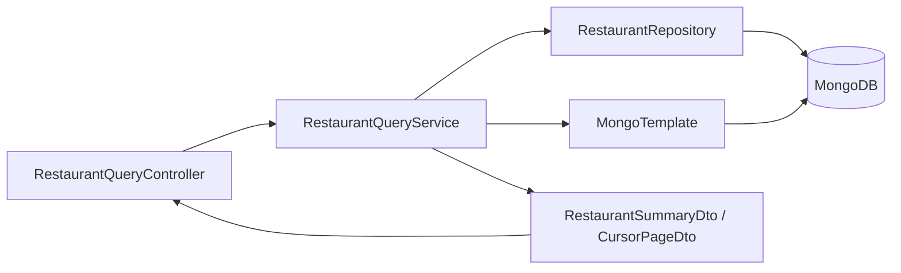
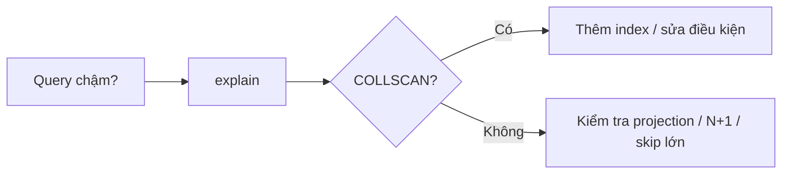
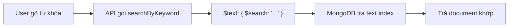
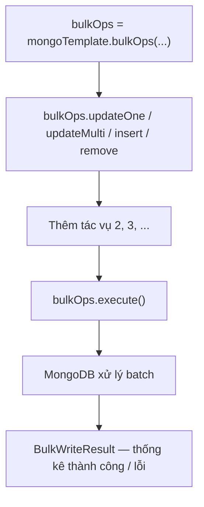

# Bài 6: Tối ưu truy vấn MongoDB với Spring Boot

## Mục tiêu bài học

Sau bài này, học viên có thể:

- Hiểu **index** (chỉ số) giúp tăng tốc tìm kiếm như thế nào; tạo index trong `mongosh` và khai báo `@Indexed` trong model
- Dùng **`explain("executionStats")`** để nhận biết query chậm (`COLLSCAN`) và query đã dùng index (`IXSCAN`)
- Viết **custom query** bằng `@Query`, `MongoTemplate` + `Criteria`/`Update` khi derived method không đủ
- Chỉ lấy **một vài field** (projection) thay vì load cả document
- Cập nhật hàng loạt bằng **`updateMulti`** và **`BulkOperations`** (gom nhiều thao tác trong một lần gọi)
- Tìm kiếm chuỗi bằng **regex** và **`$text`**, biết cách nào phù hợp khi dữ liệu lớn
- Phân biệt phân trang **`skip + limit`** (Bài 4) và **cursor `lastSeenId`** (lướt xuống liên tục)
- Tránh **N+1 query** khi đọc nhiều document liên quan
- Áp dụng vài mẹo cơ bản khi dùng **aggregation** (`$match` sớm, `$project` gọn)

## Điều kiện tiên quyết

- Đã hoàn thành **[Bài 3 — Spring Boot & MongoDB (1)](./java_m3_bai3_MongoDB_Spring_1.md)**: model, repository, service, `@Query` cơ bản
- Đã hoàn thành **[Bài 4 — Spring Boot & MongoDB (2)](./java_m3_bai4_MongoDB_Spring_2.md)**: phân trang `Pageable`, `Sort`
- Đã hoàn thành **[Bài 5 — Relationship trong MongoDB](./java_m3_bai5_Relationship_in_MongoDB.md)**: `MongoTemplate` + `$lookup` (§7.4), `updateMulti` chi tiết (§9), Transaction, collection `restaurants` / `items`
- MongoDB đang chạy ở `localhost:27017`

```xml
<dependency>
    <groupId>org.springframework.boot</groupId>
    <artifactId>spring-boot-starter-web</artifactId>
</dependency>
<dependency>
    <groupId>org.springframework.boot</groupId>
    <artifactId>spring-boot-starter-data-mongodb</artifactId>
</dependency>
```

> **Ghi chú:** Bài này tiếp tục dùng collection **`restaurants`** và **`items`** trên database
> `db_java_t3h_module3`. Demo đầy đủ: [`demo-bai6-query-optimization`](../../demo-bai6-query-optimization)
> (script seed + lab `explain` + REST API cho từng kỹ thuật trong bài).
> Các chủ đề nâng cao (TTL index, Atlas Search, tuning connection pool…) **không** nằm trong phạm vi bài này.

### Thời lượng gợi ý

| Phần | Thời gian |
|------|-----------|
| Index + `explain` §1–3 | ~25 phút |
| Custom Query + projection §4 | ~25 phút |
| Cập nhật hiệu quả §5 | ~20 phút |
| Tìm kiếm chuỗi §6 | ~15 phút |
| Phân trang cursor §7 | ~20 phút |
| Tránh N+1 + aggregation cơ bản §8–9 | ~20 phút |
| Bài tập + lỗi thường gặp | ~25 phút |

## Nội dung

| # | Chủ đề |
|---|--------|
| 1 | Vì sao cần tối ưu truy vấn |
| 2 | Index trong collection (`mongosh` + `@Indexed`) |
| 3 | Kiểm tra query: `explain("executionStats")` |
| 4 | Custom Query — `@Query`, projection, `$text`, `MongoTemplate` |
| 5 | Cập nhật hiệu quả — `updateMulti`, `BulkOperations` |
| 6 | Tìm kiếm chuỗi — regex và `$text` |
| 7 | Phân trang — `skip` vs cursor (`lastSeenId`) |
| 8 | Tránh N+1 khi đọc dữ liệu |
| 9 | Tối ưu aggregation cơ bản |
| 10 | Bài tập thực hành (gợi ý API) |
| 11 | Lỗi thường gặp |
| Phụ lục | Tóm tắt · Bài tập · Checklist · Liên kết |
| — | **Kiến trúc project demo** (cấu trúc package, bảng nhiệm vụ tầng) |

---

## Kiến trúc project demo

> Demo đầy đủ: [`demo-bai6-query-optimization`](../../demo-bai6-query-optimization)

### Cấu trúc package (gợi ý)

Bài 6 **chỉ có REST API** (`@RestController`) — không có Thymeleaf. Tập trung tối ưu truy vấn:
custom `@Query`, `MongoTemplate`, projection, cursor pagination, bulk update. Tách
`RestaurantQueryService` và `ItemQueryService` theo nghiệp vụ.

```
src/main/java/vn/demo/
├── DemoBai6MongoApplication.java
├── config/
│   ├── DataSeeder.java                  ← nạp dữ liệu mẫu (nếu collection rỗng)
│   └── IndexConfig.java                 ← tạo text index (§4.3 $text search)
├── model/
│   ├── RestaurantModel.java             ← @Indexed trên các field truy vấn
│   └── ItemModel.java
├── repository/
│   ├── RestaurantRepository.java        ← @Query projection, $text, regex
│   └── ItemRepository.java              ← findByRestaurantIdIn (tránh N+1)
├── service/
│   ├── RestaurantQueryService.java      ← projection, feed cursor, bulk, N+1 demo
│   └── ItemQueryService.java            ← aggregation, updateMulti
├── dto/
│   ├── RestaurantSummaryDto.java        ← projection (name, borough, restaurant_id)
│   ├── ItemSummaryDto.java              ← projection món theo restaurant_id (§10.5)
│   ├── CursorPageDto.java               ← phân trang cursor generic (§7)
│   ├── RestaurantWithItemsDto.java      ← nhà hàng + items (N+1 vs optimized)
│   ├── ItemWithRestaurantDto.java       ← aggregation $lookup
│   └── BulkUpdateResultDto.java         ← kết quả BulkOperations
├── exception/
│   └── ResourceNotFoundException.java
└── controller/
    └── api/                             ← chỉ REST API (trả JSON)
        ├── HomeController.java            ← / liệt kê endpoint
        ├── RestaurantQueryController.java ← summary, feed, search, bulk…
        ├── ItemQueryController.java
        └── RestExceptionHandler.java

src/main/resources/
└── application.properties               ← feed-size, MongoDB URI

01-create-sample-data.mongodb            ← script nạp dữ liệu lab
02-explain-lab.mongodb                   ← script lab explain (COLLSCAN vs IXSCAN)
```

### Nhiệm vụ cụ thể của từng tầng

| Tầng | Lớp trong bài | Nhiệm vụ cụ thể |
|------|---------------|-----------------|
| **Model** | `RestaurantModel`, `ItemModel` | Ánh xạ document; `@Indexed` khai báo index cần tối ưu |
| **Repository** | `RestaurantRepository`, `ItemRepository` | Derived query + `@Query` custom (projection, `$text`, regex) |
| **Service** | `RestaurantQueryService`, `ItemQueryService` | Logic tối ưu: cursor feed, bulk, N+1; map Model → DTO |
| **DTO** | `RestaurantSummaryDto`, `ItemSummaryDto`, `CursorPageDto`… | Contract API ổn định; không lộ entity/`Page` ra Controller |
| **Controller (api)** | `RestaurantQueryController` | Nhận HTTP, gọi Service, trả JSON |
| **Config** | `IndexConfig`, `DataSeeder` | Tạo text index lúc khởi động; seed dữ liệu lab |

> **Quy tắc vàng:** `Controller → Service → Repository/MongoTemplate → MongoDB`.
> Phân trang offset dùng `PagedResponse` (Bài 4); cursor/infinite scroll dùng `CursorPageDto<T>` (Bài 6) —
> hai paradigm **tách biệt**, không gộp chung một DTO.



---

Khi collection còn ít document, hầu hết query đều “cảm giác nhanh”. Khi dữ liệu tăng lên hàng nghìn / hàng triệu bản ghi:

- Tìm **không có index** → MongoDB phải **quét toàn bộ collection** (chậm)
- Load **cả document** trong khi UI chỉ cần 2–3 field → tốn băng thông và bộ nhớ
- Gọi DB **nhiều lần trong vòng lặp** (N+1) → chậm và tải server cao
- Phân trang bằng **`skip` lớn** → phải bỏ qua rất nhiều bản ghi mỗi lần



**Mục tiêu bài 6:** biết **nhận diện** và **sửa** các vấn đề phổ biến ở mức ứng dụng Spring Boot thông thường — chưa cần đi sâu kiến trúc production.

---

## 2. Index trong collection

### 2.1. Index là gì?

**Index (chỉ số)** là cấu trúc dữ liệu phụ, lưu một phần thông tin của document gốc để MongoDB **tìm nhanh hơn** thay vì đọc hết collection.

Ví dụ: collection có hàng nghìn nhà hàng, tìm `name = "Kim"` **không có index** → quét từng document (chậm). Có index trên `name` → tra cứu trực tiếp (nhanh hơn).

> Trong thực tế, index lưu **con trỏ tới vị trí document** trên đĩa, không chỉ lưu giá trị field đơn thuần.

### 2.2. Tạo index trong `mongosh`

**Index một field:**

```javascript
db.restaurants.createIndex({ restaurant_id: 1 });   // 1 = tăng dần, -1 = giảm dần
```

**Index nhiều field (compound index):**

```javascript
db.restaurants.createIndex({ borough: 1, name: 1 });
```

**Kiểm tra index hiện có:**

```javascript
db.restaurants.getIndexes();
// Mặc định luôn có index trên _id
```

### 2.3. Index trong Spring (`@Indexed`)

Bài 5 đã dùng `@Indexed` trên khóa liên kết. Bài 6 nhắc lại quy tắc:

> **Chỉ index các field thường dùng để tìm kiếm, sắp xếp, hoặc làm khóa liên kết** — không index bừa mọi field (ghi chậm hơn, tốn dung lượng).

```java
@Document(collection = "restaurants")
public class RestaurantModel {

    @Id
    private String id;

    @Indexed
    @Field("restaurant_id")
    private String restaurantId;

    private String name;
    private String borough;
    private String cuisine;
}
```

| Cách tạo index | Khi nào dùng |
|----------------|--------------|
| `createIndex` trong `mongosh` | Lab, script migrate, DBA thủ công |
| `@Indexed` trên model | Index gắn với code, dễ đọc khi review model |

---

## 3. Kiểm tra query: `explain("executionStats")`

Đây là bước **quan trọng nhất** khi học tối ưu — chỉ cần nhớ vài dấu hiệu cơ bản.

### 3.1. Ví dụ trong `mongosh`

```javascript
// Giả sử chưa có index trên borough
db.restaurants.find({ borough: "Bronx" }).explain("executionStats")
```

Quan sát trong kết quả:

| Dấu hiệu | Ý nghĩa (mức cơ bản) |
|----------|------------------------|
| `stage: "COLLSCAN"` | Quét cả collection → **thường chậm** khi dữ liệu lớn |
| `stage: "IXSCAN"` | Đang dùng index → **tốt hơn** |
| `totalDocsExamined` lớn hơn nhiều so với `nReturned` | Đọc thừa nhiều document → xem lại index hoặc điều kiện query |

**Thử thêm index rồi chạy lại:**

```javascript
db.restaurants.createIndex({ borough: 1 });
db.restaurants.find({ borough: "Bronx" }).explain("executionStats");
// Kỳ vọng: IXSCAN, totalDocsExamined giảm
```

### 3.2. Quy trình đơn giản cho học viên

1. Query cảm giác chậm → chạy `explain("executionStats")`
2. Thấy `COLLSCAN` → cân nhắc `createIndex` trên field trong điều kiện `find`
3. Chạy lại `explain` để xác nhận đã cải thiện

> **Lưu ý:** Với collection **rất nhỏ** (vài chục document), MongoDB đôi khi vẫn chọn `COLLSCAN` vì nhanh hơn dùng index. Bài tập nên dùng bộ dữ liệu đủ lớn (import NDJSON Bài 4) để thấy khác biệt rõ hơn.

---

## 4. Custom Query — `@Query`, projection, `$text`, `MongoTemplate`

### 4.1. Khi nào cần custom query?

**Derived query method** (`findByBorough`, `findByRestaurantIdIn`…) đủ cho điều kiện đơn giản.
Dùng **`@Query`** hoặc **`MongoTemplate`** khi:

- Cần projection (chỉ lấy vài field)
- Cần `$text` search
- Cần cập nhật một phần document mà không load hết entity → **đã học chi tiết ở [Bài 5 §9](./java_m3_bai5_Relationship_in_MongoDB.md#9-tối-ưu-cập-nhật-hàng-loạt--mongotemplate--updatemulti)**

### 4.2. Projection — chỉ lấy field cần thiết

**Vì sao:** Danh sách nhà hàng trên UI thường chỉ cần `name`, `borough` — không cần load object lồng nhau hay field không hiển thị.

**Repository:**

```java
import org.springframework.data.mongodb.repository.Query;

public interface RestaurantRepository extends MongoRepository<RestaurantModel, String> {

    @Query(value = "{}", fields = "{ 'name': 1, 'borough': 1, 'restaurant_id': 1 }")
    List<RestaurantModel> findAllNamesAndBoroughs();
}
```

Tương đương `mongosh`:

```javascript
db.restaurants.find({}, { name: 1, borough: 1, restaurant_id: 1 });
```

> Field không liệt kê (trừ `_id`) sẽ không được trả về — giúp response nhẹ hơn.

### 4.3. Tìm kiếm bằng `$text`

#### `$text` là gì?

`$text` là toán tử tìm kiếm **toàn văn (full-text search)** của MongoDB: bạn gõ **từ khóa**, MongoDB tìm trong các field đã được đánh **text index** (ví dụ `name`, `cuisine`).

Khác với **regex** (§6) — phải khớp **chuỗi ký tự** theo pattern — `$text` tìm theo **từ** và phù hợp khi người dùng gõ từ khóa tự do: `"asia"`, `"bake shop"`, `"chinese brooklyn"`.



#### Điều kiện bắt buộc: phải có text index trước

`$text` **chỉ hoạt động** khi collection đã có ít nhất một index có kiểu `"text"`.
Nếu chưa tạo index mà query `$text` → MongoDB báo lỗi.

**Bước 1 — tạo text index (chạy một lần trong `mongosh`):**

```javascript
db.restaurants.createIndex({ name: "text", cuisine: "text" });
```

| Phần trong lệnh | Ý nghĩa |
|-----------------|----------|
| `createIndex({ ... })` | Tạo index mới trên collection |
| `name: "text"` | Field `name` tham gia full-text search |
| `cuisine: "text"` | Field `cuisine` cũng tham gia — **gộp chung một text index** |
| Gộp nhiều field | MongoDB tìm từ khóa trong **cả** `name` **và** `cuisine` |

**Kiểm tra index đã tạo:**

```javascript
db.restaurants.getIndexes();
// Tìm entry có "textIndexVersion" hoặc key chứa "_fts"
```

> **Quy tắc quan trọng:** Mỗi collection thường chỉ có **một** text index.
> Muốn thêm field vào tìm kiếm → **drop** text index cũ rồi tạo lại gộp field mới (không tạo text index thứ hai riêng lẻ).

#### Bước 2 — truy vấn với `$search`

```javascript
db.restaurants.find({ $text: { $search: "asia" } });
```

| Phần | Ý nghĩa |
|------|---------|
| `$text` | Báo MongoDB dùng full-text search (không phải so sánh `=` thông thường) |
| `$search: "asia"` | Từ khóa người dùng nhập — tìm document có từ liên quan trong `name` hoặc `cuisine` |

**Ví dụ với dữ liệu Bài 5:**

| Từ khóa `$search` | Có thể khớp (minh họa) |
|-------------------|-------------------------|
| `"Morris"` | `name: "Morris Park Bake Shop"` |
| `"Bakery"` | `cuisine: "Bakery"` |
| `"chinese"` | `cuisine: "Chinese"` |
| `"brooklyn chinese"` | Document có **cả hai từ** (mặc định là AND giữa các từ) |

**Tìm một trong các từ (OR):**

```javascript
db.restaurants.find({ $text: { $search: "bakery OR chinese" } });
```

**Loại trừ từ:**

```javascript
db.restaurants.find({ $text: { $search: "shop -morris" } });
// Tìm "shop" nhưng KHÔNG chứa "morris"
```

> Ở mức bài học cơ bản, chỉ cần nhớ: **một từ** hoặc **nhiều từ cách nhau bằng dấu cách** (mặc định AND). Cú pháp `OR`, `-` là mở rộng tùy chọn.

#### So sánh nhanh: `$text` vs regex

| Tiêu chí | `$text` | Regex (`$regex`) |
|----------|---------|------------------|
| Cần index đặc biệt | Text index (`"text"`) | Index field thường (prefix `^` mới hiệu quả) |
| Tìm từ khóa tự do | Phù hợp | Khó hơn, thường phải viết pattern |
| Tìm “chứa chuỗi” ở giữa | Có (qua token từ) | Có (`/shop/`) nhưng dễ chậm |
| Phân biệt hoa thường | Không (mặc định) | Tùy `$options` |
| Số index trên collection | Một text index | Nhiều index field thường được |

#### Dùng trong Spring Repository

```java
@Query("{ $text: { $search: ?0 } }")
// ?0 = tham số thứ nhất của method (keyword)
// ?1 = tham số thứ hai nếu có, ...
List<RestaurantModel> searchByKeyword(String keyword);
```

**Luồng khi gọi API:**

```java
// GET /api/restaurants/search?q=chinese
List<RestaurantModel> list = restaurantRepository.searchByKeyword("chinese");
```

Spring Data MongoDB thay `?0` bằng giá trị `"chinese"` → gửi xuống MongoDB:

```javascript
{ $text: { $search: "chinese" } }
```

**Lưu ý khi triển khai:**

1. **Tạo text index trước** (script migrate hoặc `mongosh`) — `@Indexed` thường dùng cho index thường, text index hay tạo thủ công hoặc qua `MongoTemplate`.
2. **Không trộn** `$text` với điều kiện `$regex` trên cùng field trong một query phức tạp nếu chưa nắm rõ — ưu tiên một cách tìm kiếm chính.
3. Kết quả `$text` có thể sắp xếp theo **độ liên quan** (`textScore`) — nâng cao, không bắt buộc ở bài này.

### 4.4. Cập nhật một phần bằng `MongoTemplate` — tóm tắt (đã học ở Bài 5)

> **Chi tiết đầy đủ:** [Bài 5 §9](./java_m3_bai5_Relationship_in_MongoDB.md#9-tối-ưu-cập-nhật-hàng-loạt--mongotemplate--updatemulti) —
> `MongoTemplate`, `Query`, `Criteria`, `Update`, `updateMulti`, so sánh với `save()` trong vòng lặp,
> pattern `ItemRepositoryCustom` + `ItemRepositoryImpl`.

Ở Bài 6, demo **tái sử dụng** cùng kỹ thuật trong `ItemQueryService.reassignRestaurantId`
(API `PUT /api/items/reassign`):

```java
Query query = new Query(Criteria.where("restaurant_id").is(oldId));
Update update = new Update().set("restaurant_id", newId);
UpdateResult result = mongoTemplate.updateMulti(query, update, "items");
return result.getModifiedCount();
```

Sau reassign, kiểm tra bằng `GET /api/items?restaurantId=` — trả `List<ItemSummaryDto>` (không lộ `ItemModel`):

```java
// ItemQueryService — map Model → DTO trước khi trả Controller
public List<ItemSummaryDto> findSummariesByRestaurantId(String restaurantId) {
    return itemRepository.findByRestaurantId(restaurantId).stream()
            .map(ItemSummaryDto::fromEntity)
            .toList();
}
```

| Khái niệm | Nhắc lại (xem Bài 5 §9.0) |
|-----------|----------------------------|
| `Query` + `Criteria` | Filter — document nào bị ảnh hưởng |
| `Update.set` | Chỉ đổi field cần thiết (`$set`) |
| `updateMulti` | Cập nhật **tất cả** document khớp filter |
| `getModifiedCount()` | Số document thực sự bị thay đổi |

> **Xem code:** [`ItemQueryService.java`](../../demo-bai6-query-optimization/java-springboot-bai6/src/main/java/vn/demo/service/ItemQueryService.java) ·
> So sánh với Bài 5: [`ItemRepositoryImpl.java`](../../demo-bai5-mongodb-spring/java-springboot-bai5/src/main/java/vn/demo/repository/ItemRepositoryImpl.java)

---

## 5. Cập nhật hiệu quả — `updateMulti`, `BulkOperations`

### 5.1. `updateMulti` vs gọi `save()` nhiều lần

> **Đã học chi tiết ở [Bài 5 §9](./java_m3_bai5_Relationship_in_MongoDB.md#9-tối-ưu-cập-nhật-hàng-loạt--mongotemplate--updatemulti).**
> Bài 6 tập trung thêm **`BulkOperations`** — gom **nhiều** lệnh ghi khác nhau trong một `execute()`.

| Cách | Đặc điểm |
|------|----------|
| Loop `findById` + `save()` | N lần round-trip → chậm (N+1 **write**) — xem Bài 5 §8.5 |
| `updateMulti` (1 điều kiện, 1 thay đổi) | 1 round-trip — Bài 5 §9.0 |
| `BulkOperations` (nhiều tác vụ ghi) | 1 round-trip cho **cả batch** — §5.2 bên dưới |

### 5.2. `BulkOperations`

#### BulkOperations là gì?

Khi cần thực hiện **nhiều thao tác ghi** (update / insert / delete) cùng lúc, gọi từng lệnh riêng lẻ sẽ tốn **nhiều round-trip** (mỗi lần gọi = app ↔ MongoDB đi về một lượt).

**`BulkOperations`** cho phép **xếp hàng** nhiều tác vụ trong Java, rồi gửi **một lần** bằng `execute()` — giống gom nhiều việc vào một chuyến giao hàng thay vì chạy store từng món một.



#### Code ví dụ (có chú thích từng bước)

```java
import com.mongodb.bulk.BulkWriteResult;
import org.springframework.data.mongodb.core.BulkOperations;
import org.springframework.data.mongodb.core.MongoTemplate;
import org.springframework.data.mongodb.core.query.Criteria;
import org.springframework.data.mongodb.core.query.Query;
import org.springframework.data.mongodb.core.query.Update;

public void bulkUpdateRestaurants(MongoTemplate mongoTemplate) {

    // Bước A: Khởi tạo đối tượng bulk — chọn collection và chế độ thực thi
    BulkOperations bulkOps =
            mongoTemplate.bulkOps(BulkOperations.BulkMode.UNORDERED, "restaurants");

    // Bước B: Đăng ký tác vụ 1 — updateOne = chỉ sửa TỐI ĐA 1 document khớp
    Query q1 = new Query(Criteria.where("name").is("Wendy'S"));
    Update u1 = new Update().set("borough", "Brooklyn Center");
    bulkOps.updateOne(q1, u1);

    // Bước C: Đăng ký tác vụ 2 — updateMulti = sửa TẤT CẢ document khớp
    Query q2 = new Query(Criteria.where("cuisine").is("Bakery"));
    Update u2 = new Update().set("cuisine", "Pastry Shop");
    bulkOps.updateMulti(q2, u2);

    // Bước D: Gửi toàn bộ tác vụ đã xếp hàng xuống MongoDB
    BulkWriteResult result = bulkOps.execute();
}
```

#### Giải thích từng bước

**Bước A — `mongoTemplate.bulkOps(BulkMode, "restaurants")`**

| Tham số | Ý nghĩa |
|---------|---------|
| `BulkMode.UNORDERED` hoặc `ORDERED` | Cách MongoDB xử lý thứ tự và lỗi (bảng bên dưới) |
| `"restaurants"` | Collection nhận **tất cả** tác vụ trong batch này |

Lúc này **chưa có gì được ghi** xuống DB — mới chỉ tạo “hộp chứa” các lệnh.

**Bước B & C — `bulkOps.updateOne(...)` / `bulkOps.updateMulti(...)`**

| Method trong bulk | Tương đương đơn lẻ | Số document bị ảnh hưởng |
|-----------------|-------------------|---------------------------|
| `updateOne(q, u)` | `mongoTemplate.updateFirst(q, u, ...)` | Tối đa **1** document |
| `updateMulti(q, u)` | `mongoTemplate.updateMulti(q, u, ...)` | **Mọi** document khớp `q` |

Mỗi lần gọi `updateOne` / `updateMulti` = **thêm một tác vụ** vào hàng đợi:

- **Tác vụ 1:** tên đúng `"Wendy'S"` → đổi `borough`
- **Tác vụ 2:** `cuisine` là `"Bakery"` → đổi thành `"Pastry Shop"`

Các tác vụ khác có thể thêm (không có trong ví dụ rút gọn):

| Method bulk | Dùng khi |
|-------------|----------|
| `insert(document)` | Thêm document mới |
| `remove(query)` | Xóa document khớp điều kiện |
| `replaceOne(query, document)` | Thay thế cả document |

**Bước D — `bulkOps.execute()`**

- Gửi **toàn bộ** tác vụ đã đăng ký trong **một lần** gọi mạng tới MongoDB.
- Trả về `BulkWriteResult` — có thể đọc số lượng inserted/updated/deleted.
- **Sau `execute()`**, muốn chạy batch mới phải tạo `bulkOps` mới.

#### `UNORDERED` vs `ORDERED`

| | `UNORDERED` | `ORDERED` |
|---|-------------|-----------|
| Thứ tự thực thi | MongoDB **có thể** chạy song song / không đảm bảo thứ tự | Chạy **tuần tự** đúng thứ tự đăng ký |
| Một tác vụ lỗi | Các tác vụ khác **vẫn có thể** chạy tiếp | Thường **dừng** các tác vụ còn lại |
| Khi nào dùng | Các update **độc lập**, không phụ thuộc nhau | Tác vụ sau **phụ thuộc** tác vụ trước |

**Ví dụ dễ hình dung:**

- Đổi `borough` cho Wendy'S **và** đổi `cuisine` cho mọi Bakery → hai việc **không liên quan** → `UNORDERED` ổn.
- Bước 1 tạo bản ghi, Bước 2 cập nhật chính bản ghi đó → cần `ORDERED`.

#### So sánh: gọi lẻ vs Bulk

Giả sử 3 tác vụ update:

| Cách | Số lần app ↔ MongoDB | Ghi chú |
|------|----------------------|---------|
| Gọi `updateMulti` 3 lần riêng | **3** round-trip | Dễ đọc, ít tác vụ |
| `BulkOperations` + `execute()` | **1** round-trip (cho cả batch) | Hiệu quả hơn khi nhiều tác vụ |

> Bulk **không** thay thế logic nghiệp vụ — vẫn phải viết đúng `Query` / `Update` cho từng tác vụ. Bulk chỉ **gom cách gửi** xuống DB.

#### Kết quả sau `execute()`

```java
BulkWriteResult result = bulkOps.execute();

result.getInsertedCount();   // số document insert thành công
result.getModifiedCount();   // số document update thành công
result.getDeletedCount();    // số document xóa thành công
```

Nếu một phần tác vụ lỗi (vd vi phạm unique index), `BulkWriteException` có thể được ném ra — tùy `BulkMode` và cấu hình driver. Ở bài cơ bản: test kỹ filter trước khi chạy bulk trên dữ liệu thật.

#### Khi nào dùng BulkOperations?

| Tình huống | Gợi ý |
|------------|-------|
| 1–2 lệnh update đơn giản | `updateMulti` trực tiếp đủ dùng |
| Import / migrate: hàng chục–trăm thao tác ghi | **BulkOperations** |
| Cập nhật batch theo danh sách từ file CSV | Loop tạo `updateOne` → một `execute()` |

> **⚠️ Cảnh báo:** `new Query()` **không có điều kiện** + `updateMulti` sẽ cập nhật **toàn bộ collection**.
> Trong production **luôn** có `Criteria.where(...)` rõ ràng. Không đăng ký tác vụ bulk “update tất cả” vào code thật.

---

## 6. Tìm kiếm chuỗi — regex và `$text`

### 6.1. Regex trong `mongosh`

```javascript
// Chậm hơn — tìm "shop" ở bất kỳ vị trí nào trong name
db.restaurants.find({ name: { $regex: "shop" } });

// Nhanh hơn (nếu đã có index trên name) — tên BẮT ĐẦU bằng "shop"
db.restaurants.find({ name: { $regex: "^shop" } });

// Tên KẾT THÚC bằng "shop"
db.restaurants.find({ name: { $regex: "shop$" } });

// Chứa "shop" VÀ "cafe", không phân biệt hoa thường — thường CHẬM, khó dùng index
db.restaurants.find({
  $and: [
    { name: { $regex: "shop", $options: "i" } },
    { name: { $regex: "cafe", $options: "i" } }
  ]
});
```

### 6.2. Quy tắc đơn giản cho người mới

| Cách | Gợi ý |
|------|-------|
| Prefix `^keyword` | Phù hợp autocomplete, gợi ý tìm kiếm |
| `$text` + text index | Phù hợp tìm từ khóa trên nhiều field |
| Regex “chứa chuỗi” / `$options: "i"` | Chỉ dùng khi dữ liệu nhỏ hoặc chấp nhận chậm |

**Spring — prefix search:**

```java
public List<RestaurantSummaryDto> searchByPrefix(String prefix) {
    return restaurantRepository.findByNameRegex("^" + prefix.trim()).stream()
            .map(RestaurantSummaryDto::fromEntity)
            .toList();
}
```

> Service map `RestaurantModel` → `RestaurantSummaryDto` trước khi trả Controller — không lộ entity.

---

## 7. Phân trang — `skip` vs cursor (`lastSeenId`)

### 7.0. Vì sao dùng `CursorPageDto<T>`? (Bài 6 — tương tự `PagedResponse`)

Ở Bài 4–5, phân trang offset dùng **`PagedResponse<T>`** thay vì `Page`. Ở Bài 6 (cursor/infinite scroll),
dùng **`CursorPageDto<T>`** generic — không tạo `FeedPageDto` riêng chứa `List<RestaurantModel>`:

| Lý do | Giải thích ngắn |
|-------|-----------------|
| Không lộ entity | Service map `RestaurantModel` → `RestaurantSummaryDto` trước khi trả API |
| Contract ổn định | `items`, `lastSeenId`, `hasMore` — client không phụ thuộc cấu trúc MongoDB |
| Tách paradigm | Offset (`PagedResponse`) và cursor (`CursorPageDto`) là hai kiểu phân trang khác nhau |

### 7.1. `skip + limit` (đã học ở Bài 4 — `PagedResponse`)

```java
// Nội bộ Service — Repository/Page chỉ dùng trong tầng này (Bài 4)
Pageable pageable = PageRequest.of(page, 20, Sort.by("name").ascending());
Page<RestaurantModel> result = restaurantRepository.findAll(pageable);
// Controller nhận PagedListView<RestaurantDto> — không trả Page ra ngoài
```

> Demo Bài 4: [`RestaurantService#findPage`](../../demo-bai4-mongodb-spring/java-springboot-bai4/src/main/java/vn/demo/service/RestaurantService.java)

| Ưu điểm | Nhược điểm |
|---------|-------------|
| Có “trang số” (1, 2, 3…) | `skip` lớn (vd. trang 500) → MongoDB phải **bỏ qua** hàng nghìn document → **chậm** |

> **Sửa hiểu nhầm thường gặp:** `skip` **không** bắt buộc phải `count` tổng số document.
> Nó chậm vì phải **scan và bỏ qua** N bản ghi đầu, không phải vì đếm tổng.

### 7.2. Cursor pagination với `lastSeenId` + `CursorPageDto<T>`

Phù hợp **lướt xuống liên tục** (mobile feed, “Xem thêm”): lưu `_id` (hoặc field sort) của bản ghi cuối, lần sau lấy các bản ghi **sau** mốc đó.

**Pattern enterprise (Bài 6):** tương tự `PagedResponse<T>` cho offset, dùng **`CursorPageDto<T>`**
generic thay vì `FeedPageDto` riêng chứa `List<RestaurantModel>`:

| Lớp | Vai trò |
|-----|---------|
| `CursorPageDto<T>` | Contract cursor: `items`, `lastSeenId`, `hasMore` |
| `RestaurantSummaryDto` | DTO projection — Service map entity trước khi trả Controller |

```java
public CursorPageDto<RestaurantSummaryDto> findFeed(String afterId, Integer limit) {
    // ... Query MongoTemplate, lấy pageSize + 1 để biết hasMore ...
    List<RestaurantSummaryDto> items = page.stream()
            .map(RestaurantSummaryDto::fromEntity).toList();
    String lastSeenId = page.isEmpty() ? null : page.get(page.size() - 1).getId();
    return new CursorPageDto<>(items, lastSeenId, hasMore);
}
```

**Hai điểm hay gây khó hiểu cho người mới — `pageSize + 1` và `hasMore`:**

| Khái niệm | Giải thích dễ hiểu |
|-----------|--------------------|
| `pageSize` | Số bản ghi muốn hiển thị **một trang** (vd 20). Client gửi `limit`, ta chặn trên (vd tối đa 50) để một request không kéo quá nhiều dữ liệu. |
| **Mẹo `.limit(pageSize + 1)`** | Cố tình lấy **dư 1 bản ghi**. Nếu DB trả về **đủ `pageSize + 1`** nghĩa là **vẫn còn** dữ liệu phía sau → biết được **mà không cần** chạy thêm câu `count` tổng (vốn chậm khi dữ liệu lớn). |
| **`hasMore`** | `= (số bản ghi lấy được > pageSize)`. `true` → client hiện nút **“Xem thêm”**; `false` → đã hết dữ liệu. Sau đó **cắt bỏ** bản ghi dư, chỉ trả đúng `pageSize`. |

> **Ví dụ:** `pageSize = 20` → query `.limit(21)`.
> - Trả về **21** bản ghi → `hasMore = true`, cắt còn **20** để hiển thị.
> - Trả về **≤ 20** bản ghi → `hasMore = false` (trang cuối).

> **Xem code (có chú thích từng bước):** [`RestaurantQueryService#findFeed`](../../demo-bai6-query-optimization/java-springboot-bai6/src/main/java/vn/demo/service/RestaurantQueryService.java) ·
> [`dto/CursorPageDto.java`](../../demo-bai6-query-optimization/java-springboot-bai6/src/main/java/vn/demo/dto/CursorPageDto.java) ·
> [`RestaurantQueryController#feed`](../../demo-bai6-query-optimization/java-springboot-bai6/src/main/java/vn/demo/controller/api/RestaurantQueryController.java)

Logic truy vấn MongoDB (nội bộ Service):

```java
import org.bson.types.ObjectId;
import org.springframework.data.domain.Sort;
import org.springframework.data.mongodb.core.MongoTemplate;
import org.springframework.data.mongodb.core.query.Criteria;
import org.springframework.data.mongodb.core.query.Query;

public List<RestaurantModel> findNextPage(String lastSeenId, int limit) {
    Query query = new Query();
    if (lastSeenId != null && !lastSeenId.isBlank()) {
        // lastSeenId = giá trị String của field id (ánh xạ _id) từ bản ghi cuối trang trước
        query.addCriteria(Criteria.where("_id").gt(new ObjectId(lastSeenId)));
    }
    query.with(Sort.by(Sort.Direction.ASC, "_id")).limit(limit);
    return mongoTemplate.find(query, RestaurantModel.class, "restaurants");
}
```

> **`_id` vs `restaurant_id`:** Cursor pagination nên dùng **`_id`** (unique, có index mặc định).
> Không nhầm với `restaurant_id` (id nghiệp vụ) — field đó dùng để liên kết với `items` (Bài 5).

Tương đương `mongosh`:

```javascript
db.restaurants.find({ _id: { $gt: ObjectId("...") } })
  .sort({ _id: 1 })
  .limit(20);
```

| Yêu cầu | Lý do |
|---------|-------|
| Luôn **`sort`** cùng field với điều kiện `gt` | Không sort → thứ tự không ổn định, phân trang sai |
| Ưu tiên `_id` | Unique, có index mặc định |
| API trả kèm `lastSeenId` của bản ghi cuối | Client gửi lại ở request tiếp theo |

**Ví dụ API:**

```
GET /api/restaurants/feed?limit=20
GET /api/restaurants/feed?limit=20&afterId=665f1a2b3c4d5e6f7a8b9c0d
```

### 7.3. Chọn cách nào?

| Tình huống | Gợi ý |
|------------|-------|
| Trang admin, ít trang, cần số trang | `Pageable` + `skip` (Bài 4) |
| Feed mobile, infinite scroll | Cursor `afterId` / `lastSeenId` |

---

## 8. Tránh N+1 khi đọc dữ liệu

### 8.1. Vấn đề N+1

**N+1** xảy ra khi: 1 query lấy danh sách (cha), rồi **vòng lặp** gọi thêm 1 query cho **từng** phần tử để lấy dữ liệu con.

```java
// ❌ N+1 — 1 query restaurants + N query items (mỗi nhà hàng 1 lần gọi DB)
List<RestaurantModel> restaurants = restaurantRepository.findAll();   // 1 query
for (RestaurantModel r : restaurants) {
    List<ItemModel> items = itemRepository.findByRestaurantId(r.getRestaurantId()); // + N query
}
```

Có **10 nhà hàng** → **11 lần** gọi DB; có **1000 nhà hàng** → **1001 lần**. Càng nhiều dữ liệu càng chậm.

**Có 2 cách sửa** — cả hai đều gộp việc lấy dữ liệu con lại, khác nhau ở **chỗ ghép dữ liệu**:

### 8.2. Cách 1 — Gộp ở tầng ứng dụng: `findByRestaurantIdIn` (`$in`)

Lấy **tất cả** id cha một lượt, dùng **một** query `$in` lấy hết con, rồi **ghép trong Java** bằng `Map`.

```java
// ✅ 2 query tổng cộng, ghép bằng Map ở tầng Java
List<RestaurantModel> restaurants = restaurantRepository.findAll();          // query 1
List<String> ids = restaurants.stream().map(RestaurantModel::getRestaurantId).toList();
List<ItemModel> items = itemRepository.findByRestaurantIdIn(ids);            // query 2 ($in)

Map<String, List<ItemModel>> byRestaurant = items.stream()
        .collect(Collectors.groupingBy(ItemModel::getRestaurantId));         // ghép trong bộ nhớ
```

Repository cần **tự thêm** derived method:

```java
import java.util.Collection;

List<ItemModel> findByRestaurantIdIn(Collection<String> restaurantIds);
```

> Xem demo: [`RestaurantQueryService#loadItemsOptimized`](../../demo-bai6-query-optimization/java-springboot-bai6/src/main/java/vn/demo/service/RestaurantQueryService.java)

### 8.3. Cách 2 — Gộp ngay trong DB: `$lookup` (đã học ở Bài 5)

MongoDB tự **join** hai collection và trả về document đã ghép — ứng dụng chỉ nhận kết quả.

```javascript
db.restaurants.aggregate([
  { $lookup: {
      from: "items",
      localField: "restaurant_id",
      foreignField: "restaurant_id",
      as: "items"
  }}
]);
```

> Cần **index** trên `restaurant_id` ở collection con (§2), nếu không `$lookup` sẽ quét toàn bộ.

### 8.4. Chọn cách nào cho tối ưu?

| Tiêu chí | Cách 1 — `findByRestaurantIdIn` (ghép ở Java) | Cách 2 — `$lookup` (ghép ở DB) |
|----------|----------------------------------------------|--------------------------------|
| Số lần gọi DB | 2 query | 1 query |
| Nơi xử lý ghép | JVM (ứng dụng) — tốn RAM giữ 2 danh sách | MongoDB server |
| Độ dễ hiểu (người mới) | Cao — thuần Java, dễ debug | Cần biết cú pháp aggregation pipeline |
| Tái sử dụng | Dùng lại entity/DTO & repository sẵn có | Thường phải map kết quả sang DTO riêng |
| Biến đổi dữ liệu (lọc/nhóm/tính toán) khi join | Làm thủ công trong Java | Làm ngay trong pipeline (`$match`, `$group`, `$project`) |
| Khi danh sách id **rất lớn** | `$in` với quá nhiều id → query cồng kềnh, nên chia batch | Ổn hơn nếu có index + lọc (`$match`) trước |

**Gợi ý chọn:**

- **Dùng Cách 1 (`$in`)** khi:
  - Đã có **sẵn danh sách cha trong bộ nhớ** (vd sau khi phân trang) và chỉ cần “đính kèm” con.
  - Logic ghép **đơn giản**, dữ liệu hai phía **vừa phải**.
  - Muốn **thuần Java**, dễ đọc/dễ test, tái dùng repository + DTO có sẵn.

- **Dùng Cách 2 (`$lookup`)** khi:
  - Muốn **giảm round-trip xuống 1 lần** gọi DB.
  - Cần **lọc/nhóm/tính toán** ngay lúc join (đẩy việc nặng cho DB), hoặc trả thẳng **cấu trúc lồng** cho client.
  - Đã **lọc/`limit` bớt** dữ liệu cha trước (kết hợp `$match` sớm — §9.1).

> **Điểm chung:** cả hai đều thay thế vòng lặp `findById` (N+1) và đều cần **index** trên khóa liên kết `restaurant_id`.
> Với người mới, **ưu tiên Cách 1** vì dễ hình dung; chuyển sang `$lookup` khi cần join phức tạp hoặc tối ưu round-trip.

---

## 9. Tối ưu aggregation cơ bản

Bài 5 đã dùng `$lookup`. Ở mức cơ bản, nhớ **hai mẹo**:

### 9.1. `$match` càng sớm càng tốt

Lọc bớt document **trước** khi `$lookup` → ít dữ liệu phải join.

```javascript
db.items.aggregate([
  { $match: { category: "Main" } },           // lọc trước
  { $lookup: {
      from: "restaurants",
      localField: "restaurant_id",
      foreignField: "restaurant_id",
      as: "restaurant"
  }},
  { $unwind: "$restaurant" }
]);
```

### 9.2. `$project` — chỉ giữ field cần trả về

```javascript
db.items.aggregate([
  { $match: { restaurant_id: "30075445" } },
  { $lookup: { from: "restaurants", localField: "restaurant_id",
                foreignField: "restaurant_id", as: "restaurant" } },
  { $unwind: "$restaurant" },
  { $project: {
      name: 1,
      price: 1,
      restaurantName: "$restaurant.name"
  }}
]);
```

Trong Spring, map kết quả sang **DTO** (Bài 5) thay vì trả `HashMap` — code dễ bảo trì hơn.

---

## 10. Bài tập thực hành (gợi ý API)

Mở rộng project Bài 5 (hoặc tạo `RestaurantQueryRepository` mới):

### 10.1. API tìm kiếm có projection

```
GET /api/restaurants/summary
→ Trả name, borough, restaurant_id (không load field thừa)
```

### 10.2. API feed cursor

```
GET /api/restaurants/feed?limit=20&afterId=...
→ CursorPageDto<RestaurantSummaryDto>: items + lastSeenId + hasMore
```

Response mẫu:

```json
{
  "items": [{ "id": "...", "restaurantId": "40356018", "name": "...", "borough": "Brooklyn" }],
  "lastSeenId": "665f1a2b3c4d5e6f7a8b9c0d",
  "hasMore": true
}
```

> **Khác offset (Bài 4):** `PagedResponse` dùng `page`/`totalPages`; `CursorPageDto` dùng `afterId` —
> hai paradigm tách biệt, không gộp chung một DTO.

### 10.3. API tìm theo prefix

```
GET /api/restaurants/search?prefix=Mor
→ Dùng regex ^Mor hoặc @Query tương đương
```

### 10.4. Lab `explain`

1. Chạy `find({ borough: "..." })` **chưa** có index → ghi nhận `COLLSCAN`
2. `createIndex({ borough: 1 })` → chạy lại → ghi nhận `IXSCAN`
3. Chụp màn hình hoặc copy `totalDocsExamined` trước/sau

### 10.5. API kiểm tra món theo `restaurant_id` (sau reassign)

```
GET /api/items?restaurantId=777888
→ List<ItemSummaryDto>: id, restaurantId, name, price, category
```

Dùng sau `PUT /api/items/reassign` để xác nhận `restaurant_id` đã đổi — endpoint debug, nhưng vẫn tuân **enterprise DTO** (Controller không trả entity).

```java
@GetMapping
public List<ItemSummaryDto> byRestaurantId(@RequestParam String restaurantId) {
    return itemQueryService.findSummariesByRestaurantId(restaurantId);
}
```

---

## 11. Lỗi thường gặp

| Triệu chứng | Nguyên nhân | Cách xử lý |
|-------------|-------------|------------|
| Query chậm khi dữ liệu lớn | Không có index, `COLLSCAN` | `createIndex` / `@Indexed`, kiểm tra bằng `explain` |
| `$text` báo lỗi / không ra kết quả | Chưa tạo text index | `createIndex({ field: "text" })` trước khi query |
| Cập nhật nhầm toàn bộ collection | `Query()` rỗng + `updateMulti` | Luôn có `Criteria.where(...)` |
| Phân trang cursor bị trùng / thiếu dòng | Thiếu `sort` hoặc sort field khác field `gt` | Thêm `.with(Sort.by(...))` nhất quán |
| Regex tìm kiếm rất chậm | Dùng “chứa chuỗi” / `$options: "i"` trên collection lớn | Dùng prefix `^` hoặc `$text` |
| N+1 khi load list + detail | `findById` trong vòng lặp | `findBy...In` hoặc `$lookup` |
| `@Query` không map đúng field DB | Tên Java khác tên MongoDB | Dùng tên field trong DB: `restaurant_id` không phải `restaurantId` |
| `explain` vẫn COLLSCAN sau khi index | Collection quá nhỏ hoặc index không khớp field query | Import thêm dữ liệu; kiểm tra field trong `find` trùng index |

---

## Tóm tắt

| Khái niệm | Ý chính |
|-----------|---------|
| Index | Tăng tốc tìm kiếm; tạo bằng `createIndex` hoặc `@Indexed` |
| `explain` | `COLLSCAN` = chậm; `IXSCAN` = dùng index |
| Projection | Chỉ lấy field cần — `@Query(fields=...)` hoặc `$project` |
| `@Query` / `MongoTemplate` | Query phức tạp, `$text`; `updateMulti` (chi tiết Bài 5 §9) |
| `BulkOperations` | Gom nhiều ghi trong một lần gọi |
| Regex | Prefix `^` tốt hơn “chứa chuỗi”; `$text` cho tìm từ khóa |
| `skip` vs cursor | `skip` lớn chậm; cursor (`afterId`) cho infinite scroll |
| N+1 | Tránh query trong vòng lặp — dùng `$in` hoặc `$lookup` |
| Aggregation | `$match` sớm + `$project` gọn + index khóa liên kết |

---

### Bài tập

1. **Index:** Tạo index `{ cuisine: 1 }`, so sánh `explain` trước và sau với `find({ cuisine: "Bakery" })`.
2. **Projection:** Viết API trả danh sách nhà hàng chỉ gồm `name`, `borough`, `restaurant_id`.
3. **Cursor:** Implement `GET /api/restaurants/feed` với `afterId` + `limit` (không dùng `skip`).
4. **Bulk:** Viết `bulkUpdateRestaurants` với ít nhất 2 tác vụ update có **filter rõ ràng**.
5. **N+1:** Refactor đoạn code loop `findByRestaurantId` thành `findByRestaurantIdIn`.
6. **Aggregation:** Thêm `$match` + `$project` vào pipeline lấy items kèm tên nhà hàng (mở rộng Bài 5).

### Checklist nộp bài

- [ ] Biết chạy `explain("executionStats")` và giải thích `COLLSCAN` vs `IXSCAN`
- [ ] Có ít nhất một index tạo thủ công + một `@Indexed` trên model
- [ ] Có custom `@Query` với projection hoặc `$text`
- [ ] Có ví dụ `MongoTemplate.updateMulti` (học từ Bài 5 §9; demo Bài 6: `PUT /api/items/reassign`) kèm lệnh shell `updateMany` tương đương **đúng**
- [ ] Có API hoặc service dùng cursor `afterId` kèm `sort`
- [ ] Không có `updateMulti` / bulk với `Query` rỗng trong code nộp bài
- [ ] Đã sửa hoặc tránh N+1 trong ít nhất một use case

### Liên kết tham khảo

- [MongoDB — Indexes](https://www.mongodb.com/docs/manual/indexes/)
- [MongoDB — Explain Results](https://www.mongodb.com/docs/manual/reference/explain-results/)
- [MongoDB — Text Search](https://www.mongodb.com/docs/manual/text-search/)
- [Spring Data MongoDB — `@Query`](https://docs.spring.io/spring-data/mongodb/reference/mongodb/repositories/query-methods.html)
- [Spring Data MongoDB — MongoTemplate](https://docs.spring.io/spring-data/mongodb/reference/mongodb/template.html)
- [Bài 4 — Phân trang `Pageable`](./java_m3_bai4_MongoDB_Spring_2.md)
- [Bài 5 — Relationship & `updateMulti`](./java_m3_bai5_Relationship_in_MongoDB.md)
- [Bài 3 — Spring Boot & MongoDB (1)](./java_m3_bai3_MongoDB_Spring_1.md)
- Demo: [`demo-bai6-query-optimization`](../../demo-bai6-query-optimization)
- Demo Bài 5: [`demo-bai5-mongodb-spring`](../../demo-bai5-mongodb-spring)
- **Tiếp theo:** [Bài 7 — Kết hợp Database và Template](./java_m3_bai7_Database_Query_To_FrontEnd.md)
