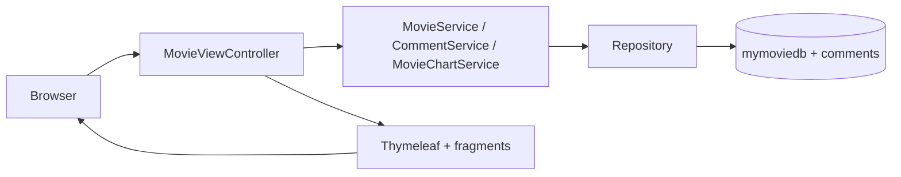

# Bài 7: Kết hợp Database và Template — Import CSV, Thymeleaf Fragment, Comment, Chart.js

## Mục tiêu bài học

Sau bài này, học viên có thể:

- Ghép **template HTML có sẵn** (Anime / Bootstrap) vào Spring Boot qua `static` + `templates` + **Thymeleaf fragment**
- Import **CSV Netflix** vào MongoDB bằng `mongoimport`, ánh xạ field bằng `@Field`
- Xây **trang chủ động** (`index`): Hero, Trending, Popular, Recent, Live Action, Sidebar từ MongoDB
- Hiển thị **danh sách phân trang** (`categories`) bằng `Pageable` + `PagedListView`
- Xây **chi tiết + watching + form bình luận khách** (không đăng nhập), lưu collection `comments`, áp dụng **PRG**
- Truyền dữ liệu Controller → **Chart.js** qua `th:inline="javascript"` + **MongoDB aggregation**
- Tuân thủ quy ước: class model suffix **`Model`**; Controller → Service → Repository; form bind **DTO**

## Điều kiện tiên quyết

- **[Bài 3](./java_m3_bai3_MongoDB_Spring_1.md)**: model, repository, service
- **[Bài 4](./java_m3_bai4_MongoDB_Spring_2.md)**: Thymeleaf, phân trang, PRG, `PagedListView`
- **[Bài 6](./java_m3_bai6_Query_Optimization.md)**: aggregation (`$group`, `$sort`, `$limit`)
- **[Module 2 — Bài 8](../../../t3h-ltv-java-module-2/syllabus/module-2/java_m2_bai8_SpringMVC.md)**: static + Thymeleaf cơ bản
- MongoDB chạy tại `localhost:27017`

```xml
<dependency>
    <groupId>org.springframework.boot</groupId>
    <artifactId>spring-boot-starter-web</artifactId>
</dependency>
<dependency>
    <groupId>org.springframework.boot</groupId>
    <artifactId>spring-boot-starter-thymeleaf</artifactId>
</dependency>
<dependency>
    <groupId>org.springframework.boot</groupId>
    <artifactId>spring-boot-starter-data-mongodb</artifactId>
</dependency>
<dependency>
    <groupId>org.springframework.boot</groupId>
    <artifactId>spring-boot-starter-validation</artifactId>
</dependency>
<dependency>
    <groupId>org.projectlombok</groupId>
    <artifactId>lombok</artifactId>
    <optional>true</optional>
</dependency>
```

> **Demo chuẩn (latest):** [`demo-bai7-mongodb-thymeleaf`](../../demo-bai7-mongodb-thymeleaf).  
> Database `db_java_t3h_module3`, collection **`mymoviedb`** + **`comments`**.  
> Theme: [ThemeWagon Anime](https://github.com/themewagon/anime).

### Thời lượng gợi ý

| Phần | Thời gian |
|------|-----------|
| Kiến trúc + cấu hình + import CSV §1–3 | ~30 phút |
| Template + fragment §4 | ~35 phút |
| Model / Repo / DTO + trang chủ §5 | ~40 phút |
| Categories + phân trang §6 | ~25 phút |
| Detail + Watching + Comment PRG §7 | ~45 phút |
| Chart.js + aggregation §8 | ~30 phút |
| Lỗi thường gặp + bài tập | ~20 phút |

## Nội dung (làm theo thứ tự)

| # | Chủ đề | Kết quả kiểm tra |
|---|--------|------------------|
| 1 | Tổng quan luồng | Hiểu Controller → Service → Repo → View |
| 2 | Cấu hình project | App chạy, redirect `/` → `/movies` |
| 3 | Import CSV | `db.mymoviedb.countDocuments() > 0` |
| 4 | Template + fragment | CSS load; header/footer dùng chung |
| 5 | Trang chủ động | `/movies` hiện Hero + 4 section + sidebar |
| 6 | Categories + phân trang | `/movies/home` đổi trang được |
| 7 | Detail + Watching + Comment | Gửi bình luận, F5 không trùng |
| 8 | Chart.js | `/movies/chart` có cột dữ liệu |
| 9 | Lỗi thường gặp | — |
| Phụ lục | Bài tập · Checklist · Liên kết | — |

---

## Kiến trúc project demo

```
src/main/java/vn/demo/
├── DemoBai7MongoApplication.java
├── model/
│   ├── MovieModel.java              ← collection "mymoviedb" (suffix Model)
│   └── CommentModel.java            ← collection "comments"
├── repository/
│   ├── MovieRepository.java
│   └── CommentRepository.java
├── service/
│   ├── MovieService.java            ← index, phân trang, detail, related
│   ├── CommentService.java          ← lưu + list + sidebar comment
│   └── MovieChartService.java       ← aggregation top country
├── dto/
│   ├── MovieCardDto.java            ← thẻ phim (list / hero / sidebar)
│   ├── MovieDetailDto.java          ← trang detail / watching
│   ├── HomePageView.java            ← gom section trang chủ
│   ├── CommentFormDto.java          ← bind form (không bind entity)
│   ├── CommentSidebarDto.java       ← sidebar "New Comment"
│   ├── LanguageCountDto.java        ← kết quả chart (field language = country)
│   ├── PagedResponse.java           ← tái dùng Bài 4
│   ├── PageMapper.java
│   └── PagedListView.java
└── controller/
    ├── HomeController.java          ← GET / → redirect:/movies
    └── MovieViewController.java     ← toàn bộ /movies/*

src/main/resources/
├── application.properties
├── static/                          ← css, js, img, fonts, videos (từ theme Anime)
└── templates/
    ├── fragments/
    │   ├── layout.html              ← head, header, footer, search, scripts
    │   ├── movie.html               ← productCard, productSidebar
    │   └── comments.html            ← reviewList, commentForm, relatedSidebar
    ├── anime-main/
    │   ├── index.html
    │   ├── categories.html
    │   ├── anime-details.html
    │   └── anime-watching.html
    └── movies/
        ├── chart.html
        └── not-found.html
```

| Tầng | Lớp | Nhiệm vụ |
|------|-----|----------|
| **Model** | `MovieModel`, `CommentModel` | Ánh xạ document; **bắt buộc** suffix `Model` |
| **Repository** | `MovieRepository`, `CommentRepository` | Query MongoDB |
| **Service** | `MovieService`, `CommentService`, `MovieChartService` | Nghiệp vụ + map DTO |
| **DTO** | `*Dto`, `HomePageView`, `PagedListView` | Đưa ra view; **không** lộ entity |
| **Controller** | `MovieViewController` | Nhận request, gọi Service, trả tên template / `redirect:` |
| **Template** | `anime-main/*` + `fragments/*` | `th:replace` + `th:each` + form |

> **Quy tắc vàng:** `Controller → Service → Repository → MongoDB`.  
> POST form xong luôn **`redirect:`** (PRG). Không bind entity vào form.



### Bảng URL (khớp demo)

| Method | URL | Template | Dữ liệu chính |
|--------|-----|----------|---------------|
| GET | `/` | redirect | → `/movies` |
| GET | `/movies` | `anime-main/index` | Hero, trending, popular, recent, liveAction, topViews, sidebarComments |
| GET | `/movies/home?page=0` | `anime-main/categories` | list + phân trang + sidebar |
| GET | `/movies/detail/{id}` | `anime-main/anime-details` | movie, comments, related, commentForm |
| POST | `/movies/detail/{id}` | redirect | lưu comment (PRG) |
| GET | `/movies/watching/{id}?ep=1` | `anime-main/anime-watching` | video + episodes + comments |
| POST | `/movies/watching/{id}` | redirect | lưu comment (PRG) |
| GET | `/movies/chart` | `movies/chart` | labels, counts (aggregation) |

---

## 1. Kết hợp database và template

**Mục đích:** dùng theme HTML có sẵn, thay nội dung tĩnh bằng dữ liệu MongoDB.

**Thứ tự làm (học viên làm theo):**

1. Cấu hình MongoDB + dependency  
2. Import CSV → collection `mymoviedb`  
3. Copy CSS/JS/img vào `static/`; HTML vào `templates/`  
4. Tách **fragment** dùng chung  
5. Viết Model → Repository → DTO → Service → Controller  
6. Nối từng trang: index → categories → detail → watching → chart  

---

## 2. Cấu hình project

### Bước 2.1 — `application.properties`

```properties
spring.application.name=demo-bai7-mongodb-thymeleaf
# Chỉnh URI theo máy bạn (có/không auth)
spring.data.mongodb.uri=mongodb://localhost:27017/db_java_t3h_module3
spring.thymeleaf.cache=false

app.movies.page-size=9
# Sample 100 dòng: min-count=2. Full Kaggle ~8800 dòng: dùng 50
app.movies.chart-min-count=2
app.movies.chart-limit=10
```

| Key | Ý nghĩa |
|-----|---------|
| `spring.thymeleaf.cache=false` | Sửa HTML không cần restart (dev) |
| `app.movies.chart-min-count` | Chỉ hiện country có số title **>** ngưỡng |
| `app.movies.chart-limit` | Top N cột trên biểu đồ |

> Demo hardcode `pageSize = 9` trong controller; property `page-size` để học viên tự nối nếu muốn.

### Bước 2.2 — `HomeController`

**File:** `controller/HomeController.java`

```java
@Controller
public class HomeController {

    @GetMapping("/")
    public String home() {
        // --- Trang mặc định → danh sách phim (index) ---
        return "redirect:/movies";
    }
}
```

**Kiểm tra:** mở `http://localhost:8080/` → chuyển sang `/movies`.

---

## 3. Import dữ liệu CSV (`mongoimport`)

### Bước 3.1 — Nguồn dữ liệu

- Kaggle: [rahulverma07/netflix-movie-dataset](https://www.kaggle.com/datasets/rahulverma07/netflix-movie-dataset)  
- Hoặc file sẵn trong demo: `sample-data/mymoviedb.csv` (~100 dòng) / `mymoviedb-full.csv` (~7800 dòng)

**Header CSV (bắt buộc khớp `@Field`):**

```text
show_id,type,title,director,cast,country,date_added,release_year,rating,duration,listed_in,description
```

### Bước 3.2 — Chạy import

```bash
cd demo-bai7-mongodb-thymeleaf/java-springboot-bai7
chmod +x scripts/import-movies.sh
./scripts/import-movies.sh sample-data/mymoviedb.csv
```

Tương đương:

```bash
mongoimport \
  --db db_java_t3h_module3 \
  --collection mymoviedb \
  --type csv \
  --headerline \
  --drop \
  --file sample-data/mymoviedb.csv
```

| Cờ | Ý nghĩa |
|----|---------|
| `--headerline` | Dòng 1 = tên field document |
| `--drop` | Xóa collection cũ trước khi import (tránh trùng) |
| `--type csv` | Định dạng file |

### Bước 3.3 — Kiểm tra trong `mongosh`

```javascript
use db_java_t3h_module3
db.mymoviedb.countDocuments()
db.mymoviedb.findOne()
```

> **Không dùng DataSeeder** trong bài này — học viên luyện `mongoimport` như PDF.

---

## 4. Tích hợp template + Thymeleaf fragment

### Bước 4.1 — Copy static

Từ theme Anime, copy vào `src/main/resources/static/`:

- `css/`, `js/`, `img/`, `fonts/`, `videos/`

Path trong HTML phải là **tuyệt đối từ root**: `/css/style.css`, `/img/logo.png` (không dùng `css/...` tương đối — sẽ vỡ khi đổi URL).

### Bước 4.2 — Vì sao cần fragment?

Header/footer/card lặp trên nhiều trang. Tách ra `templates/fragments/` rồi gắn bằng `th:replace` → sửa một chỗ, mọi trang cập nhật.

### Bước 4.3 — `fragments/layout.html` (làm trước)

```html
<head th:fragment="head(pageTitle)">
    <meta charset="UTF-8">
    <title th:text="${pageTitle}">Anime</title>
    <link rel="stylesheet" href="/css/bootstrap.min.css" type="text/css">
    <link rel="stylesheet" href="/css/style.css" type="text/css">
    <!-- ... các CSS khác của theme ... -->
</head>

<header th:fragment="header(active)" class="header">
    <!-- active = 'home' | 'categories' | 'chart' để tô menu -->
    <li th:classappend="${active == 'home'} ? 'active'">
        <a th:href="@{/movies}">Homepage</a>
    </li>
    <li th:classappend="${active == 'categories'} ? 'active'">
        <a th:href="@{/movies/home}">Categories</a>
    </li>
    <li th:classappend="${active == 'chart'} ? 'active'">
        <a th:href="@{/movies/chart}">Our Blog</a>
    </li>
</header>

<footer th:fragment="footer" class="footer">...</footer>
<th:block th:fragment="scripts">
    <script src="/js/jquery-3.3.1.min.js"></script>
    <script src="/js/main.js"></script>
</th:block>
```

> **Xem code đầy đủ:** [`fragments/layout.html`](../../demo-bai7-mongodb-thymeleaf/java-springboot-bai7/src/main/resources/templates/fragments/layout.html)

### Bước 4.4 — Dùng fragment trong trang

```html
<!DOCTYPE html>
<html lang="zxx" xmlns:th="http://www.thymeleaf.org">
<head th:replace="~{fragments/layout :: head('Anime | Homepage')}"></head>
<body>
<div th:replace="~{fragments/layout :: preloader}"></div>
<header th:replace="~{fragments/layout :: header('home')}"></header>

<!-- nội dung riêng của trang -->

<footer th:replace="~{fragments/layout :: footer}"></footer>
<th:block th:replace="~{fragments/layout :: scripts}"></th:block>
</body>
</html>
```

**Giải thích cú pháp:** `~{đường_dẫn_file :: tên_fragment(tham_số)}`  
- `~{...}` = biểu thức fragment  
- `th:replace` = thay thế **cả thẻ hiện tại** bằng nội dung fragment  

### Bước 4.5 — `fragments/movie.html` — card + sidebar

```html
<!-- Card 1 phim: click ảnh HOẶC tên → detail -->
<div th:fragment="productCard(r)" class="col-lg-4 col-md-6 col-sm-6">
    <div class="product__item">
        <a class="product__item__pic set-bg"
           th:href="@{/movies/detail/{id}(id=${r.id})}"
           th:attr="data-setbg=${r.posterUrl}">
            <div class="ep" th:text="${r.releaseYear}">2020</div>
        </a>
        <div class="product__item__text">
            <h5>
                <a th:href="@{/movies/detail/{id}(id=${r.id})}" th:text="${r.title}">Title</a>
            </h5>
        </div>
    </div>
</div>

<!-- Sidebar: cần model attribute topViews + sidebarComments -->
<div th:fragment="productSidebar" class="product__sidebar">
    <!-- Top Views: th:each="t : ${topViews}" -->
    <!-- New Comment: th:each="s : ${sidebarComments}" -->
</div>
```

**Cách gọi card trong vòng lặp:**

```html
<div class="row">
    <th:block th:each="r : ${trending}">
        <div th:replace="~{fragments/movie :: productCard(${r})}"></div>
    </th:block>
</div>
```

> **CSS quan trọng:** `a.product__item__pic { display: block; }` — vì poster đổi từ `<div>` sang `<a>` để click được.

---

## 5. Model, Repository, DTO và trang chủ (`/movies`)

Làm theo thứ tự: **Model → Repository → DTO → Service → Controller → HTML**.

### Bước 5.1 — `MovieModel` (suffix Model)

**File:** `model/MovieModel.java`

```java
@Data
@Document(collection = "mymoviedb")
public class MovieModel {

    @Id
    private String id;

    @Field("show_id")
    private String showId;

    private String type;
    private String title;
    private String director;
    private String cast;
    private String country;

    @Field("date_added")
    private String dateAdded;

    @Field("release_year")
    private Integer releaseYear;

    private String rating;
    private String duration;

    @Field("listed_in")
    private String listedIn;

    private String description;
}
```

| CSV header | Java field | Ghi chú |
|------------|------------|---------|
| `show_id` | `showId` | Cần `@Field` vì tên khác |
| `release_year` | `releaseYear` | Cần `@Field` |
| `listed_in` | `listedIn` | Cần `@Field` |
| `title` | `title` | Trùng tên → không cần `@Field` |

> **Vì sao `@Field`?** `mongoimport --headerline` giữ nguyên tên cột CSV (snake_case). Java dùng camelCase → phải map tường minh, nếu không field luôn `null`.

### Bước 5.2 — `MovieRepository`

```java
public interface MovieRepository extends MongoRepository<MovieModel, String> {

    List<MovieModel> findByTypeIgnoreCase(String type, Pageable pageable);

    @Query("{ 'listed_in': { $regex: ?0, $options: 'i' } }")
    List<MovieModel> findByListedInRegex(String regex, Pageable pageable);
}
```

- `findAll(Pageable)` — có sẵn từ `MongoRepository` (dùng cho phân trang / hero)  
- `findByTypeIgnoreCase` — Trending (`Movie`) / Popular (`TV Show`)  
- `findByListedInRegex` — Live Action (genre chứa `Action`)  

### Bước 5.3 — `MovieCardDto` (không đưa entity ra view)

CSV Netflix **không có URL poster**. Demo gán ảnh theme theo hash `id`:

```java
public static MovieCardDto fromEntity(MovieModel m, String folder, String prefix) {
    // --- Chọn ảnh /img/{folder}/{prefix}-{n}.jpg theo hash id ---
    int index = posterIndex(m, maxIndexFor(folder, prefix));
    return MovieCardDto.builder()
            .id(m.getId())
            .title(m.getTitle())
            .posterUrl("/img/" + folder + "/" + prefix + "-" + index + ".jpg")
            .releaseYear(m.getReleaseYear())
            .rating(m.getRating())
            .duration(m.getDuration())
            .type(m.getType())
            .genreLabel(firstGenre(m.getListedIn()))
            .description(/* cắt ≤ 120 ký tự cho Hero */)
            .build();
}
```

| Section | `folder` | `prefix` | Ví dụ file |
|---------|----------|----------|------------|
| Hero | `hero` | `hero` | `/img/hero/hero-1.jpg` |
| Trending | `trending` | `trend` | `/img/trending/trend-1.jpg` |
| Popular | `popular` | `popular` | `/img/popular/popular-1.jpg` |
| Recent | `recent` | `recent` | `/img/recent/recent-1.jpg` |
| Live | `live` | `live` | `/img/live/live-1.jpg` |
| Sidebar | `sidebar` | `tv` | `/img/sidebar/tv-1.jpg` |

### Bước 5.4 — `HomePageView` + `MovieService.buildHomePage()`

**DTO gom section:**

```java
@Data
@Builder
public class HomePageView {
    private List<MovieCardDto> hero;
    private List<MovieCardDto> trending;
    private List<MovieCardDto> popular;
    private List<MovieCardDto> recent;
    private List<MovieCardDto> liveAction;
    private List<MovieCardDto> topViews;
}
```

**Service — map section → query (học thuộc bảng này):**

| Section UI | Attribute | Query | Size |
|------------|-----------|-------|------|
| Hero | `hero` | `findAll` sort `release_year` DESC, page 0 | 3 |
| Trending Now | `trending` | `type = Movie` | 6 |
| Popular Shows | `popular` | `type = TV Show` | 6 |
| Recently Added | `recent` | `findAll` **page 1** (tránh trùng hero) | 6 |
| Live Action | `liveAction` | `listed_in` regex `Action` | 6 |
| Top Views | `topViews` | `findAll` page 0 | 5 |

```java
public HomePageView buildHomePage() {
    Sort byYearDesc = Sort.by(Sort.Direction.DESC, "release_year");

    // --- Hero slider (3 slide) ---
    List<MovieCardDto> hero = mapList(
            movieRepository.findAll(PageRequest.of(0, 3, byYearDesc)).getContent(),
            m -> MovieCardDto.fromEntity(m, "hero", "hero"));

    // --- Trending = Movie ---
    List<MovieCardDto> trending = mapList(
            movieRepository.findByTypeIgnoreCase("Movie", PageRequest.of(0, 6, byYearDesc)),
            m -> MovieCardDto.fromEntity(m, "trending", "trend"));

    // --- Popular = TV Show (fallback findAll nếu CSV mẫu ít TV) ---
    // --- Recent = page index 1 ---
    // --- Live Action = regex Action ---
    // --- topViews ---
    return HomePageView.builder() /* ... */ .build();
}
```

> **Giải thích “page 1” cho Recent:** `PageRequest.of(1, 6)` = trang thứ 2 (0-indexed). Hero lấy 3 bản ghi đầu; Recent lấy tiếp theo để ít trùng title.

### Bước 5.5 — Controller trang chủ

```java
@GetMapping(produces = MediaType.TEXT_HTML_VALUE)
public String showIndex(Model model) {
    // --- Gom section từ MongoDB ---
    HomePageView home = movieService.buildHomePage();
    model.addAttribute("hero", home.getHero());
    model.addAttribute("trending", home.getTrending());
    model.addAttribute("popular", home.getPopular());
    model.addAttribute("recent", home.getRecent());
    model.addAttribute("liveAction", home.getLiveAction());
    model.addAttribute("topViews", home.getTopViews());

    // --- Sidebar New Comment = comment thật (CommentService) ---
    model.addAttribute("sidebarComments", commentService.findRecentSidebar(4));
    return "anime-main/index";
}
```

### Bước 5.6 — HTML `index.html` (phần riêng)

```html
<!-- Hero -->
<div class="hero__items set-bg" th:each="h : ${hero}" th:attr="data-setbg=${h.posterUrl}">
    <h2><a th:href="@{/movies/detail/{id}(id=${h.id})}" th:text="${h.title}">Title</a></h2>
    <a th:href="@{/movies/detail/{id}(id=${h.id})}"><span>Watch Now</span></a>
</div>

<!-- Trending: dùng fragment productCard -->
<th:block th:each="r : ${trending}">
    <div th:replace="~{fragments/movie :: productCard(${r})}"></div>
</th:block>

<!-- Tương tự: popular, recent, liveAction -->
<div th:replace="~{fragments/movie :: productSidebar}"></div>
```

**Kiểm tra:** `/movies` — có slider, 4 khối phim, sidebar; click ảnh/tên vào detail.

> **Xem code:** [`MovieService`](../../demo-bai7-mongodb-thymeleaf/java-springboot-bai7/src/main/java/vn/demo/service/MovieService.java) · [`index.html`](../../demo-bai7-mongodb-thymeleaf/java-springboot-bai7/src/main/resources/templates/anime-main/index.html)

---

## 6. Categories + phân trang (`/movies/home`)

### Bước 6.1 — Service phân trang

```java
public PagedListView<MovieCardDto> findPage(int page, int pageSize) {
    // --- Lấy 1 trang document ---
    Page<MovieModel> moviePage = movieRepository.findAll(
            PageRequest.of(Math.max(page, 0), pageSize));

    // --- Map DTO + tính cửa sổ số trang (startPage/endPage) ---
    return PagedListView.from(moviePage, MovieCardDto::fromEntity, null, null, null, 5);
}
```

**`PagedListView` (ôn Bài 4) giúp gì?**

- `content` — list DTO trang hiện tại  
- `pagination.page` / `totalPages` — số trang (0-indexed)  
- `startPage` / `endPage` — chỉ hiện tối đa 5 nút số trang (không vẽ 100 nút)  

### Bước 6.2 — Controller

```java
@GetMapping(value = "/home", produces = MediaType.TEXT_HTML_VALUE)
public String showMovieList(@RequestParam(defaultValue = "0") int page, Model model) {
    PagedListView<MovieCardDto> listView = movieService.findPage(page, 9);
    model.addAttribute("list", listView.getContent());
    model.addAttribute("currentPage", listView.getPagination().getPage());
    model.addAttribute("totalPages", listView.getPagination().getTotalPages());
    model.addAttribute("startPage", listView.getStartPage());
    model.addAttribute("endPage", listView.getEndPage());
    model.addAttribute("topViews", movieService.findTopViews(5));
    model.addAttribute("sidebarComments", commentService.findRecentSidebar(4));
    return "anime-main/categories";
}
```

### Bước 6.3 — HTML phân trang (khớp CSS theme)

```html
<div class="row">
    <th:block th:each="r : ${list}">
        <div th:replace="~{fragments/movie :: productCard(${r})}"></div>
    </th:block>
</div>

<div class="product__pagination" th:if="${totalPages > 0}">
    <a th:if="${currentPage > 0}" th:href="@{/movies/home(page=${currentPage - 1})}">&laquo;</a>
    <a th:each="pageNum : ${#numbers.sequence(startPage, endPage)}"
       th:href="@{/movies/home(page=${pageNum})}"
       th:classappend="${pageNum == currentPage} ? 'current-page'"
       th:text="${pageNum + 1}">1</a>
    <a th:if="${currentPage < totalPages - 1}"
       th:href="@{/movies/home(page=${currentPage + 1})}">
        <i class="fa fa-angle-double-right"></i>
    </a>
</div>
```

| Chi tiết dễ sai | Cách đúng |
|-----------------|-----------|
| Hiện `pageNum` thô | UI hiện `pageNum + 1` (người dùng thấy trang 1, 2, 3…) |
| Link dùng trang 1-indexed | Server nhận **0-indexed** (`page=0` là trang đầu) |
| Current page dùng `<span class="current-page">` | CSS theme style **`a.current-page`** |
| Pagination nằm trong `product__page__content` | Phải là **anh em** với content, cùng trong `col-lg-8` (giống HTML gốc) |

**Kiểm tra:** `/movies/home`, `/movies/home?page=1` — đổi trang, sidebar vẫn hiện.

---

## 7. Chi tiết, Watching và Comment (PRG)

### Bước 7.1 — `CommentModel`

```java
@Data
@Document(collection = "comments")
public class CommentModel {
    @Id
    private String id;
    private String movieId;          // reference tới MovieModel.id
    private String name;
    private String email;            // tùy chọn
    private String message;
    private LocalDateTime createdAt = LocalDateTime.now();
}
```

> Quan hệ **reference** bằng `movieId` (string) — không dùng `@DBRef` trong lab này.

### Bước 7.2 — `CommentFormDto` (guest, không đăng nhập)

```java
@Data
public class CommentFormDto {
    @NotBlank(message = "Vui lòng nhập tên")
    @Size(max = 80)
    private String name;

    @Email(message = "Email không hợp lệ")  // không @NotBlank
    private String email;

    @NotBlank(message = "Vui lòng nhập nội dung")
    @Size(max = 1000)
    private String message;

    private String movieId;  // set từ path trong Controller
}
```

### Bước 7.3 — `CommentRepository` + `CommentService`

```java
public interface CommentRepository extends MongoRepository<CommentModel, String> {
    List<CommentModel> findByMovieIdOrderByCreatedAtDesc(String movieId);
    List<CommentModel> findAllByOrderByCreatedAtDesc(Pageable pageable);
}
```

```java
public CommentModel save(CommentFormDto form) {
    // --- Map DTO → entity (không bind entity từ request) ---
    CommentModel comment = new CommentModel();
    comment.setMovieId(form.getMovieId());
    comment.setName(form.getName().trim());
    comment.setEmail(/* null nếu blank */);
    comment.setMessage(form.getMessage().trim());
    comment.setCreatedAt(LocalDateTime.now());
    return commentRepository.save(comment);
}

public List<CommentSidebarDto> findRecentSidebar(int limit) {
    // --- Comment mới nhất + lookup title phim ---
    return commentRepository.findAllByOrderByCreatedAtDesc(PageRequest.of(0, limit))
            .stream().map(this::toSidebarDto).toList();
}
```

### Bước 7.4 — `MovieDetailDto` (detail + watching)

Map từ `MovieModel`: title, type, director, cast, country, rating, duration, listed_in, poster, **episodes**.

| Loại | Số tập giả lập | Lý do |
|------|----------------|-------|
| Movie | 1 | CSV không có episode |
| TV Show / duration có "season" | 12 | Đủ để demo UI watching |

Video dùng file mẫu theme: `/videos/1.mp4`, poster `/videos/anime-watch.jpg`.

### Bước 7.5 — Fragment comment

**File:** `fragments/comments.html`

| Fragment | Việc |
|----------|------|
| `reviewList` | `th:each` trên `${comments}` |
| `commentForm(postUrl)` | Form guest → POST `postUrl` |
| `relatedSidebar` | `th:each` trên `${related}` |

```html
<div th:fragment="commentForm(postUrl)" class="anime__details__form">
    <p>Không cần đăng nhập. Chỉ cần tên và nội dung.</p>
    <p th:if="${message}" th:text="${message}"></p>
    <form th:action="${postUrl}" th:object="${commentForm}" method="post">
        <input th:field="*{name}" placeholder="Tên của bạn *">
        <input th:field="*{email}" placeholder="Email (không bắt buộc)">
        <textarea th:field="*{message}" placeholder="Nội dung *"></textarea>
        <button type="submit">Gửi bình luận</button>
    </form>
</div>
```

### Bước 7.6 — Controller GET/POST detail (PRG)

```java
@GetMapping("/detail/{id}")
public String showMovieDetail(@PathVariable String id, Model model) {
    MovieDetailDto movie = movieService.findDetailById(id).orElse(null);
    if (movie == null) {
        return "movies/not-found";
    }
    model.addAttribute("movie", movie);
    model.addAttribute("comments", commentService.findByMovieId(id));
    model.addAttribute("related", movieService.findRelated(id, 4));
    model.addAttribute("commentForm", new CommentFormDto());
    return "anime-main/anime-details";
}

@PostMapping("/detail/{id}")
public String createCommentOnDetail(@PathVariable String id,
        @Valid @ModelAttribute("commentForm") CommentFormDto form,
        BindingResult bindingResult,
        RedirectAttributes redirectAttributes,
        Model model) {

    // --- Luôn lấy movieId từ path (không tin field ẩn client) ---
    form.setMovieId(id);

    if (bindingResult.hasErrors()) {
        // --- Fail: render lại form, giữ lỗi validation ---
        model.addAttribute("movie", movieService.findDetailById(id).orElseThrow());
        model.addAttribute("comments", commentService.findByMovieId(id));
        model.addAttribute("related", movieService.findRelated(id, 4));
        return "anime-main/anime-details";
    }

    // --- OK: lưu + redirect (PRG — F5 không gửi lại POST) ---
    commentService.save(form);
    redirectAttributes.addFlashAttribute("message", "Đã lưu bình luận");
    return "redirect:/movies/detail/" + id;
}
```

**Giải thích PRG (Post-Redirect-Get):**

```text
Browser                Server
   |  POST /detail/abc    |
   |--------------------->|
   |  302 redirect        |
   |<---------------------|
   |  GET /detail/abc     |
   |--------------------->|
   |  200 HTML            |
   |<---------------------|
F5 chỉ lặp GET → không tạo comment trùng
```

`addFlashAttribute` sống **một request** sau redirect — hiện dòng “Đã lưu bình luận”.

### Bước 7.7 — Watching

- GET `/movies/watching/{id}?ep=1` → `anime-watching.html`  
- Nút **Watch Now** trên detail trỏ tới đây  
- Query `ep` (mặc định 1): Controller kẹp trong khoảng `1 … episodes.size()` rồi đưa `currentEp` ra view  
- Episodes: `th:each` + `th:classappend="${iter.count == currentEp} ? ' active'"`  
- Video: `<source src="/videos/1.mp4">` (file mẫu theme)  
- POST comment tương tự detail, redirect về `/movies/watching/{id}`  

```html
<div th:replace="~{fragments/comments :: reviewList}"></div>
<div th:replace="~{fragments/comments :: commentForm(@{/movies/watching/{id}(id=${movie.id})})}"></div>
```

**Kiểm tra:** gửi bình luận không login → thấy trong list + sidebar “New Comment” trên trang chủ / categories.

---

## 8. Biểu đồ Chart.js + aggregation

### Bước 8.1 — Vì sao không `findAll()` rồi group trong Java?

Dataset Netflix đầy đủ ~8000+ document. `findAll()` tải hết vào RAM rồi `groupingBy` → chậm, dễ OOM.  
Đúng cách (Bài 6): **aggregation trên MongoDB**, chỉ trả top N về app.

### Bước 8.2 — `LanguageCountDto` + `MovieChartService`

> Tên field DTO là `language` (giữ từ bài mẫu cũ) nhưng dữ liệu thực tế là **country**.

```java
public List<LanguageCountDto> topCountries() {
    // --- Pipeline aggregation ---
    Aggregation agg = Aggregation.newAggregation(
            Aggregation.match(Criteria.where("country").ne(null)),
            Aggregation.group("country").count().as("count"),
            Aggregation.match(Criteria.where("count").gt(chartMinCount)),
            Aggregation.sort(Sort.Direction.DESC, "count"),
            Aggregation.limit(chartLimit),
            Aggregation.project("count").and("_id").as("language"));

    return mongoTemplate.aggregate(agg, "mymoviedb", LanguageCountDto.class)
            .getMappedResults();
}
```

| Stage | Ý nghĩa |
|-------|---------|
| `$match` country ≠ null | Bỏ document thiếu quốc gia |
| `$group` by country | Đếm số title |
| `$match` count > min | Lọc nhiễu (sample nhỏ → min=2; full → 50) |
| `$sort` + `$limit` | Top N |

### Bước 8.3 — Controller

```java
@GetMapping("/chart")
public String showChart(Model model) {
    List<LanguageCountDto> data = movieChartService.topCountries();
    // --- 2 list cùng thứ tự cho Chart.js ---
    model.addAttribute("labels", data.stream().map(LanguageCountDto::getLanguage).toList());
    model.addAttribute("counts", data.stream().map(LanguageCountDto::getCount).toList());
    return "movies/chart";
}
```

### Bước 8.4 — HTML + Chart.js

```html
<canvas id="barChart"></canvas>
<script src="https://cdn.jsdelivr.net/npm/chart.js"></script>
<script th:inline="javascript">
    const languages = /*[[${labels}]]*/ [];
    const counts = /*[[${counts}]]*/ [];
    new Chart(document.getElementById('barChart'), {
        type: 'bar',
        data: {
            labels: languages,
            datasets: [{ label: 'Number of Titles', data: counts, backgroundColor: '#e53637' }]
        }
    });
</script>
```

**Giải thích `th:inline="javascript"`:** Thymeleaf thay `/*[[${labels}]]*/` bằng JSON array thật khi render. Hai list `labels`/`counts` **phải cùng thứ tự** (không dùng `Map.keySet()` + `values()` riêng lẻ).

**Kiểm tra:** `/movies/chart` có cột. Nếu trống → hạ `app.movies.chart-min-count` hoặc import CSV đầy đủ.

---

## 9. Lỗi thường gặp

| Triệu chứng | Nguyên nhân | Cách xử lý |
|-------------|-------------|------------|
| CSS/JS vỡ layout | Path `css/...` tương đối | Đổi `/css/...` |
| `th:each` không hiện | Sai tên `model.addAttribute` | Khớp `${trending}` ↔ `"trending"` |
| Field luôn `null` | `@Field` ≠ header CSV | `findOne()` trong mongosh, sửa `@Field` |
| F5 tạo comment trùng | POST trả view, thiếu PRG | `return "redirect:/movies/detail/" + id` |
| Biểu đồ trống (sample) | `chart-min-count` quá cao | Đặt `2` với CSV 100 dòng |
| Chart labels lệch counts | Tách `Map` key/value | Truyền 2 `List` đã sort cùng pipeline |
| Comment không gắn phim | Thiếu `movieId` | `form.setMovieId(id)` từ `@PathVariable` |
| Form bind entity | Mass assignment | Dùng `CommentFormDto` + `@Valid` |
| Ảnh poster trống | Quên `set-bg` / `main.js` | Kiểm tra `data-setbg` + class `set-bg` |
| Click ảnh không vào detail | Poster vẫn là `<div>` | Dùng `<a class="product__item__pic">` + CSS `display:block` |
| Pagination lệch layout | Sai chỗ đóng `</div>` | Pagination **ngoài** `product__page__content` |
| Class model không chuẩn | Thiếu suffix | Đặt `MovieModel`, `CommentModel` |

---

## Tóm tắt

| Khái niệm | Ý chính trong demo |
|-----------|-------------------|
| Merge template | `static/` + path `/css/...`; trang dùng `th:replace` fragment |
| Fragment | `layout` / `movie` / `comments` — DRY header, card, form |
| `mongoimport` | `--headerline --drop`; collection `mymoviedb` |
| `@Field` | Map snake_case CSV ↔ camelCase Java |
| Suffix `Model` | `MovieModel`, `CommentModel` |
| Index động | `buildHomePage()` — mỗi section một query |
| Phân trang | `PageRequest` 0-indexed + `PagedListView` |
| Comment guest | name + message bắt buộc; email tùy chọn; PRG |
| Chart | Aggregation `country` + `th:inline` + Chart.js |

---

## Đối chiếu syllabus ↔ code demo (đã kiểm tra)

Các mục sau **đã có trong demo** và được mô tả trong bài:

| Hạng mục demo | Trong syllabus |
|---------------|----------------|
| `MovieModel` / `CommentModel` (suffix Model) | §5.1, §7.1 |
| `mongoimport` + `import-movies.sh` (không DataSeeder) | §3 |
| Fragments `layout` / `movie` / `comments` | §4, §5.6, §7.5 |
| Trang chủ `buildHomePage` (Hero + 4 section + Top Views) | §5.4–5.6 |
| Sidebar New Comment từ DB (`findRecentSidebar`) | §5.5, §7.3 |
| Categories + `PagedListView` + `a.current-page` | §6 |
| Click ảnh + tên → detail | §4.5 |
| Detail + Watching + comment guest + PRG | §7 |
| `MovieDetailDto.episodes` + `/videos/1.mp4` | §7.4, §7.7 |
| `movies/not-found.html` khi sai id | §7.6 |
| Chart aggregation `country` + Chart.js | §8 |
| `app.movies.chart-min-count` / `chart-limit` | §2.1, §8 |

**Có trong demo nhưng cố ý không bắt học viên làm (hoặc để bài tập):**

| Mục | Ghi chú |
|-----|---------|
| `anime-main/blog-details.html` | File thừa từ theme — **không** gắn controller; bỏ qua |
| `app.movies.page-size` | Có trong properties; controller đang hardcode `9` → bài tập 1 |
| `scripts/prepare-templates.py` | Legacy, không chạy (trang đã dùng fragment thủ công) |
| `LanguageCountDto.language` | Tên field lịch sử; giá trị thực là **country** (§8.2) |

**Thứ tự code học viên nên mở khi làm theo:**

1. `application.properties` → `HomeController`  
2. `MovieModel` → `MovieRepository` → `MovieCardDto` → `MovieService` → `MovieViewController.showIndex` → `index.html`  
3. `showMovieList` → `categories.html`  
4. `CommentModel` → `CommentFormDto` → `CommentService` → POST detail → `fragments/comments.html`  
5. `showWatching` → `anime-watching.html`  
6. `MovieChartService` → `chart.html`  

---

## Phụ lục

### Bài tập

1. Nối `app.movies.page-size` vào `showMovieList` (đừng hardcode `9`).  
2. Thêm `?q=` trên `/movies/home` — lọc `title` bằng regex prefix `^` (Bài 6 §6).  
3. Pie chart top genre từ field `listed_in` (cắt phần trước dấu phẩy).  
4. `GET /api/movies?page=0&size=9` trả JSON — tái sử dụng `MovieService.findPage`.  
5. Trang watching: khi đổi `ep`, giữ flash message / scroll tới player.

### Checklist nộp bài (khớp demo)

- [ ] Import CSV; `findOne()` khớp `@Field`  
- [ ] Class model có suffix `Model`  
- [ ] Có `fragments/layout.html`, `movie.html`, `comments.html`  
- [ ] `/movies` hiện đủ Hero + 4 section + sidebar  
- [ ] `/movies/home` phân trang; Prev/Next đúng (0-indexed)  
- [ ] Click **ảnh** và **tên** đều vào detail  
- [ ] `/movies/detail/{id}` + comment guest + PRG (F5 không trùng)  
- [ ] `/movies/watching/{id}` phát video mẫu + list tập  
- [ ] Sidebar “New Comment” lấy từ collection `comments`  
- [ ] `/movies/chart` aggregation (không `findAll` group Java)  
- [ ] Constructor injection; không `@Autowired` trên field  

### Liên kết tham khảo

- [Thymeleaf — Using Thymeleaf](https://www.thymeleaf.org/doc/tutorials/3.1/usingthymeleaf.html)  
- [Thymeleaf — Fragment inclusion](https://www.thymeleaf.org/doc/tutorials/3.1/usingthymeleaf.html#template-layout)  
- [Chart.js — Bar chart](https://www.chartjs.org/docs/latest/samples/bar/vertical.html)  
- [mongoimport](https://www.mongodb.com/docs/database-tools/mongoimport/)  
- [Spring Data MongoDB — Aggregation](https://docs.spring.io/spring-data/mongodb/reference/mongodb/aggregation-framework.html)  
- [Bài 3](./java_m3_bai3_MongoDB_Spring_1.md) · [Bài 4](./java_m3_bai4_MongoDB_Spring_2.md) · [Bài 6](./java_m3_bai6_Query_Optimization.md)  
- Demo: [`demo-bai7-mongodb-thymeleaf`](../../demo-bai7-mongodb-thymeleaf) · README: [`README.md`](../../demo-bai7-mongodb-thymeleaf/README.md)
- **Tiếp theo:** [Bài 8 — Unit Testing](./java_m3_bai8_Unit_Testing.md)
