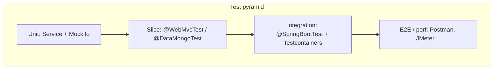
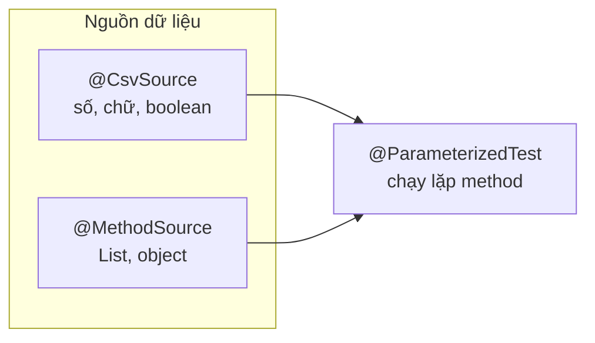
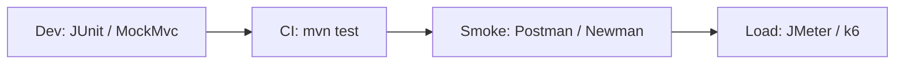

# Bài 8: Kiểm thử trong Spring Boot — Unit, Slice & thực tế dự án

## Mục tiêu bài học

Sau bài này, học viên có thể:

- Giải thích **vì sao cần kiểm thử** và phân biệt các lớp trong **test pyramid** (Unit → Slice/Integration → E2E)
- Thiết kế test case: **happy path**, **Equivalence Partitioning**, **Boundary Value**, edge case
- Viết **unit test Service** bằng **JUnit 5 + Mockito + AssertJ** (không cần MongoDB) — kỹ năng lõi khi đi làm
- Dùng **`@ParameterizedTest`**: `@CsvSource` (input đơn giản) và `@MethodSource` (stub list/object)
- Viết **slice test Repository** bằng **`@DataMongoTest`** trên DB test
- Viết **slice test Controller** bằng **`@WebMvcTest` + MockMvc**
- Hiểu **chiến lược test thực tế**: test gì / không test gì (Model anemic, getter/setter…)
- Biết các hướng **nâng cao** team hay dùng: `@SpringBootTest`, Testcontainers, CI, coverage
- Nhận biết **công cụ ngoài code** (Postman, JMeter…) — vai trò, không lab trong bài
- Chạy test bằng IDE và `mvn test`

> **Không nằm trong phạm vi bài này:** unit test Model/entity (getter/setter hoặc anemic model); lab Postman/JMeter từng bước.

## Điều kiện tiên quyết

- **[Bài 3](./java_m3_bai3_MongoDB_Spring_1.md)**: Model / Repository / Service / REST Controller (collection `movies`)
- **[Bài 6](./java_m3_bai6_Query_Optimization.md)**: `@Query` (khi làm repo test với query tùy chỉnh)
- **[Bài 7](./java_m3_bai7_Database_Query_To_FrontEnd.md)**: Controller → Service → Repository
- MongoDB tại `localhost:27017` (chỉ khi chạy `@DataMongoTest`)
- Dependency:

```xml
<dependency>
    <groupId>org.springframework.boot</groupId>
    <artifactId>spring-boot-starter-test</artifactId>
    <scope>test</scope>
</dependency>
```

> **`spring-boot-starter-test`:** JUnit 5, Mockito, AssertJ, MockMvc, Hamcrest…  
> **Demo chuẩn:** [`demo-bai8-unit-testing`](../../demo-bai8-unit-testing) — REST Movie gọn + đủ 3 lớp test (+ package `advanced` đọc hiểu §9).  
> Domain: **`MovieModel`** (field `rating`). Nền kiến thức CRUD: [Bài 3](./java_m3_bai3_MongoDB_Spring_1.md).

### Thời lượng gợi ý


| Phần                                               | Thời gian |
| -------------------------------------------------- | --------- |
| Tầm quan trọng + pyramid + chiến lược thực tế §1–2 | ~25 phút  |
| Thiết kế test case §3                              | ~15 phút  |
| **Unit Service + Mockito + giải thích annotation** §4 | ~50 phút |
| Slice Repository `@DataMongoTest` §5               | ~25 phút  |
| Slice Controller `@WebMvcTest` + MockMvc (GET–DELETE) §6 | ~35 phút |
| Assertion + lỗi thường gặp §7–8                    | ~15 phút  |
| **Nâng cao thực tế** §9                            | ~25 phút  |
| Công cụ ngoài code (Postman, JMeter…) §10          | ~10 phút  |
| Bài tập + checklist                                | ~15 phút  |


## Nội dung (làm theo thứ tự)


| #       | Chủ đề                                              | Kết quả kiểm tra                                              |
| ------- | --------------------------------------------------- | ------------------------------------------------------------- |
| 1       | Tầm quan trọng + các loại kiểm thử                  | Nói được hậu quả khi không test                               |
| 2       | Test pyramid + chiến lược thực tế (test gì / bỏ gì) | Biết ưu tiên Service & MockMvc; **không** bắt buộc test Model |
| 3       | Thiết kế test case                                  | Viết bảng case cho Service (rating / not-found)               |
| 4       | Unit Service + **giải thích annotation** + CsvSource/MethodSource | Giải thích được `@Mock`, `@InjectMocks`, `@ParameterizedTest`…; test pass |
| 5       | Slice Repository `@DataMongoTest`                   | Query trên `testdb` đúng kỳ vọng                              |
| 6       | Slice Controller `@WebMvcTest` + MockMvc (GET/POST/PUT/DELETE) | Status + JSON; 201/204/400/404 |
| 7       | Assertion hay dùng                                  | Chọn đúng `assertThat` / `assertThrows`                       |
| 8       | Lỗi thường gặp                                      | —                                                             |
| 9       | **Nâng cao — tình hình thực tế**                    | Biết Testcontainers, CI, coverage, `@SpringBootTest`          |
| 10      | Công cụ test ngoài code                             | Biết Postman, JMeter… dùng khi nào                            |
| Phụ lục | Bài tập · Checklist · Liên kết                      | —                                                             |


---

## Kiến trúc kiểm thử theo tầng

```
src/test/java/vn/demo/
├── service/
│   └── MovieServiceTest.java            ← Unit: Mockito mock Repository  ★ lõi
├── repository/
│   └── MovieRepositoryTest.java         ← Slice: @DataMongoTest (testdb)
├── controller/
│   └── MovieRestControllerTest.java     ← Slice: @WebMvcTest + MockMvc   ★ lõi
└── advanced/                            ← §9 đọc hiểu (@Disabled)
    ├── TestcontainersOverviewTest.java
    └── SpringBootTestOverviewTest.java

src/test/resources/
└── application-test.properties          ← URI testdb (+ auth nếu Mongo lab yêu cầu)
```


| Loại              | Annotation / tool                  | Cần Spring Context? | Cần MongoDB?       | Tốc độ     | Mức ưu tiên đi làm  |
| ----------------- | ---------------------------------- | ------------------- | ------------------ | ---------- | ------------------- |
| **Unit Service**  | JUnit + Mockito                    | Không               | Không              | Rất nhanh  | **P0**              |
| **Slice Web**     | `@WebMvcTest`                      | Một phần (MVC)      | Không              | Nhanh      | **P0**              |
| **Slice Repo**    | `@DataMongoTest`                   | Một phần            | Có (DB test)       | Trung bình | P1 (query phức tạp) |
| **Integration**   | `@SpringBootTest` + Testcontainers | Đầy đủ              | Có                 | Chậm       | P2 (nâng cao)       |
| **Công cụ ngoài** | Postman, JMeter…                   | —                   | Thường có app chạy | —          | P2 (QA / perf)      |





> **Quy tắc vàng:** nhiều test nhanh ở đáy; ít test chậm ở đỉnh.  
> **Chiến lược mặc định team Spring:** Service (mock) + MockMvc cho API quan trọng → thêm DataMongoTest khi query khó → integration/Testcontainers trên CI → Postman/JMeter bổ trợ ngoài build (hoặc pipeline riêng).

---

## 1. Tầm quan trọng của việc kiểm thử

Nếu bỏ kiểm thử, dễ gặp: lỗi chức năng, rủi ro bảo mật/UX, chi phí sửa muộn tăng, chậm release, khó mở rộng.

Các loại kiểm thử phổ biến:  
[GeeksforGeeks — Types of Software Testing](https://www.geeksforgeeks.org/software-testing/types-software-testing/).

**Trong bài này:** Unit (Service) + Slice Spring Boot. Công cụ như Postman/JMeter chỉ **giới thiệu** ở cuối (§10).

---

## 2. Unit testing & chiến lược thực tế

### 2.1. Unit là gì?

**Unit test** kiểm tra một đơn vị nhỏ (method/class) **không phụ thuộc** DB, mạng, HTTP thật.

- Hợp lệ: logic nghiệp vụ trong **Service** (dependency đã **mock**)
- Không phải pure unit: gọi Mongo thật → slice/integration; gọi HTTP ngoài (Postman) → API/E2E

### 2.2. Test gì / không test gì (quan trọng khi đi làm)


| Nên test                                             | Thường **không** test                                |
| ---------------------------------------------------- | ---------------------------------------------------- |
| Service: validate, map DTO, nhánh if/else, exception | Getter/setter, Lombok, entity **anemic** (chỉ field) |
| Controller: status, JSON, `@Valid` (MockMvc)         | Mọi derived method repo đơn giản (`findById`)        |
| `@Query` / aggregation phức tạp (DataMongoTest)      | “Coverage cho đủ số” bằng test vô nghĩa              |
| Boundary / null / not-found trên nghiệp vụ           | Nhân đôi cùng một logic ở 3 tầng                     |


**Vì sao bài này không test Model?**

Trong Spring CRUD phổ biến, `MovieModel` chủ yếu là **dữ liệu** (`@Document` + field). Logic nằm ở **Service**. Test getter/setter hoặc entity không hành vi → tốn thời gian, ít giá trị.

Chỉ test Model/VO khi có **hành vi domain thật** (tính tiền, chuyển trạng thái, invariant). Phạm vi khóa này: **bỏ Model test**, tập trung Service + Controller.

### 2.3. Chạy test

```bash
mvn test
mvn test -Dtest=MovieServiceTest
```

IDE: ▶ cạnh class / method `@Test`.

### 2.4. Quy ước tên + AAA

```text
methodName_condition_expectedResult
ví dụ: getById_throws_whenMovieMissing
```

```java
@Test
void getById_throws_whenMovieMissing() {
    // Arrange
    when(movieRepository.findById("x")).thenReturn(Optional.empty());

    // Act + Assert
    assertThrows(ResourceNotFoundException.class, () -> movieService.getById("x"));
    verify(movieRepository).findById("x");
}
```

---

## 3. Cách thiết kế test cases


| Kỹ thuật                     | Ý chính                   | Ví dụ Service `findHighlyRated(min)`                      |
| ---------------------------- | ------------------------- | --------------------------------------------------------- |
| **Happy path**               | Luồng bình thường         | Repo trả 1 phim rating 9 → DTO đúng title                 |
| **Equivalence Partitioning** | Chia nhóm, lấy đại diện   | Có kết quả / rỗng                                         |
| **Boundary Value**           | Biên nhóm                 | `min = 8.0` với rating đúng 8.0                           |
| **Edge**                     | Null, rỗng, thiếu dữ liệu | `findById` → empty → exception                            |
| **Decision Table**           | Tổ hợp điều kiện          | 2 tham số × 4 giá trị → **4 × 4 = 16** (không phải `2^4`) |
| **State Transition**         | Đổi trạng thái            | Order: NEW → PAID → …                                     |


> “Chia nhóm” = Equivalence; sát biên = Boundary.

---

## 4. Unit test Service + Mockito ★

Service chứa nghiệp vụ và gọi Repository. **Mock Repository** → nhanh, ổn định, không cần Mongo.

### 4.0. Từ điển annotation — đọc trước khi code

Phần này giải thích các annotation **mới với học viên** trong Bài 8. Không cần thuộc lòng mọi API; hiểu **vai trò** và **khi nào dùng**.

| Mục | Nội dung |
|-----|----------|
| **§4.0.1** | JUnit 5 — `@Test`, `@BeforeEach`, … |
| **§4.0.2** | `@ParameterizedTest` (+ **§4.0.2.1** về `name =`) |
| **§4.0.3** | `@CsvSource` |
| **§4.0.4** | `@MethodSource` |
| **§4.0.5** | Mockito — `@Mock`, `@InjectMocks` |
| **§4.0.6** | Annotation slice (xem nhanh) |

#### 4.0.1. JUnit 5 — chạy test

| Annotation | Nghĩa đơn giản | Ví dụ trong demo |
|------------|----------------|------------------|
| **`@Test`** | Một method = **một** kịch bản kiểm tra | `getById_throws_whenMovieMissing` |
| **`@DisplayName("...")`** | Tên hiện trên báo cáo / IDE (tiếng Việt được) | Dễ đọc khi giảng |
| **`@BeforeEach`** | Chạy **trước mỗi** `@Test` (dọn data, reset) | `MovieRepositoryTest.clean()` |
| **`@Disabled`** | Bỏ qua test (chưa làm / nâng cao) | `advanced/*OverviewTest` |

```text
JUnit nhìn thấy @Test → chạy method đó độc lập.
Nhiều @Test trong một class → chạy lần lượt (thường không phụ thuộc thứ tự).
```

#### 4.0.2. `@ParameterizedTest` — một method, nhiều bộ dữ liệu

**Vấn đề:** viết 5 method gần giống nhau chỉ khác input/output → dài, dễ copy-paste sai.

**Giải pháp:** `@ParameterizedTest` = “chạy **lặp** cùng một method với **nhiều dòng dữ liệu**”.

```text
Không parameterized:          Có @ParameterizedTest:
  test_min_0()                  isValidMinRating(min, expected)
  test_min_8()                    ← chạy 5 lần với 5 dòng CSV
  test_min_10()
  test_min_am()
  test_min_11()
```

- Method **không** gắn `@Test` thường — gắn `@ParameterizedTest`.
- Phải có **nguồn dữ liệu**: `@CsvSource` hoặc `@MethodSource` (hoặc `@ValueSource`, …).
- Thuộc tính `name = "..."`: chỉ để **hiển thị** trên IDE / báo cáo (xem **§4.0.2.1** ngay dưới).

##### 4.0.2.1. `name = "min={0} → {1}"` nghĩa là gì?

`name` **không** đổi logic test — chỉ đặt **nhãn hiển thị** cho từng lần chạy.

**JUnit lấy giá trị tham số thật** (lúc chạy test) thay vào `{0}`, `{1}`, `{2}` rồi hiện tên đó trên:

| Nơi nhìn thấy | Ví dụ |
|---------------|--------|
| Cây test trong IDE (IntelliJ / Cursor / VS Code) | `min=8.0 → size=1` |
| Báo cáo Maven Surefire (`mvn test`) | Cùng chuỗi tên khi pass/fail |
| Thông báo khi **fail** | Biết ngay bộ data nào lỗi |

> **Không phải** `System.out.println` / log ứng dụng.  
> Không in ra console app — chỉ là **tên test** trên báo cáo kiểm thử.

```text
Chạy @CsvSource 2 dòng:
  "0.0, true"
  "10.1, false"

Với name = "min={0} → {1}"  →  IDE hiện roughly:

  ✓ isValidMinRating(min=0.0 → true)
  ✓ isValidMinRating(min=10.1 → false)

Thiếu name → tên mặc định khó đọc (kiểu [1] 0.0, true …).
```

| Trong chuỗi `name` | Ý nghĩa |
|--------------------|---------|
| **`{0}`** | Giá trị tham số **thứ 1** của method (đếm từ 0) |
| **`{1}`** | Tham số **thứ 2** |
| **`{2}`** | Tham số **thứ 3** |
| Chữ `min`, `size`, mũi tên `→` | Chỉ là **nhãn tự viết** cho người đọc — JUnit không hiểu tên biến |

**Có cần trùng tên với tham số trong hàm không?** → **Không.**

```java
// Tham số method:     min          expected
// Chỉ số:             {0}          {1}
@ParameterizedTest(name = "min={0} → {1}")
void isValidMinRating(double min, boolean expected) { ... }

// Đổi tên biến vẫn chạy giống hệt — {0}/{1} theo VỊ TRÍ, không theo tên:
@ParameterizedTest(name = "min={0} → {1}")
void isValidMinRating(double nguong, boolean ketQua) { ... }  // vẫn OK
```

Ví dụ thứ hai trong demo:

```java
// Tham số:  min={0}   repoResult={1}   expectedSize={2}
@ParameterizedTest(name = "min={0} → size={2}")
void findHighlyRated_...(double min, List<MovieModel> repoResult, int expectedSize)
```

- Dùng `{0}` và `{2}`, **bỏ qua `{1}`** vì `List` in ra báo cáo dài/khó đọc.
- Viết `size=` chỉ là chữ mô tả; **không** bắt buộc trùng tên `expectedSize`.
- Khi chạy, báo cáo có thể hiện: `min=8.0 → size=1`, `min=9.5 → size=0`, …

Một số placeholder khác (biết là đủ):

| Placeholder | Ý nghĩa |
|-------------|---------|
| `{index}` | Số thứ tự lần chạy (1, 2, 3…) |
| `{0}`, `{1}`, … | Theo vị trí tham số — **giá trị lúc chạy** |

#### 4.0.3. `@CsvSource` — nguồn dữ liệu dạng bảng CSV

Mỗi **chuỗi** trong mảng = **một lần chạy**; cột cách nhau bởi dấu phẩy.

```java
@ParameterizedTest(name = "min={0} → {1}")
@CsvSource({
    "0.0, true",    // lần 1: min=0.0, expected=true
    "10.1, false"   // lần 2: min=10.1, expected=false
})
void isValidMinRating(double min, boolean expected) { ... }
```

| Ưu điểm | Hạn chế |
|---------|---------|
| Rất ngắn, dễ đọc | Chỉ thuận tiện với kiểu đơn giản (số, chữ, boolean) |
| Hợp Boundary Value | **Không** nhét `List<MovieModel>` sạch sẽ vào CSV |

→ Dùng cho `isValidMinRating` trong demo.

#### 4.0.4. `@MethodSource` — nguồn dữ liệu từ method Java

Khi cần truyền **object / List**, viết method `static` trả `Stream<Arguments>`:

```java
@ParameterizedTest
@MethodSource("highlyRatedCases")  // tên method nguồn
void findHighlyRated_...(double min, List<MovieModel> repoResult, int expectedSize) { ... }

static Stream<Arguments> highlyRatedCases() {
    return Stream.of(
        Arguments.of(8.0, List.of(inception), 1),  // 1 lần chạy
        Arguments.of(9.5, List.of(), 0)              // lần khác
    );
}
```

| Ý | Giải thích |
|---|------------|
| `Arguments.of(a, b, c)` | Khớp **thứ tự** tham số của method test |
| `static` | JUnit gọi được **không** cần tạo instance test |
| Stub trong test | `when(repo....(min)).thenReturn(repoResult)` — **list lấy từ Arguments**, không viết `if` trong stub |

→ Dùng cho `findHighlyRated` trong demo.



#### 4.0.5. Mockito — giả dependency (`@Mock`, `@InjectMocks`)

**Vấn đề:** `MovieService` cần `MovieRepository`. Unit test **không** muốn bật Mongo.

**Mock** = object **giả**: trông như Repository nhưng **không** gọi DB. Bạn **dạy** nó trả gì bằng `when(...).thenReturn(...)`.

```text
                    @InjectMocks
                 ┌──────────────────┐
                 │  MovieService    │  ← object THẬT đang được test
                 │  (code của bạn)  │
                 └────────┬─────────┘
                          │ constructor tiêm
                          ▼
                 ┌──────────────────┐
     @Mock       │ MovieRepository  │  ← object GIẢ (Mockito tạo)
                 │  (không có Mongo)│
                 └──────────────────┘
```

| Annotation / API | Nghĩa |
|------------------|--------|
| **`@ExtendWith(MockitoExtension.class)`** | Bật engine Mockito cho class test (JUnit 5) — **bắt buộc** nếu dùng `@Mock` |
| **`@Mock`** | Tạo dependency giả (`MovieRepository`) |
| **`@InjectMocks`** | Tạo class đang test (`MovieService`) và **tiêm** các `@Mock` vào (qua constructor / field) |
| **`when(repo.xxx()).thenReturn(y)`** | “Khi gọi `xxx`, hãy trả `y`” — gọi là **stub** |
| **`verify(repo).xxx()`** | “Hãy chắc Service **đã gọi** `xxx` (đúng tham số)” |
| **`assertThrows(Ex.class, () -> ...)`** | Kỳ vọng đoạn code **ném** exception (JUnit, không phải Mockito) |

**Thứ tự hay dùng (AAA):**

1. **Arrange:** `when(...).thenReturn(...)`  
2. **Act:** gọi `movieService....`  
3. **Assert:** `assertThat` / `assertThrows` + (tuỳ) `verify`

> **Lệch khái niệm hay gặp:** `@Mock` ≠ `@MockitoBean`.  
> - `@Mock`: unit test **thuần** (không Spring context) — `MovieServiceTest`.  
> - `@MockitoBean`: mock bean **trong** Spring slice (`@WebMvcTest`) — §6 / **§4.0.6**.

#### 4.0.6. Annotation slice (xem nhanh — chi tiết §5–§6)

| Annotation | Tầng | Việc nó làm |
|------------|------|-------------|
| **`@DataMongoTest`** | Repository | Chỉ load Spring Data Mongo; cần Mongo/`testdb` |
| **`@ActiveProfiles("test")`** | Config | Bật `application-test.properties` |
| **`@WebMvcTest(Controller.class)`** | Controller | Chỉ load tầng web của controller chỉ định |
| **`@Import(RestExceptionHandler.class)`** | Controller | Thêm advice 404 vào slice (không tự có) |
| **`@MockitoBean`** | Controller | Mock `MovieService` trong context Spring (Boot 3.4+) |
| **`MockMvc`** | Controller | Giả lập HTTP `GET/POST/PUT/DELETE` **không** mở port thật |

---

### 4.1. Method mẫu trên Service / Repository

```java
// MovieRepository
List<MovieModel> findByRatingGreaterThanEqual(Double rating);

// MovieService
public List<MovieDto> findHighlyRated(double minRating) {
    return movieRepository.findByRatingGreaterThanEqual(minRating).stream()
            .map(MovieDto::fromEntity)
            .toList();
}

/** Logic thuần 0..10 — lab @CsvSource / Boundary (không cần mock repo). */
public boolean isValidMinRating(double min) {
    return min >= 0.0 && min <= 10.0;
}
```

Dùng thêm `getById` để lab `assertThrows`.

### 4.2. Chọn `@CsvSource` hay `@MethodSource`?

| Annotation | Khi nào | Ví dụ trong demo |
|------------|---------|------------------|
| **`@CsvSource`** | Tham số đơn giản: số, chuỗi, boolean | `isValidMinRating` (biên 0 và 10) |
| **`@MethodSource`** | Cần `List` / object / stub phức tạp | `findHighlyRated` — mỗi case kèm list repo trả về |

Cả hai đều dùng phổ biến trong dự án thật. **Không** dùng `@CsvSource` rồi viết `if` trong `when(...)` để “giả” filter Mongo.

### 4.3. `MovieServiceTest` (rút gọn — đủ 2 kiểu ParameterizedTest)

```java
@ExtendWith(MockitoExtension.class)
class MovieServiceTest {

    @Mock MovieRepository movieRepository;
    @InjectMocks MovieService movieService;

    // --- @CsvSource: ngắn, dễ đọc (Boundary) ---
    @ParameterizedTest(name = "min={0} → {1}")
    @CsvSource({
            "0.0, true",
            "8.0, true",
            "10.0, true",
            "-0.1, false",
            "10.1, false"
    })
    void isValidMinRating(double min, boolean expected) {
        assertThat(movieService.isValidMinRating(min)).isEqualTo(expected);
    }

    // --- @MethodSource: stub rõ list entity ---
    @ParameterizedTest(name = "min={0} → size={2}")
    @MethodSource("highlyRatedCases")
    void findHighlyRated_mapsRepositoryResultToDto(
            double min,
            List<MovieModel> repoResult,
            int expectedSize) {
        when(movieRepository.findByRatingGreaterThanEqual(min))
                .thenReturn(repoResult);

        assertThat(movieService.findHighlyRated(min)).hasSize(expectedSize);
        verify(movieRepository).findByRatingGreaterThanEqual(min);
    }

    static Stream<Arguments> highlyRatedCases() {
        MovieModel inception = new MovieModel(
                "1", "Inception", 2010, List.of("Sci-Fi"), "Nolan", 8.8);
        MovieModel darkKnight = new MovieModel(
                "2", "The Dark Knight", 2008, List.of("Action"), "Nolan", 9.0);
        return Stream.of(
                Arguments.of(8.0, List.of(inception), 1),
                Arguments.of(9.5, List.of(), 0),
                Arguments.of(8.0, List.of(inception, darkKnight), 2));
    }

    // ... thêm @Test: map DTO, empty list, getById + assertThrows (xem file demo)
}
```

| Annotation | Ý nghĩa (chi tiết §4.0.1–§4.0.6) |
|------------|-------------------------|
| `@Mock` / `@InjectMocks` | Giả dependency + tiêm vào Service |
| `@ParameterizedTest` + `@CsvSource` | Nhiều dòng CSV — input đơn giản |
| `@ParameterizedTest` + `@MethodSource` | Nhiều case — object/list đầy đủ |

> Demo đầy đủ (kèm `@Test` map/empty/getById):  
> [`MovieServiceTest.java`](../../demo-bai8-unit-testing/java-springboot-bai8/src/test/java/vn/demo/service/MovieServiceTest.java).

### 4.4. Demo “test đỏ” (giảng trên lớp)

Cố tình sai kỳ vọng trên case hợp lệ để HV thấy red bar — **xóa trước khi nộp**:

```java
@Test
void demo_failingAssertion_forTeachingOnly() {
    when(movieRepository.findByRatingGreaterThanEqual(8.0)).thenReturn(List.of());
    assertThat(movieService.findHighlyRated(8.0)).hasSize(1); // cố tình sai
}
```

---

## 5. Slice test Repository — `@DataMongoTest`

Dùng khi cần chắc **câu query / mapping field** đúng với Mongo. Không cần test hết mọi `findBy…` đơn giản.

### 5.1. Tách database test (bắt buộc)

`src/test/resources/application-test.properties` (khớp demo):

```properties
# Có auth (máy lab module-3):
spring.data.mongodb.uri=mongodb://root:…@localhost:27017/testdb?authSource=admin
# Không auth:
# spring.data.mongodb.uri=mongodb://localhost:27017/testdb
```

> Quên `@ActiveProfiles("test")` hoặc URI trùng DB chính + `deleteAll` → **xoá dữ liệu thật**. Luôn kiểm URI trước khi chạy.  
> Demo: [`MovieRepositoryTest.java`](../../demo-bai8-unit-testing/java-springboot-bai8/src/test/java/vn/demo/repository/MovieRepositoryTest.java).

### 5.2. Query

```java
// Derived (đủ cho lab)
List<MovieModel> findByRatingGreaterThanEqual(Double rating);

// Hoặc @Query
@Query("{ 'rating' : { $gte: ?0 } }")
List<MovieModel> findHighlyRated(double minRating);
```

### 5.3. `MovieRepositoryTest`

```java
package vn.demo.repository;

import static org.assertj.core.api.Assertions.assertThat;

import java.util.List;

import org.junit.jupiter.api.BeforeEach;
import org.junit.jupiter.api.Test;
import org.springframework.beans.factory.annotation.Autowired;
import org.springframework.boot.test.autoconfigure.data.mongo.DataMongoTest;
import org.springframework.test.context.ActiveProfiles;

import vn.demo.model.MovieModel;

@DataMongoTest
@ActiveProfiles("test")
class MovieRepositoryTest {

    @Autowired
    private MovieRepository movieRepository;

    @BeforeEach
    void clean() {
        movieRepository.deleteAll();
    }

    @Test
    void findByRatingGreaterThanEqual_returnsOnlyMoviesAtOrAboveThreshold() {
        movieRepository.save(movieWithRating(6.0));
        movieRepository.save(movieWithRating(9.5));
        movieRepository.save(movieWithRating(8.0));

        List<MovieModel> result = movieRepository.findByRatingGreaterThanEqual(8.0);

        assertThat(result).hasSize(2);
        assertThat(result).extracting(MovieModel::getRating)
                .allMatch(r -> r >= 8.0);
    }

    private static MovieModel movieWithRating(double rating) {
        MovieModel m = new MovieModel();
        m.setTitle("Sample " + rating);
        m.setYear(2020);
        m.setRating(rating);
        return m;
    }
}
```

---

## 6. Slice test Controller — `@WebMvcTest` + MockMvc ★

Kiểm tầng HTTP: status, JSON — **mock Service**, không cần Mongo.  
(Nhắc lại nghĩa `@WebMvcTest` / `@MockitoBean` / `MockMvc`: xem **§4.0.6**.)

Demo cover: **GET**, **POST**, **PUT**, **DELETE** (kèm 404 / 400).

### 6.1. Cấu trúc class test

```java
@WebMvcTest(controllers = MovieRestController.class)
@Import(RestExceptionHandler.class) // cần cho case 404 / 400 trong slice
class MovieRestControllerTest {

    @Autowired
    private MockMvc mockMvc;

    /** Spring Boot 3.4+: @MockitoBean (thay @MockBean đã deprecated). */
    @MockitoBean
    private MovieService movieService;

    // ... các @Test bên dưới
}
```

### 6.2. GET (ôn lại)

```java
@Test
void getHighlyRated_returnsOkAndJsonArray() throws Exception {
    when(movieService.findHighlyRated(8.0))
            .thenReturn(List.of(
                    new MovieDto("1", "Inception", 2010, List.of("Sci-Fi"), "Nolan", 8.8)));

    mockMvc.perform(get("/api/movies/highly-rated").param("min", "8.0"))
            .andExpect(status().isOk())
            .andExpect(jsonPath("$[0].title").value("Inception"));
}
```

Endpoint (trong `@RequestMapping("/api/movies")` — khai báo **trước** `/{id}`):

```java
@GetMapping("/highly-rated")
public ResponseEntity<List<MovieDto>> highlyRated(
        @RequestParam(defaultValue = "8.0") double min) {
    return ResponseEntity.ok(movieService.findHighlyRated(min));
}
```

### 6.3. POST — tạo mới (201) + validation 400

```java
@Test
void create_returns201_andBody() throws Exception {
    when(movieService.create(any(MovieDto.class)))
            .thenReturn(new MovieDto("99", "Tenet", 2020, List.of("Action"), "Nolan", 7.4));

    String body = """
            {"title":"Tenet","year":2020,"genre":["Action"],"director":"Nolan","rating":7.4}
            """;

    mockMvc.perform(post("/api/movies")
                    .contentType(MediaType.APPLICATION_JSON)
                    .content(body))
            .andExpect(status().isCreated())       // 201
            .andExpect(jsonPath("$.id").value("99"))
            .andExpect(jsonPath("$.title").value("Tenet"));

    verify(movieService).create(any(MovieDto.class));
}

@Test
void create_returns400_whenTitleBlank() throws Exception {
    // @Valid chặn trước Service — không cần when(...)
    mockMvc.perform(post("/api/movies")
                    .contentType(MediaType.APPLICATION_JSON)
                    .content("{\"title\":\"\",\"year\":2020,\"rating\":7.0}"))
            .andExpect(status().isBadRequest())
            .andExpect(jsonPath("$.fields.title").exists());
}
```

Controller:

```java
@PostMapping
public ResponseEntity<MovieDto> create(@Valid @RequestBody MovieDto movie) {
    return new ResponseEntity<>(movieService.create(movie), HttpStatus.CREATED);
}
```

### 6.4. PUT — cập nhật (200 / 404)

```java
@Test
void update_returns200_andUpdatedTitle() throws Exception {
    when(movieService.update(eq("1"), any(MovieDto.class)))
            .thenReturn(new MovieDto("1", "Inception Remastered", 2010,
                    List.of("Sci-Fi"), "Nolan", 8.8));

    mockMvc.perform(put("/api/movies/1")
                    .contentType(MediaType.APPLICATION_JSON)
                    .content("{\"title\":\"Inception Remastered\"}"))
            .andExpect(status().isOk())
            .andExpect(jsonPath("$.title").value("Inception Remastered"));
}

@Test
void update_returns404_whenMissing() throws Exception {
    when(movieService.update(eq("missing"), any(MovieDto.class)))
            .thenThrow(new ResourceNotFoundException("Không tìm thấy phim với id: missing"));

    mockMvc.perform(put("/api/movies/missing")
                    .contentType(MediaType.APPLICATION_JSON)
                    .content("{\"title\":\"X\"}"))
            .andExpect(status().isNotFound());
}
```

Controller:

```java
@PutMapping("/{id}")
public ResponseEntity<MovieDto> update(@PathVariable String id, @RequestBody MovieDto movie) {
    return ResponseEntity.ok(movieService.update(id, movie));
}
```

### 6.5. DELETE — xóa (204 / 404)

`delete` trên Service là `void` → stub bằng **`doNothing()`** / **`doThrow()`** (không dùng `when(...).thenReturn(...)`).

```java
@Test
void delete_returns204() throws Exception {
    doNothing().when(movieService).delete("1");

    mockMvc.perform(delete("/api/movies/1"))
            .andExpect(status().isNoContent());   // 204

    verify(movieService).delete("1");
}

@Test
void delete_returns404_whenMissing() throws Exception {
    doThrow(new ResourceNotFoundException("Không tìm thấy phim với id: missing"))
            .when(movieService).delete("missing");

    mockMvc.perform(delete("/api/movies/missing"))
            .andExpect(status().isNotFound());
}
```

Controller:

```java
@DeleteMapping("/{id}")
public ResponseEntity<Void> delete(@PathVariable String id) {
    movieService.delete(id);
    return ResponseEntity.noContent().build();
}
```

### 6.6. Bảng nhớ nhanh MockMvc theo HTTP method

| Method | MockMvc | Status hay gặp | Stub Service |
|--------|---------|----------------|--------------|
| GET | `get(url)` | 200, 404 | `when(...).thenReturn` / `thenThrow` |
| POST | `post(url).contentType(JSON).content(body)` | 201, 400 | `when(create(any())).thenReturn` |
| PUT | `put(url).contentType(JSON).content(body)` | 200, 404 | `when(update(eq(id), any()))...` |
| DELETE | `delete(url)` | 204, 404 | `doNothing()` / `doThrow()` vì method `void` |

> Demo đầy đủ: [`MovieRestControllerTest.java`](../../demo-bai8-unit-testing/java-springboot-bai8/src/test/java/vn/demo/controller/MovieRestControllerTest.java).

---

## 7. Một số assertion hay dùng

Ưu tiên **AssertJ** (`assertThat`).


| Mục đích   | Ví dụ                                                        |
| ---------- | ------------------------------------------------------------ |
| So sánh    | `assertThat(actual).isEqualTo(expected);`                    |
| Null       | `assertThat(obj).isNull();` / `isNotNull()`                  |
| Collection | `assertThat(list).hasSize(2).extracting(...).contains(...);` |
| Exception  | `assertThrows(ResourceNotFoundException.class, () -> …);`    |
| Boolean    | `assertThat(flag).isTrue();`                                 |


---

## 8. Lỗi thường gặp


| Triệu chứng                 | Nguyên nhân                             | Cách xử lý                               |
| --------------------------- | --------------------------------------- | ---------------------------------------- |
| Xoá data “thật”             | Quên profile `test` / URI trùng         | URI `testdb` + `@ActiveProfiles("test")` |
| `@DataMongoTest` thiếu bean | Slice không load Service                | Đừng inject Service vào đây              |
| `@WebMvcTest` thiếu bean    | Chưa `@MockitoBean` / `@MockBean`       | Mock mọi dependency controller           |
| Case 404 không chạy         | Slice chưa load `@RestControllerAdvice` | `@Import(RestExceptionHandler.class)`    |
| Repo test Unauthorized      | Mongo bật auth, URI thiếu user/pass     | Thêm `authSource=admin` như demo lab     |
| `UnnecessaryStubbing`       | `when` không được gọi                   | Xóa stub thừa                            |
| NPE trên mock               | Quên `thenReturn`                       | Stub trước khi Act                       |
| Test chậm / flaky           | Phụ thuộc Mongo local / thứ tự          | Testcontainers (§9); `@BeforeEach` clean |
| Coverage cao nhưng vẫn bug  | Test getter, không test nhánh nghiệp vụ | Ưu tiên Service + MockMvc có ý nghĩa     |


---

## 9. Nâng cao — tình hình thực tế (đọc hiểu / demo ngắn)

> Phần này **không bắt buộc code đủ** trong buổi học. Mục tiêu: HV biết team thật làm gì sau khóa cơ bản.

### 9.1. Chiến lược theo quy mô team


| Giai đoạn         | Thường làm                                                                                |
| ----------------- | ----------------------------------------------------------------------------------------- |
| Startup / bài tập | Service unit + vài MockMvc; test tay bằng Postman                                         |
| Team product      | P0 trên CI; review bắt buộc test cho PR đụng logic                                        |
| Enterprise        | Thêm integration (Testcontainers), contract test, perf (JMeter/k6), quality gate coverage |


### 9.2. `@SpringBootTest` — integration gần “app thật”

Load gần như toàn bộ context; chậm hơn slice. Dùng khi cần nhiều bean phối hợp (security + MVC + data).

```java
@SpringBootTest
@AutoConfigureMockMvc
class MovieApiIntegrationTest {
    // mockMvc gọi API thật trong process; DB thường là testcontainer / testdb
}
```

Trade-off: **chậm, dễ flaky** nếu phụ thuộc môi trường → hạn chế số lượng.

### 9.3. Testcontainers — Mongo trong Docker cho CI

Thay Mongo local bằng container tạm mỗi lần test → máy dev/CI đồng nhất, ít “chạy được trên máy tôi”.

```java
// Ý tưởng (dependency testcontainers + mongodb module)
@Container
static MongoDBContainer mongo = new MongoDBContainer("mongo:7");

@DynamicPropertySource
static void mongoProps(DynamicPropertyRegistry registry) {
    registry.add("spring.data.mongodb.uri", mongo::getReplicaSetUrl);
}
```

> Cần Docker. Chi tiết: [Testcontainers](https://testcontainers.com/).  
> Trong demo: javadoc sống tại [`TestcontainersOverviewTest`](../../demo-bai8-unit-testing/java-springboot-bai8/src/test/java/vn/demo/advanced/TestcontainersOverviewTest.java) (`@Disabled`).

### 9.4. CI — test chạy trên mọi Pull Request

```text
git push → CI (GitHub Actions / GitLab CI) → mvn test → đỏ thì không merge
```

Unit/slice phải **tự chứa** (không phụ thuộc DB production). Integration dùng Testcontainers hoặc service CI.

### 9.5. Coverage (JaCoCo) — dùng đúng cách

- Đo **% code được thực thi** khi chạy test — **không** đồng nghĩa “hết bug”
- Team hay đặt ngưỡng mềm (ví dụ 60–80% dòng Service/Controller), **cấm** tăng coverage bằng test getter
- Plugin phổ biến: **JaCoCo** + báo cáo trên CI

### 9.6. Kỹ thuật Mockito hay gặp thêm


| Kỹ thuật                                 | Khi nào                                           |
| ---------------------------------------- | ------------------------------------------------- |
| `verify(repo, never()).delete(...)`      | Đảm bảo không gọi nhầm                            |
| `ArgumentCaptor`                         | Bắt object truyền vào `save(...)` để assert field |
| `@MockitoSettings(strictness = LENIENT)` | Tránh khi mới học — che stub thừa                 |
| Test `@Transactional` / rollback         | Chủ yếu integration; unit ít đụng                 |


### 9.7. Phân tầng trách nhiệm QA vs Dev


| Dev (trong repo)                        | QA / Perf / Ops                     |
| --------------------------------------- | ----------------------------------- |
| JUnit, Mockito, MockMvc, DataMongoTest  | Postman collections, exploratory    |
| Testcontainers trên CI                  | JMeter / k6 — tải, soak             |
| Contract (Spring Cloud Contract, Pact…) | Monitor lỗi production (sau deploy) |


---

## 10. Công cụ test ngoài code (tổng quan)

Không lab chi tiết trong bài. Biết **tên + mục đích** để làm việc với QA và đọc JD.


| Công cụ                   | Loại                            | Dùng khi nào                                                                                    |
| ------------------------- | ------------------------------- | ----------------------------------------------------------------------------------------------- |
| **Postman**               | API manual / collection / smoke | Gọi REST nhanh, chia sẻ collection cho team, regression nhẹ (Collection Runner, Newman trên CI) |
| **Insomnia / Bruno**      | Tương tự Postman                | Alternative client API                                                                          |
| **Apache JMeter**         | Performance / load              | Đo TPS, latency, mô phỏng nhiều user đồng thời                                                  |
| **k6 / Gatling**          | Performance (code-ish)          | Load test trong pipeline, script Git-friendly                                                   |
| **REST Assured**          | API test **trong Java**         | Giữa MockMvc và Postman — assert HTTP trong `mvn test`                                          |
| **Selenium / Playwright** | UI E2E                          | Ít dùng nếu app chủ yếu API; Thymeleaf đầy đủ mới cân nhắc                                      |
| **Newman**                | Chạy Postman collection CLI     | Gắn collection vào CI không mở GUI                                                              |





**Lưu ý:** Postman/JMeter **không thay** unit/slice trong code. Thiếu test trong repo → CI không chặn regression logic.

---

## Tóm tắt


| Khái niệm                   | Ý chính                                       |
| --------------------------- | --------------------------------------------- |
| Pyramid                     | Nhiều unit nhanh; ít E2E/perf                 |
| **Không test Model anemic** | Logic ở Service → test Service                |
| Service + Mockito           | **P0** — kỹ năng đi làm chính                 |
| MockMvc                     | **P0** — contract HTTP                        |
| `@DataMongoTest`            | P1 — query / mapping quan trọng               |
| `@ParameterizedTest` | `@CsvSource` (đơn giản) + `@MethodSource` (list/object) |
| Nâng cao                    | Testcontainers, `@SpringBootTest`, CI, JaCoCo |
| Postman / JMeter            | Công cụ ngoài — biết vai trò (§10)            |


---

## Phụ lục

### Bài tập

1. **Service + Mockito (bắt buộc):** `getById` — empty → `ResourceNotFoundException` (`assertThrows` + `verify`).
2. **Service + `@CsvSource`:** test `isValidMinRating` với biên `0`, `10`, ngoài biên.
3. **Service + `@MethodSource`:** ít nhất 3 bộ `(min, repoResult, expectedSize)` cho `findHighlyRated` — **không** dùng `if` trong `when`.
4. **Repository:** `@DataMongoTest` — `findByTitleContainingIgnoreCase`, seed ≥ 3 phim, assert size + title.
5. **Controller:** `@WebMvcTest` — đủ GET + **POST 201** + **PUT 200** + **DELETE 204**; thêm ít nhất một case 404 hoặc 400.
6. **(Nâng cao — đọc hiểu):** Viết 8–12 dòng so sánh Mongo local vs Testcontainers (ưu/nhược).
7. **(Nâng cao — tìm hiểu):** Mở trang JMeter hoặc Postman, ghi 5 bullet “dùng được cho dự án Movie API của mình”.

### Checklist nộp bài

- Giải thích được Unit vs Slice vs Integration vs công cụ ngoài (Postman/JMeter)
- Nói được **vì sao không bắt buộc test Model** trong CRUD anemic
- Có `MovieServiceTest` (`@Mock` / `@InjectMocks`) — **bắt buộc**
- Có `@ParameterizedTest` + **`@CsvSource`** (vd `isValidMinRating`)
- Có `@ParameterizedTest` + **`@MethodSource`** (stub rõ list cho `findHighlyRated`)
- Có `MovieRestControllerTest` (`@WebMvcTest` + MockMvc) — **bắt buộc** (ít nhất GET + POST + PUT hoặc DELETE)
- Có `MovieRepositoryTest` (`@DataMongoTest` + profile `test` + URI `testdb`)
- Không `deleteAll` trên DB production; không commit test cố tình fail
- (Tuỳ chọn) Ghi chú ngắn về Testcontainers hoặc JaCoCo / CI

### Liên kết tham khảo

- [JUnit 5 User Guide](https://junit.org/junit5/docs/current/user-guide/)
- [Mockito](https://javadoc.io/doc/org.mockito/mockito-core/latest/org/mockito/Mockito.html)
- [AssertJ](https://assertj.github.io/doc/)
- [Spring Boot — Testing](https://docs.spring.io/spring-boot/reference/testing/index.html)
- [Spring Boot — `@DataMongoTest](https://docs.spring.io/spring-boot/reference/testing/spring-boot-applications.html#testing.spring-boot-applications.autoconfigured-data-mongodb-test)`
- [Spring Boot — `@WebMvcTest](https://docs.spring.io/spring-boot/reference/testing/spring-boot-applications.html#testing.spring-boot-applications.spring-mvc-tests)`
- [Testcontainers](https://testcontainers.com/)
- [JaCoCo](https://www.jacoco.org/jacoco/)
- [Postman Learning Center](https://learning.postman.com/docs/introduction/overview/)
- [Apache JMeter](https://jmeter.apache.org/)
- [Bài 3 — Spring Boot & MongoDB (1)](./java_m3_bai3_MongoDB_Spring_1.md)
- [Bài 7 — Database Query To FrontEnd](./java_m3_bai7_Database_Query_To_FrontEnd.md)
- **Demo chuẩn:** [`demo-bai8-unit-testing`](../../demo-bai8-unit-testing) · [README](../../demo-bai8-unit-testing/README.md)
- **Tiếp theo:** [Bài 9 — Online Payment](./java_m3_bai9_Online_Payment.md)

